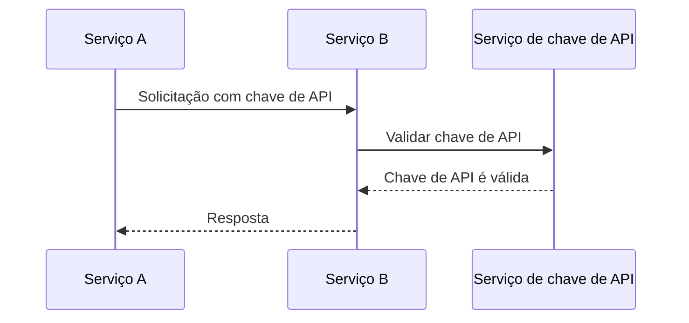
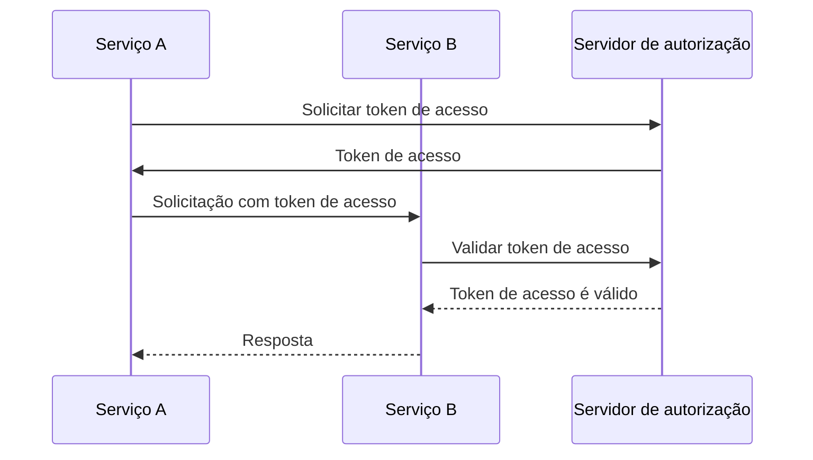
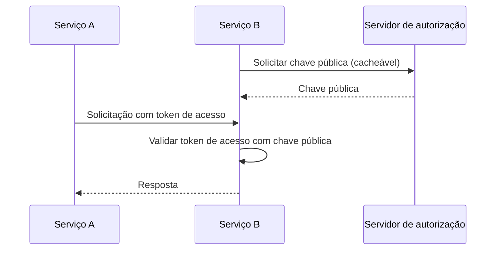

## O que é comunicação máquina a máquina?

Comunicação máquina a máquina (M2M) refere-se à troca automatizada de dados entre dispositivos sem intervenção humana. No contexto de autenticação (authentication) e autorização (authorization), a comunicação M2M frequentemente envolve um aplicativo cliente que precisa acessar recursos, onde o aplicativo cliente é uma máquina (serviço) ou uma máquina agindo em nome de um usuário.

## Por que precisamos lidar com comunicação máquina a máquina?

Quando você tem apenas um serviço sem dependências, provavelmente não precisa se comunicar com outros serviços. À medida que seu sistema cresce, ou você deseja integrar com um sistema de gerenciamento de identidade e acesso (IAM), você precisa lidar com a comunicação máquina a máquina.

No entanto, ainda parece simples - tudo o que você precisa é identificar o serviço e autenticá-lo. Mas, na realidade, há vários desafios que você precisa enfrentar:

### 1. Autenticação (Authentication)

Como você autentica o serviço? Você não pode usar um nome de usuário e senha, pois não há um humano para inseri-los. Você precisa usar um mecanismo diferente, como chaves de API (api key), certificados de cliente ou credenciais de cliente OAuth (client credentials).

### 2. Autorização (Authorization)

Uma vez que você autentica o serviço, como você determina o que o serviço pode fazer? Você precisa definir as permissões e papéis (roles) para o serviço, semelhante a como você os define para usuários. A última coisa que você quer é codificar as permissões no seu código.

### 3. Segurança

Como você garante que a comunicação entre serviços é segura? As credenciais serão atualizadas regularmente? Como você monitora e audita a comunicação?

### 4. Escalabilidade

À medida que o número de serviços cresce, como você gerencia a autenticação e autorização para cada serviço?

## As abordagens comuns para comunicação máquina a máquina

Com os desafios em mente, há várias abordagens comuns na indústria:

### 1. Chaves de API (API keys)

<Ref slug="api-key">Chaves de API</Ref> são uma maneira simples de autenticar serviços. Cada serviço pode ter uma ou mais chaves de API, que são usadas para autenticação (e às vezes autorização). Você pode ver alguns serviços pedindo para fornecer uma chave de API no cabeçalho da solicitação, como `X-API-Key: sua-chave-de-api`.

Um exemplo não normativo de como as chaves de API funcionam:

Vantagens:

- Simples de implementar e usar.
- Com geração aleatória segura e suficientemente longa, as chaves de API são difíceis de adivinhar.
- A validação é dinâmica, o que significa que você pode revogar uma chave de API a qualquer momento.

Desvantagens:

- Requer comunicação de rede para validar a chave de API.
- Não é autossuficiente, o que significa que um serviço é necessário para introspecção.
- O outro serviço tem o mesmo nível de acesso que o serviço que possui a chave de API (isso pode ser parcialmente mitigado usando um gateway de API).
- É difícil gerenciar um grande número de chaves de API entre serviços.

### 2. Credenciais de cliente OAuth (OAuth client credentials)

OAuth (ou OIDC, já que OpenID Connect é baseado em OAuth 2.0) <Ref slug="client-credentials-flow" /> é uma maneira mais avançada de autenticar serviços. É baseado no framework OAuth 2.0, que é amplamente usado para autenticação e autorização de usuários. Com credenciais de cliente OAuth, um serviço pode obter um token de acesso (access token) apresentando seu ID de cliente e segredo de cliente ao servidor de autorização (authorization server).

Um exemplo não normativo de como as credenciais de cliente OAuth funcionam:

Normalmente, o token de acesso é um JSON Web Token (JWT), que contém informações sobre o serviço e suas permissões. Então, o outro serviço pode validar o token de acesso sem se comunicar com o servidor de autorização (desde que tenha a chave pública para verificar a assinatura do JWT). O fluxo de trabalho torna-se:

Para mais informações sobre JSON Web Tokens, veja <Ref slug="jwt" />.

Vantagens (com JWT):

- Autossuficiente, o que significa que o outro serviço pode imediatamente saber as informações necessárias, como permissões, sem comunicação de rede adicional.
- O token de acesso pode ter vida curta, reduzindo o risco de uso indevido.
- O outro serviço não precisa conhecer o segredo do cliente, apenas a chave pública para verificar a assinatura do JWT.
- O token de acesso pode ser usado para auditar as ações do serviço (por exemplo, qual serviço acessou qual recurso).
- É mais fácil gerenciar um grande número de serviços, pois estabelece um limite claro entre serviços e permissões.

Desvantagens:

- Um pouco mais complexo de implementar e usar do que chaves de API.
- Se o outro serviço apenas realizar validação offline, pode não saber se o token de acesso foi revogado.

### 3. Mutual TLS

Mutual TLS (mTLS) é uma maneira de autenticar serviços usando certificados de cliente. Com mTLS, cada serviço possui um certificado de cliente com uma chave privada, e o outro serviço verifica o certificado usando a chave pública. No entanto, mTLS foca na camada TLS, o que significa que sozinho geralmente não se adequa à autenticação e autorização em nível de aplicação.

Para casos de uso avançados, mTLS pode ser combinado com tokens de acesso vinculados a certificados para proteger ainda mais a comunicação. Veja [RFC 8705: OAuth 2.0 Mutual-TLS Client Authentication and Certificate-Bound Access Tokens](https://datatracker.ietf.org/doc/html/rfc8705) para mais informações.

Vantagens:

- Autenticação forte, pois é baseada em criptografia de chave pública.
- A comunicação é criptografada e segura por padrão.
- O certificado de cliente pode ser usado para identificar o serviço, semelhante a como um JWT funciona.

Desvantagens:

- Mais complexo de implementar e gerenciar do que chaves de API e credenciais de cliente OAuth.
- O certificado de cliente precisa ser atualizado regularmente.
- Mais conhecimento técnico é necessário para gerenciar certificados de cliente adequadamente.
- O outro serviço pode não suportar mTLS, o que significa que você precisa ter um mecanismo de fallback.

<SeeAlso slugs={["api-key", "client-credentials-flow", "jwt"]} />