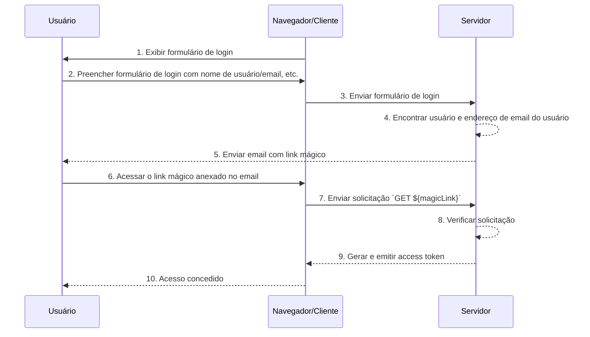

## O que são links mágicos (magic links)?

Um link mágico (magic link) é um link de uso único enviado ao usuário durante o processo de autenticação.

Ao acessar este link, o usuário completa o fluxo de autorização (authorization flow) necessário para acessar o recurso desejado e recebe o acesso apropriado aos recursos. Depois disso, o link mágico se torna inválido.

## Qual é a diferença entre link mágico (magic link) e senha de uso único (OTP)?

Vamos supor que o usuário use o email para receber um link mágico (magic link) ou <Ref slug='otp' />.

Em muitos casos, os usuários usam o email para receber um OTP para verificar o login ou como um fator de verificação adicional para <Ref slug='mfa' />. Qual é a diferença entre usar um link mágico (magic link) por email e um OTP por email?

Com o OTP, o usuário precisa verificar seu email, lembrar o OTP e, em seguida, inseri-lo no processo de login/verificação. Isso requer que o usuário alterne manualmente entre diferentes aplicativos ou páginas repetidamente.

Usando um link mágico (magic link) por email, o usuário só precisa abrir o email contendo o link mágico em seu aplicativo de email e clicar no link. Isso proporciona uma experiência de usuário mais simples.

Além disso, usar um link mágico (magic link) permite a inclusão de informações além de um token de uso único no link, como informações relacionadas à sessão para login. Isso pode melhorar tanto a segurança quanto a experiência do usuário.

## Como funciona o link mágico (magic link)?

Neste diagrama de sequência, ilustramos como um usuário faz login e obtém acesso aos recursos apropriados usando um link mágico (magic link).

Neste diagrama de sequência, assumimos que o link mágico (magic link) é enviado por email. No entanto, existem outros métodos possíveis para enviar um link mágico, como enviá-lo por mensagem de texto para um telefone celular. Essas alternativas não serão abordadas aqui, pois os fluxos são quase os mesmos.

1. **Exibir formulário de login**
O navegador/cliente inicia o processo de autenticação (authentication) exibindo ao usuário um formulário de login.
2. **Usuário preenche o formulário de login**
O usuário insere seu identificador, como nome de usuário, endereço de email ou número de telefone, no formulário de login.
As informações fornecidas precisam ser suficientes para ajudar o sistema a identificar um usuário único. Por exemplo, na maioria dos sistemas, os nomes de usuário usados para login são únicos. Em tais sistemas, os usuários só precisam fornecer seu nome de usuário para ajudar o sistema a identificar exclusivamente a conta que desejam acessar.
3. **Enviar formulário de login**
O navegador/cliente envia o formulário para o servidor, contendo as informações do usuário descritas no passo 2.
4. **Encontrar usuário e email**
O servidor processa a solicitação localizando o usuário único no banco de dados e recuperando o endereço de email associado ao usuário.
5. **Enviar email com link mágico**
O servidor envia um email para o endereço de email do usuário. Este email contém um link mágico para autenticação (authentication).
6. **Usuário acessa o link mágico**
O usuário recebe o email e clica no link mágico fornecido dentro dele.
7. **Enviar solicitação GET com link mágico**
O navegador/cliente envia uma solicitação `GET` para o servidor, usando a URL do link mágico.
8. **Verificar solicitação**
O servidor verifica a solicitação para garantir que o link mágico seja válido, não utilizado e não expirado.
9. **Gerar e emitir access token**
Uma vez que a solicitação é verificada, o servidor gera um access token e o emite para o navegador/cliente.
10. **Conceder acesso**
O navegador/cliente recebe o access token e permite que o usuário acesse o recurso solicitado.

## Qual é o benefício dos links mágicos (magic links)?

Os links mágicos (magic links) melhoram a arquitetura de segurança dos sistemas de autenticação (authentication) ao empregar um modelo de interação baseado em token. Cada link é exclusivamente criptografado e geralmente inclui um carimbo de tempo de expiração. Dada sua natureza efêmera, mesmo que um link mágico seja interceptado ou vazado, sua curta janela de validade limita a oportunidade de exploração maliciosa.

Além disso, como o uso de links mágicos requer um método de recebimento controlado pelo usuário, como um endereço de email ou número de telefone confiável, ele fornece um método de verificação adicional além do nome de usuário e senha, oferecendo segurança extra à conta. E como os links mágicos eliminam a necessidade de inserir credenciais, a segurança da conta dos usuários é melhor protegida, e o processo é mais conveniente.