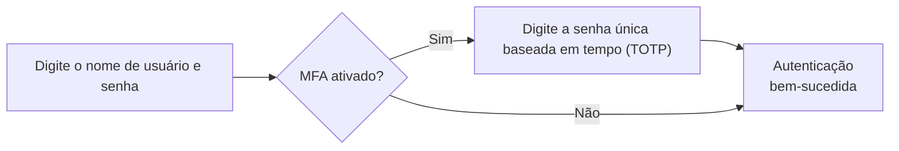

## O que é autenticação multifator (MFA)?

A autenticação multifator (MFA) melhora a segurança ao exigir que os usuários forneçam várias formas de identificação para verificar sua identidade. Ela adiciona uma camada extra de segurança ao processo de <Ref slug="authentication" />, tornando mais difícil para os invasores obterem acesso não autorizado.

Aqui está um exemplo de MFA:

### A definição de "fator"

No exemplo acima, há dois fatores:

1. Nome de usuário e senha
2. <Ref slug="totp" /> de um aplicativo móvel

Cada fator representa uma categoria diferente de credenciais que podem ser usadas para autenticar um usuário (provar que você é quem diz ser). Na prática, os fatores podem ser categorizados em três tipos principais:

|            | O que significa    | Fatores de verificação                                                                |
| ---------- | ------------------ | ------------------------------------------------------------------------------------- |
| Conhecimento | Algo que você sabe | Senha, Código de verificação por e-mail, Código de backup                            |
| Posse      | Algo que você tem  | Código de verificação por SMS, OTP de aplicativo autenticador, OTP de hardware (Chave de segurança), Cartão inteligente |
| Inerência  | Algo que você é    | Biometria como impressões digitais, reconhecimento facial                             |

Uma configuração comum de MFA envolve a combinação de dois fatores de categorias diferentes, como uma senha (conhecimento) e um <Ref slug="totp" /> de um aplicativo autenticador (posse).

### Por que a MFA é importante?

> Não existe segurança perfeita, apenas níveis variados de insegurança. —Salman Rushdie

A importância da MFA é evidente nos números: a MFA reduz o risco de comprometimento em 99,22% em toda a população e em 98,56% nos casos de credenciais vazadas[^1]. Com a ajuda da MFA, ações mais críticas podem ser realizadas com confiança, como acessar dados sensíveis e realizar transações financeiras. É uma maneira simples, mas eficaz, de oferecer um nível de segurança muito mais alto do que apenas uma senha ou autenticação de fator único.

## MFA em aplicativos modernos

Como o nome sugere, a MFA pode envolver mais de dois fatores. À medida que o número de fatores aumenta, também aumenta o nível de segurança e a complexidade do processo de autenticação, que pode ser menos amigável para o usuário. Enquanto o <Ref slug="totp" /> é uma escolha popular nos últimos anos, novas tecnologias como <Ref slug="passkey" /> estão surgindo para proporcionar uma experiência de MFA ainda mais segura e amigável.

Por exemplo, aplicativos modernos podem usar a API <Ref slug="webauthn" /> para implementar MFA com passkeys, que são credenciais resistentes a phishing protegidas por criptografia de chave pública. Empresas como a Apple integraram passkeys com autenticação biométrica (Touch ID, Face ID) para adicionar nativamente o fator de inerência ao processo de MFA, aumentando a segurança e a conveniência do usuário.

Vamos fazer uma rápida comparação para um melhor entendimento. Supondo que temos um usuário que possui:

1. Um aplicativo autenticador instalado em seu telefone para gerar códigos TOTP.
2. Uma passkey integrada com a autenticação biométrica do dispositivo.

Quando ele faz login em um site com MFA ativado em seu laptop, os dois processos seriam assim:

```mermaid
graph TD
  subgraph TOTP
    A[Digite o nome de usuário e senha]
    A -->|MFA ativado| B[Solicitar código TOTP]
    B --> C[Abrir aplicativo autenticador]
    C --> D[Encontrar o TOTP para o site]
    D --> E[Digite o código TOTP]
    E --> F[Autenticação<br/>bem-sucedida]
  end

  subgraph WebAuthn
    G[Digite o nome de usuário e senha]
    G -->|MFA ativado| H[Solicitar autenticação biométrica]
    H --> I["Autenticar com biometria (por exemplo, Touch ID)"]
    I --> J[Autenticação<br/>bem-sucedida]
  end
```

É claro que o processo WebAuthn leva menos etapas e muito menos tempo para os usuários. Além disso, empresas como a Apple suportam a sincronização de passkeys entre dispositivos (por exemplo, iPhone, iPad, Mac) para tornar o processo de MFA mais suave, mantendo um alto nível de segurança.

## Considerações de segurança

Ao implementar a MFA, algumas considerações de segurança devem ser levadas em conta:

- Use uma combinação de fatores de diferentes categorias para garantir um nível mais alto de segurança. Por exemplo, combinando uma senha (conhecimento) com um código TOTP (posse).
- Evite usar SMS como um fator de MFA devido à sua suscetibilidade a ataques de troca de SIM.
- As opções de recuperação não devem contornar a MFA. Por exemplo, se um usuário perder seu aplicativo autenticador, ele deve ser obrigado a usar um código de backup ou outro fator de MFA para recuperar o acesso.
- Imponha períodos de espera entre tentativas de MFA falhas para evitar ataques de força bruta.

[^1]: [Quão eficaz é a autenticação multifator na dissuasão de ciberataques?](https://query.prod.cms.rt.microsoft.com/cms/api/am/binary/RW166lD)

<SeeAlso slugs={["totp", "webauthn", "passkey"]} />

<Resources
  urls={[
    "https://blog.logto.io/elaborate-mfa",
    "https://blog.logto.io/web-authn-and-passkey-101",
    "https://blog.logto.io/webauthn-base-knowledge",
  ]}
/>