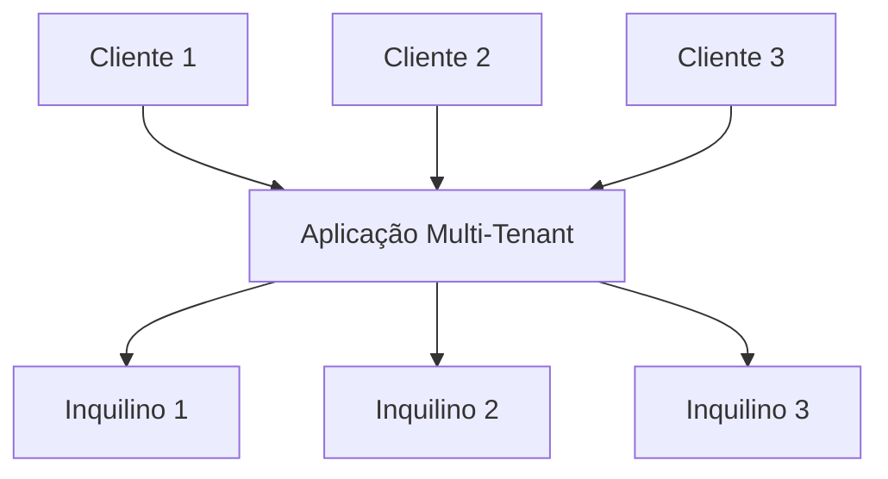
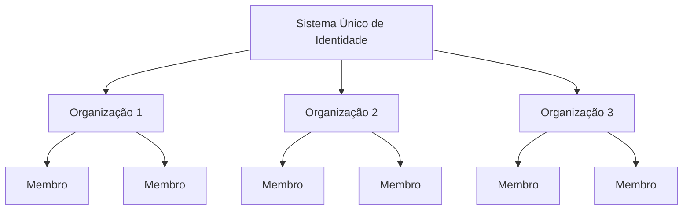

## O que é multi-tenancy (multi-tenancy)?

Multi-tenancy (Multi-tenancy) de software é um software no qual uma única instância de software é executada em um servidor e atende a vários inquilinos. Sistemas projetados dessa maneira são "compartilhados" (em vez de "dedicados" ou "isolados").

Um inquilino é um grupo de usuários que compartilham acesso comum com privilégios específicos à instância de software.

Por exemplo, sistemas CRM (Customer Relationship Management) frequentemente usam arquitetura multi-tenant para fornecer o mesmo serviço a todos os clientes.

Um princípio chave do multi-tenancy (multi-tenancy) é o "compartilhamento". Isso não significa que **toda** parte da solução é compartilhada; significa que pelo menos **alguns** componentes são reutilizados entre vários inquilinos. Compreender esse conceito mais amplo pode ajudá-lo a atender melhor às necessidades de seus clientes.

## Quais são os casos de uso para produtos multi-tenant?

Aplicativos multi-tenant são comumente usados em produtos de software como serviço (SaaS) como ferramentas de produtividade, software de colaboração, etc. Nesse cenário, cada “inquilino” geralmente representa um cliente empresarial, com vários usuários (tipicamente funcionários). Em diferentes produtos, pode ser referido como inquilino, espaço de trabalho ou projeto, dependendo do contexto. Um único negócio também pode ter vários inquilinos para representar diferentes divisões ou organizações.

Em casos mais complexos, como aplicações B2B além do SaaS, aplicativos multi-tenant fornecem uma plataforma compartilhada para várias equipes, clientes empresariais e empresas parceiras acessarem seus serviços.

## Por que você deve empregar multi-tenancy (multi-tenancy) em produtos SaaS

### Escalando com multi-tenancy (multi-tenancy)

Para empresas de grande porte, multi-tenancy (multi-tenancy) é a chave para atender efetivamente seus requisitos de disponibilidade, gerenciamento de recursos, gerenciamento de custos e segurança de dados. Em um nível técnico, adotar uma abordagem multi-tenant simplifica seus processos de desenvolvimento, minimiza desafios técnicos e promove uma expansão contínua.

### Criando uma experiência unificada

Ao examinar as raízes dos produtos SaaS, é semelhante a um edifício que abriga vários apartamentos. Todos os inquilinos compartilham utilidades comuns como água, eletricidade e gás, mas mantêm controle independente sobre o gerenciamento de seu próprio espaço e recursos. Essa abordagem simplifica o gerenciamento da propriedade.

### Garantindo segurança através do isolamento de inquilinos

Em uma arquitetura multi-tenancy (multi-tenancy), o termo "inquilino" é introduzido para criar limites que separam e protegem os recursos e dados de diferentes inquilinos dentro de uma instância compartilhada. Isso garante que os dados e operações de cada inquilino permaneçam distintos e seguros, mesmo que estejam utilizando os mesmos recursos subjacentes.

## Como alcançar o isolamento de inquilinos em uma arquitetura multi-tenancy (multi-tenancy)?

Ao discutir aplicativos multi-tenant, é sempre necessário alcançar o **isolamento de inquilinos**. Isso significa manter os dados e recursos de diferentes inquilinos separados e seguros dentro de um sistema compartilhado (por exemplo, uma infraestrutura em nuvem ou um aplicativo multi-tenant). Isso impede qualquer tentativa não autorizada de acessar os recursos de outro inquilino.

### O isolamento de inquilinos está alinhado com o conceito “compartilhado” do multi-tenancy (multi-tenancy)

Isso ocorre porque o isolamento de inquilinos não é necessariamente uma construção de nível de recurso de infraestrutura. No reino do multi-tenancy (multi-tenancy) e isolamento, alguns veem o isolamento como uma divisão estrita entre recursos reais de infraestrutura. Isso geralmente leva a um modelo onde cada inquilino tem bancos de dados, instâncias de computação, contas ou nuvens privadas separadas. Em cenários de recursos compartilhados, como aplicativos multi-tenant, a maneira de alcançar o isolamento pode ser uma construção lógica.

### Autenticação e autorização não são iguais a “isolamento”

Usar autenticação e autorização para controlar o acesso ao seu ambiente SaaS é importante, mas não garante "isolamento". Isolamento significa manter diferentes usuários ou conjuntos de dados separados para que os dados ou ações de um usuário não possam interferir ou ser acessados por outro.

Por exemplo, mesmo que você tenha configurado autenticação e autorização, onde os usuários fazem login e recebem um token definindo suas permissões, isso melhora a segurança, mas não garante que os usuários estejam totalmente isolados uns dos outros. Outro contexto deve ser introduzido para alcançar o "isolamento".

### Use “organização” como um contexto para representar o inquilino do produto SaaS, para alcançar o isolamento de inquilinos

Autenticação e autorização sozinhas não impedirão que um usuário com o papel certo acesse os recursos de outro inquilino. Para limitar o acesso, precisamos adicionar um contexto de “inquilino”, como um ID de inquilino, ID de organização ou ID de espaço de trabalho. Esses identificadores agem como paredes, portas e fechaduras, mantendo os inquilinos separados.

O termo “organização” é comumente usado para isolamento de inquilinos. Muitos <Ref slug="identity-provider" /> incluem um recurso de “organização” para ajudar a isolar inquilinos enquanto mantêm um sistema de identidade unificado. O usuário dentro da organização é chamado de "membro".

## Como as identidades são gerenciadas em aplicativos multi-tenant?

A primeira questão chave é pensar se partes do seu negócio ou produto exigem sistemas de identidade separados. Isso guiará o design do seu sistema. Aqui estão dois exemplos:

1. Um sistema de identidade: Uma única pessoa pode ter duas identidades dentro do mesmo sistema de identidade. Por exemplo, Sarah pode ter um e-mail pessoal registrado e também usar um e-mail corporativo conectado através de <Ref slug="enterprise-sso" />.
2. Múltiplos sistemas de identidade: Os usuários também podem ter duas identidades distintas em sistemas de identidade separados para produtos completamente não relacionados.

Na maioria dos aplicativos multi-tenant, as identidades são geralmente gerenciadas em um único pool, enquanto os recursos de cada inquilino são mantidos separados.

## Considerações para planejar e construir aplicativos multi-tenant

1. Foque no seu modelo: B2B ou B2C.
2. Quem irá lidar com as tarefas de gerenciamento de identidade: desenvolvedores, o administrador do seu cliente ou clientes finais?
3. Para B2B, seus clientes precisam gerenciar as identidades de sua organização?
4. Identifique quais permissões (<Ref slug="scope" />) e <Ref slug="role" /> precisam ser definidas para a organização e quais não.
5. Seu cliente requer <Ref slug="enterprise-sso" />?
6. Considere adicionar recursos de colaboração, como convites.

<Resources
  urls={[
    "https://blog.logto.io/implement-multi-tenancy",
    "https://blog.logto.io/multi-tenant-ultimate-guide",
    "https://blog.logto.io/case-study-multi-tenancy",
    "https://blog.logto.io/multi-tenancy-explained",
    "https://blog.logto.io/are-multi-tenant-apps-equal-saas",
    "https://blog.logto.io/tenancy-models",
    "https://blog.logto.io/do-you-need-multiple-tenants-identity-model",
  ]}
/>