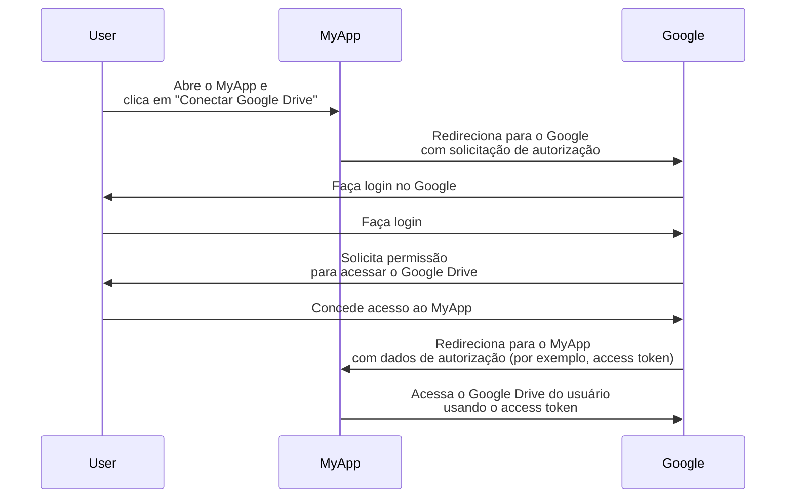
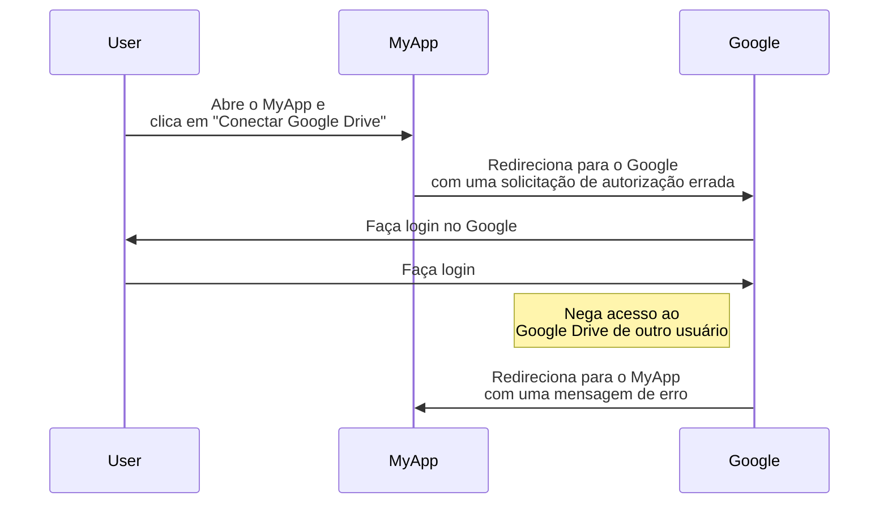
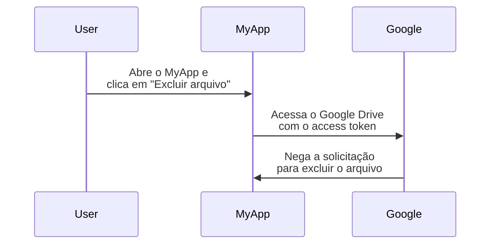

## O que é OAuth 2.0?

OAuth 2.0 é o padrão de fato para autorização e é amplamente utilizado na web. Ele permite que um aplicativo obtenha de forma segura acesso limitado a recursos protegidos em outro aplicativo, como o perfil ou dados de um usuário, sem expor credenciais como senhas.

Vamos ver um exemplo do mundo real para entender melhor. Você tem um aplicativo web MyApp que deseja acessar o Google Drive do usuário. Em vez de pedir ao usuário para compartilhar suas credenciais do Google Drive, o MyApp pode usar OAuth 2.0 para solicitar acesso ao Google Drive em nome do usuário. Aqui está um fluxo simplificado:

Neste fluxo, o MyApp nunca vê as credenciais do Google Drive do usuário. Em vez disso, ele recebe um <Ref slug="access-token" /> do Google que permite acessar o Google Drive em nome do usuário.

### Componentes principais do OAuth 2.0

Para o exemplo acima, o MyApp é o <Ref slug="client" />, o Google é tanto o <Ref slug="authorization-server" /> quanto o <Ref slug="resource-server" />, e o usuário é o <Ref slug="resource-owner" />. O fluxo envolve todos os componentes principais do OAuth 2.0:

- **Client**: O aplicativo que deseja acessar os recursos protegidos. "Client" e "aplicativo" são frequentemente usados de forma intercambiável.
- **Resource owner**: O usuário que possui os recursos protegidos. O resource owner pode conceder (autorizar) ou negar acesso ao client.
- **Authorization server**: O servidor que realiza a autorização (geralmente com autenticação) e emite access tokens para o client.
- **Resource server**: O servidor que hospeda os recursos protegidos. Ele verifica o access token e fornece os recursos protegidos ao client.

## OAuth 2.0 grants (fluxos)

<Ref slug="oauth-2.0-grant">Grant</Ref> constrói a base do OAuth 2.0 e define como o client pode obter um access token do authorization server. A especificação básica do OAuth 2.0 define quatro grants:

- <Ref slug="authorization-code-flow">Authorization code grant</Ref>
- <Ref slug="implicit-flow">Implicit grant</Ref>
- [Resource owner password credentials (ROPC) grant](https://datatracker.ietf.org/doc/html/rfc6749#section-4.3)
- <Ref slug="client-credentials-flow">Client credentials grant</Ref>

Sem entrar nos detalhes de cada grant, podemos esperar que esses grants se dividam em duas categorias:

- **Authorization grants**: Usados quando o client precisa acessar recursos em nome de um usuário, ou seja, a autorização do usuário é necessária.
- **Client credentials grant**: Usado quando o client precisa acessar recursos em seu próprio nome. Este grant é adequado para comunicação <Ref slug="machine-to-machine" />.

### Authorization grants

Independentemente do tipo de grant, os authorization grants têm as seguintes etapas comuns:

1. O client inicia uma <Ref slug="authorization-request" /> para o authorization server.
2. O authorization server autentica o usuário (resource owner) e solicita permissão para acessar os recursos.
3. O usuário concede permissão ao client.
4. O authorization server emite um access token para o client.
5. O client usa o access token para acessar os recursos protegidos no <Ref slug="resource-server" />.

Observe que as etapas exatas e os parâmetros podem variar dependendo do tipo de grant. Por exemplo, o <Ref slug="authorization-code-flow">authorization code grant</Ref> envolve mais etapas, como geração e troca de código.

### Client credentials grant

O <Ref slug="client-credentials-flow">client credentials grant</Ref> é muito mais simples e não envolve autorização do usuário. Aqui está um fluxo simplificado:

1. O client envia uma <Ref slug="token-request" /> para o authorization server.
2. O authorization server autentica o client e emite um access token.
3. O client usa o access token para acessar os recursos protegidos no <Ref slug="resource-server" />.

---

Para discussões aprofundadas sobre OAuth 2.0 grants, veja <Ref slug="oauth-2.0-grant" /> e os artigos específicos sobre grants.

## Controle de acesso com OAuth 2.0

OAuth 2.0 define o parâmetro <Ref slug="scope" /> para especificar as permissões que o client está solicitando. O authorization server pode ignorar total ou parcialmente os scopes solicitados e conceder acesso com base em suas próprias políticas de controle de acesso.

No entanto, o OAuth 2.0 deixa a critério do authorization server como impor o <Ref slug="access-control" />. Isso significa que o authorization server pode decidir quais recursos o sujeito (usuário ou client) pode acessar e quais ações eles podem realizar nesses recursos.

Vamos ainda usar o exemplo do Google Drive. O MyApp pode iniciar uma solicitação de autorização para acessar o Google Drive de outro usuário por engano. Nesse caso, o authorization server do Google deve negar a solicitação porque o usuário não tem as permissões necessárias para acessar o Google Drive de outro usuário.

Outro caso é quando o MyApp recebe um access token do Google que permite ler arquivos do Google Drive do usuário. No entanto, o MyApp tenta excluir um arquivo em vez de lê-lo. O resource server (Google) deve negar a solicitação.

Ambos os casos demonstram por que o <Ref slug="access-control" /> é necessário ao implementar o OAuth 2.0. O <Ref slug="authorization-server" /> e o <Ref slug="resource-server" /> devem trabalhar juntos para impor políticas de controle de acesso e proteger os recursos.

### Modelos de controle de acesso

Para lidar adequadamente com o controle de acesso, é recomendável usar os modelos padrão de controle de acesso, como <Ref slug="rbac" /> e <Ref slug="abac" />. Esses modelos têm se mostrado eficazes na indústria e oferecem escalabilidade para requisitos futuros.

## OAuth 2.1

<Ref slug="oauth-2.1" /> é uma atualização proposta para a especificação OAuth 2.0 que visa melhorar a segurança e a usabilidade de acordo com a experiência da indústria ao longo dos anos. Embora o OAuth 2.1 ainda não esteja finalizado, podemos aprender sobre as mudanças propostas e entender como elas podem afetar as implementações atuais do OAuth 2.0. O OAuth 2.1 pode ser tratado como uma formalização das melhores práticas e recomendações de segurança que foram amplamente adotadas na indústria.

## OAuth 2.0 e OpenID Connect (OIDC)

OAuth 2.0 define apenas o processo de autorização e não cobre a autenticação ou identidade do usuário. Por essa razão, o <Ref slug="openid-connect" /> foi introduzido como uma camada de identidade sobre o OAuth 2.0. O OIDC estende o OAuth 2.0 para fornecer autenticação de usuário e informações de identidade na forma de <Ref slug="id-token" />.

OpenID Connect estende dois grants do OAuth 2.0 (authorization code e implicit) para incluir ID tokens e introduz um novo grant chamado <Ref slug="hybrid-flow">hybrid flow</Ref> que combina ambos.

Isso significa que todo o seu conhecimento e práticas de OAuth 2.0 podem ser aplicados diretamente ao OIDC; todas as extensões do OAuth 2.0, como <Ref slug="pkce" /> e <Ref slug="resource-indicator" />, podem ser usadas no OIDC também.

<SeeAlso slugs={["oauth-2.0-grant", "oauth-2.1", "openid-connect"]} />

<Resources
  urls={[
    "https://blog.logto.io/secure-cloud-apps-with-oauth-and-openid-connect",
    "https://blog.logto.io/oauth-2-1",
    "https://datatracker.ietf.org/doc/html/rfc6749",
    "https://datatracker.ietf.org/doc/draft-ietf-oauth-v2-1/",
  ]}
/>
