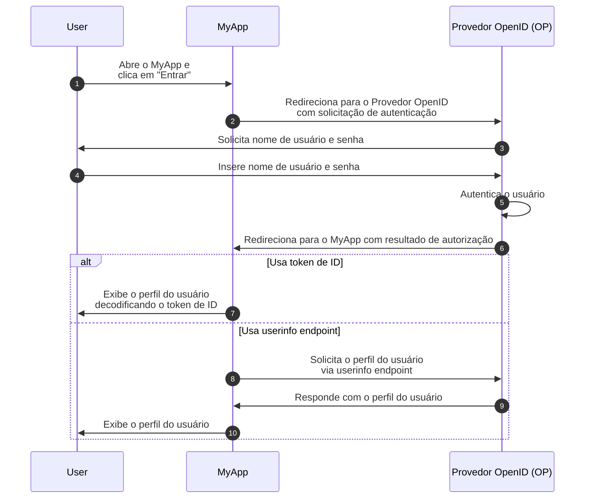
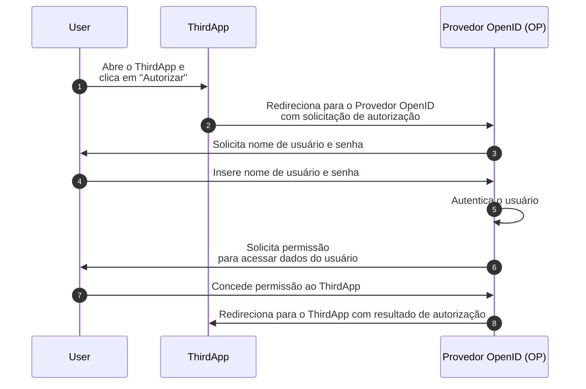

## O que é OpenID Connect (OIDC)?

OpenID Connect (OIDC) adiciona capacidades de autenticação ao <Ref slug="oauth-2.0" />, um framework de autorização, introduzindo uma camada de identidade sobre ele. OIDC permite que clientes autentiquem usuários e obtenham informações de identidade na forma de <Ref slug="id-token">tokens de ID</Ref> e respostas do <Ref slug="userinfo-endpoint" />.

Vamos dar uma olhada em um exemplo. Suponha que você tenha um aplicativo web chamado MyApp e os usuários possam fazer login usando nome de usuário e senha; após o login, eles podem acessar suas informações de perfil. Aqui está um fluxo simplificado:



Alguns termos podem ser novos para você, então vamos esclarecê-los:

### Provedor OpenID (OP) ||openid-provider-op||

Um Provedor OpenID (OP) é um <Ref slug="identity-provider" /> que implementa as especificações do OIDC e OAuth 2.0. Ou seja, um OP também é um <Ref slug="authorization-server" /> do OAuth 2.0.

Os OPs são responsáveis por autenticar usuários e emitir tokens de ID e tokens de acesso para clientes.

### Tokens

- <Ref slug="id-token">Tokens de ID</Ref> são <Ref slug="jwt">JSON Web Tokens</Ref> usados para representar informações de identidade do usuário, como nome, email e foto de perfil.
- <Ref slug="access-token">Tokens de acesso</Ref> são usados para acessar recursos protegidos em nome do usuário (o mesmo que no OAuth 2.0), por exemplo, o userinfo endpoint.

### Solicitação e resultado de autenticação

- <Ref slug="authentication-request" /> é uma solicitação feita pelo cliente ao OP para autenticar o usuário. Inclui parâmetros para especificar certos requisitos e afetará o processo de autenticação.
- Dependendo da solicitação de autenticação, o resultado da autenticação pode variar. Por enquanto, basta saber que o resultado carrega informações necessárias para o cliente identificar o usuário.

### Userinfo endpoint

<Ref slug="userinfo-endpoint" /> é um endpoint específico do OIDC que permite que clientes recuperem informações de perfil do usuário. É uma alternativa ao uso de tokens de ID, já que o userinfo endpoint geralmente fornece informações de usuário mais detalhadas do que o token de ID.

OIDC deixa para o Provedor OpenID (OP) decidir quais informações incluir no token de ID e na resposta do userinfo. Portanto, antes de analisar o token de ID ou chamar o userinfo endpoint, você deve verificar a documentação do OP para entender quais informações estão disponíveis.

## Diferenças de termos entre OAuth 2.0 e OIDC

Como o OIDC é construído sobre o OAuth 2.0, muitos termos são compartilhados entre as duas especificações. No entanto, enquanto o OAuth 2.0 foca na autorização, o OIDC introduz autenticação e identidade, tornando alguns termos inadequados no contexto do OIDC. Aqui estão algumas diferenças notáveis:

| OAuth 2.0             | OpenID Connect (OIDC)  |
|-----------------------|------------------------|
| Authorization server  | OpenID Provider (OP)   |
| Authorization request | Authentication request |
| Grant                 | Flow                   |

Essencialmente, os termos acima podem apontar para o mesmo assunto, mas têm significados diferentes no contexto do OAuth 2.0 e OIDC:

- **OpenID Provider (OP)** é um <Ref slug="authorization-server" /> do OAuth 2.0 que tem a capacidade de autenticar usuários e emitir tokens de ID.
- **<Ref slug="authentication-request" />** é uma <Ref slug="authorization-request" /> do OAuth 2.0 que usa parâmetros específicos do OIDC para solicitar autenticação do usuário final e obter um token de ID.
- **Flow** é um termo mais geral usado no OIDC para descrever o processo de autenticação e autorização do usuário, que pode envolver múltiplos passos e interações em vez de um único ciclo de solicitação-resposta. É essencialmente o mesmo que um <Ref slug="oauth-2.0-grant" />.

## Fluxos do OIDC

Como o exemplo acima mostra, os fluxos do OIDC são iniciados pelo cliente (por exemplo, MyApp) com uma solicitação de autenticação ao OP. A solicitação de autenticação especifica o fluxo a ser usado, que pode ser um dos seguintes:

- **<Ref slug="authorization-code-flow" />**: O fluxo mais seguro e recomendado para autenticação e autorização de usuários. <Ref slug="pkce" /> é obrigatório para todos os clientes no <Ref slug="oauth-2.1" />.
- **<Ref slug="implicit-flow" />**: Um fluxo simplificado que está obsoleto no OAuth 2.1 devido a preocupações de segurança.
- **<Ref slug="hybrid-flow" />**: Um fluxo do OIDC que combina o fluxo de código de autorização com o fluxo implícito. Também não é recomendado para novas aplicações devido a preocupações de segurança.

O fluxo de código de autorização e o fluxo implícito são estendidos do OAuth 2.0 para incluir tokens de ID, enquanto o fluxo híbrido é um fluxo específico do OIDC que combina ambos. Clique nos links acima para saber mais sobre cada fluxo.

## Escopos e claims do OIDC

Assim como o OAuth 2.0, o OIDC usa valores de <Ref slug="scope" /> para especificar as permissões que o cliente está solicitando. Como <Ref slug="id-token">tokens de ID</Ref> são <Ref slug="jwt">JSON Web Tokens</Ref>, eles podem incluir <Ref slug="claim">claims</Ref> (pares nome-valor) que representam informações de identidade do usuário de acordo com os escopos solicitados na <Ref slug="authentication-request" />. Tais claims também são retornados na resposta do <Ref slug="userinfo-endpoint" />.

OIDC define vários escopos padrão e claims correspondentes que os clientes podem solicitar na solicitação de autenticação:

- **openid**: Indica que o cliente é um cliente OIDC e solicita um token de ID.
- **profile**: Solicita acesso aos claims de perfil padrão do usuário, que são: `name`, `family_name`, `given_name`, `middle_name`, `nickname`, `preferred_username`, `profile`, `picture`, `website`, `gender`, `birthdate`, `zoneinfo`, `locale`, e `updated_at`.
- **email**: Solicita acesso aos claims `email` e `email_verified` do usuário.
- **address**: Solicita acesso ao claim `address` do usuário.
- **phone**: Solicita acesso aos claims `phone_number` e `phone_number_verified` do usuário.
- **offline_access**: Solicita um refresh token para permitir que o cliente obtenha novos tokens de acesso sem interação do usuário.

Confira [Standard Claims](https://openid.net/specs/openid-connect-core-1_0.html#StandardClaims) e [Requesting Claims using Scope Values](https://openid.net/specs/openid-connect-core-1_0.html#ScopeClaims) na especificação do OIDC para mais informações sobre escopos e claims. Também confira <Ref slug="offline-access" /> para uma explicação detalhada do escopo `offline_access`.

> [!Note]
> Provedores OpenID (OPs) podem suportar escopos e claims adicionais além dos padrões. Verifique a documentação do OP para mais detalhes.

## Autorização no OIDC

Se você está familiarizado com o OAuth 2.0, pode notar que o exemplo acima não envolve nenhum processo de <Ref slug="authorization" />. O exemplo omitiu a parte de consentimento do usuário porque assumimos que o MyApp é uma aplicação de primeira parte que não envolve acesso de terceiros aos dados do usuário. A autorização ainda está sendo aplicada pelo OP, mas não é explicitamente mostrada no fluxo.

A parte de consentimento do usuário é necessária quando um cliente de terceiros (por exemplo, uma aplicação que não é de propriedade do OP) solicita acesso aos dados do usuário. Nesses casos, o OP pedirá ao usuário que conceda permissão ao cliente antes de emitir o token de ID ou token de acesso. Vamos supor que há uma aplicação de terceiros chamada ThirdApp que deseja acessar os dados do usuário:



Uma vez que o processo de autorização é concluído e o ThirdApp recebe o resultado da autorização (geralmente um <Ref slug="access-token" />), ele pode acessar os dados do usuário a partir do <Ref slug="resource-server" />.

Veja <Ref slug="oauth-2.0" /> para mais informações sobre OAuth 2.0 e fluxos de autorização.

### Escopos

Semelhante ao OAuth 2.0, o OIDC usa valores de <Ref slug="scope" /> para especificar as permissões que o cliente está solicitando. Já cobrimos os escopos e claims padrão em [Escopos e claims do OIDC](#oidc-scopes-and-claims). Vale a pena notar que esses escopos e claims devem ser tratados como valores reservados no OIDC, o que significa que você NÃO deve usá-los para fins específicos de negócios.

Na prática, seu Provedor OpenID (OP) pode suportar escopos e claims personalizados para suas necessidades de negócios. Consulte a documentação do OP para mais informações sobre escopos e claims personalizados. Se você não definir escopos e claims personalizados, o OP pode ignorá-los diretamente ou retornar uma resposta de erro.

### Indicadores de recurso

Como o framework como OIDC e o OP podem reservar certos escopos e claims para propósitos específicos, geralmente o OP recomenda usar um prefixo ou namespace para evitar conflitos com valores reservados ao definir escopos e claims personalizados. Por exemplo, você pode prefixar seus escopos personalizados com `myapp:` para indicar que eles são específicos para sua aplicação.

```json
{
  "scope": "myapp:custom_scope"
}
```

No entanto, isso não pode garantir que seus escopos e claims personalizados não entrarão em conflito com valores reservados futuros, e pode aumentar o tamanho do token. Uma extensão do OAuth 2.0 chamada <Ref slug="resource-indicator">indicadores de recurso</Ref> fornece uma maneira mais flexível e escalável de alcançar o mesmo objetivo. Indicadores de recurso são URIs que representam os recursos solicitados, e eles podem ser os endpoints reais da API para refletir os recursos do mundo real. Por exemplo, você pode usar `https://api.myapp.com` como um indicador de recurso para representar os recursos da API que seu cliente deseja acessar.

Novamente, como o OIDC é construído sobre o OAuth 2.0, você pode usar indicadores de recurso em solicitações de autenticação do OIDC quando estiverem devidamente configurados. Aqui está um exemplo não normativo de uma solicitação de autenticação com um indicador de recurso:

```http
GET /authorize?response_type=code
  &client_id=YOUR_CLIENT_ID
  &redirect_uri=https%3A%2F%2Fclient.example.com%2Fcallback
  &scope=openid%20profile
  &resource=https%3A%2F%2Fapi.example.com HTTP/1.1
Host: your-openid-provider.com
```

Para usar indicadores de recurso, você precisa primeiro confirmar que seu OP suporta essa extensão (RFC 8707). Se suportado, você deve registrar um URI de indicador de recurso com o OP e usá-lo no parâmetro `resource` da solicitação de autenticação.

Confira <Ref slug="resource-indicator" /> para informações detalhadas sobre indicadores de recurso.

## Considerações de segurança do OIDC

### Comunicação segura

Todas as comunicações entre o cliente, OP e servidor de recursos devem ser protegidas usando HTTPS para evitar qualquer espionagem ou adulteração dos dados.

### Escolha fluxos seguros

Ao implementar o OIDC, é recomendado usar:

- <Ref slug="authorization-code-flow" /> com <Ref slug="pkce" /> para autenticação e autorização de usuários (obrigatório no <Ref slug="oauth-2.1" />).
- <Ref slug="client-credentials-flow" /> para comunicação máquina a máquina.

O fluxo implícito e o fluxo híbrido estão obsoletos devido a preocupações de segurança, então evite usá-los para novas aplicações e considere migrar aplicações existentes para fluxos mais seguros.

### Validação do token de ID

Ao receber um token de ID do OP, o cliente deve validar o token para garantir sua integridade e autenticidade. O processo de validação deve INCLUIR PELO MENOS as seguintes verificações:

- **Issuer**: O claim `iss` deve corresponder à URL do issuer do OP.
- **Audience**: O claim `aud` deve corresponder ao ID do cliente.
- **Expiration**: O claim `exp` deve estar no futuro.
- **Signature**: O token deve ser assinado pela <Ref slug="signing-key" /> do OP.

### Uso do token de acesso

Tokens de acesso são usados para acessar recursos protegidos em nome do usuário. Os clientes devem tratar tokens de acesso como informações sensíveis e seguir estas práticas recomendadas:

- **Armazenamento de token**: Armazene tokens de acesso de forma segura e evite expô-los a partes não autorizadas.
- **Expiração do token**: Tokens de acesso devem ter um tempo de expiração curto (por exemplo, 1 hora) para reduzir o risco de acesso não autorizado se o token for comprometido.
- **Revogação de token**: Implemente mecanismos de revogação de token para invalidar tokens de acesso quando necessário.

### Consentimento do usuário

Quando um cliente de terceiros solicita acesso aos dados do usuário, o OP deve garantir que o usuário esteja ciente das permissões solicitadas e conceda consentimento. O processo de consentimento do usuário deve ser transparente e fornecer informações claras sobre os dados sendo acessados e como serão usados.

<SeeAlso slugs={["oauth-2.0", "authorization-code-flow", "implicit-flow", "hybrid-flow", "pkce", "resource-indicator"]} />

<Resources
  urls={[
    "https://blog.logto.io/secure-cloud-apps-with-oauth-and-openid-connect",
    "https://openid.net/specs/openid-connect-core-1_0.html",
  ]}
/>
