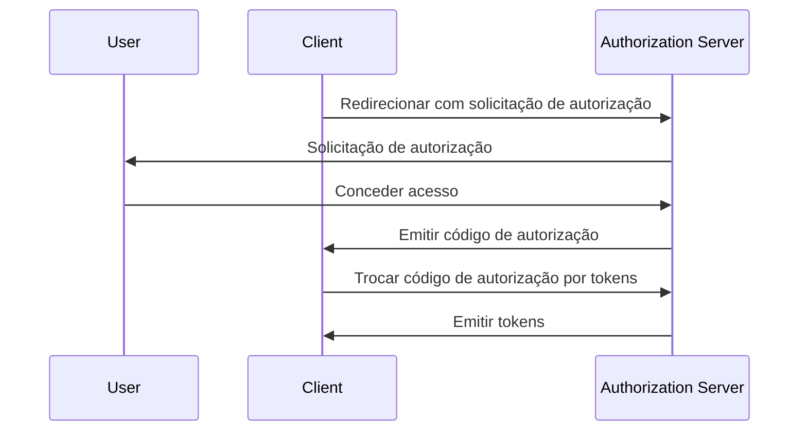

## O que é Chave de Prova para Troca de Código (PKCE)?

Chave de Prova para Troca de Código (PKCE) serve como uma extensão de segurança para <Ref slug="authorization-code-flow" /> no <Ref slug="oauth-2.0" />. Ela é projetada para proteger códigos de autorização contra interceptação e uso indevido, especialmente em clientes públicos onde o segredo do cliente não é seguro.

A partir do <Ref slug="oauth-2.1" />, PKCE é aplicada a todos os tipos de clientes, incluindo <Ref slug="client" headingId="public-clients" /> e <Ref slug="client" headingId="confidential-clients">clientes confidenciais (privados)</Ref>.

## Como funciona o PKCE?

PKCE introduz alguns passos adicionais ao fluxo de código de autorização para garantir que o <Ref slug="client" /> que troca o código de autorização seja o mesmo cliente que iniciou o fluxo.

> [!Note]
> PKCE também é aplicável aos fluxos de <Ref slug="openid-connect" /> que dependem do fluxo de código de autorização. Para simplificar, focaremos na implementação do OAuth 2.0.

Vamos revisar rapidamente o fluxo padrão de código de autorização antes de mergulharmos no PKCE:



Agora, vamos ver como o PKCE aprimora o fluxo de código de autorização.

### 1. Preparando a solicitação de autorização

#### 1.1. Cliente gera um verificador de código

Antes de iniciar a <Ref slug="authorization-request" />, o cliente deve gerar uma string aleatória chamada **verificador de código**. A string deve ser uma string criptográfica aleatória de alta entropia, segura para URL, com um comprimento mínimo de 43 caracteres e máximo de 128 caracteres.
  
Aqui está um exemplo de geração de um verificador de código em JavaScript:

```javascript
// `js-base64` é uma biblioteca universal que pode ser usada tanto no Node.js quanto em navegadores
import { fromUint8Array } from 'js-base64';

// O segundo argumento `true` indica que a saída deve ser segura para URL
const codeVerifier = fromUint8Array(crypto.getRandomValues(new Uint8Array(64)), true);
```

#### 1.2. Cliente cria um desafio de código

O cliente deve hashear o **verificador de código** usando uma função de hash criptográfica, como SHA-256, e codificar o hash em uma string Base64 segura para URL. A string resultante é chamada de **desafio de código**.

Aqui está um exemplo de criação de um desafio de código em JavaScript:

```javascript
// `js-base64` é uma biblioteca universal que pode ser usada tanto no Node.js quanto em navegadores
import { fromUint8Array } from 'js-base64';

const encodedCodeVerifier = new TextEncoder().encode(codeVerifier);
const codeChallenge = new Uint8Array(await crypto.subtle.digest('SHA-256', encodedCodeVerifier));

// O segundo argumento `true` indica que a saída deve ser segura para URL
return fromUint8Array(codeChallenge, true);
```

#### 1.3. Cliente inclui o desafio de código na solicitação de autorização

Quando o cliente inicia a solicitação de autorização, ele inclui os parâmetros `code_challenge` e `code_challenge_method` na solicitação. O parâmetro `code_challenge` contém o **desafio de código** gerado na etapa anterior, e o parâmetro `code_challenge_method` especifica o algoritmo de hash usado para criar o **desafio de código** (por exemplo, `S256` para SHA-256).

Os valores suportados para `code_challenge_method` são `plain` e `S256`, onde `plain` indica que o **desafio de código** é enviado como está, sem qualquer hash. Normalmente, `S256` é recomendado para melhor segurança.

Aqui está um exemplo não normativo de uma solicitação de autorização com PKCE:

```http
GET /authorize?response_type=code
  &client_id=YOUR_CLIENT_ID
  &redirect_uri=https%3A%2F%2Fclient.example.com%2Fcallback
  &scope=openid%20profile
  &code_challenge=YOUR_CODE_CHALLENGE
  &code_challenge_method=S256
  &state=abc123
  &nonce=123456 HTTP/1.1
```

### 2. Trocando o código de autorização por tokens

O cliente deve salvar o **verificador de código** para uso posterior e prosseguir com o fluxo de autorização como de costume. Uma vez que o cliente recebe o código de autorização, ele deve enviar a <Ref slug="token-request" /> com o **verificador de código** para o servidor de autorização.

Aqui está um exemplo não normativo de uma solicitação de token com PKCE:

```http
POST /token HTTP/1.1
Host: your-authorization-server.com
Content-Type: application/x-www-form-urlencoded

grant_type=authorization_code
  &code=YOUR_AUTHORIZATION_CODE
  &redirect_uri=https%3A%2F%2Fclient.example.com%2Fcallback
  &client_id=YOUR_CLIENT_ID
  &code_verifier=YOUR_CODE_VERIFIER
```

O servidor de autorização verificará o **desafio de código** contra o **verificador de código** para garantir que o cliente é a mesma entidade que iniciou o fluxo. Se a verificação falhar, o servidor de autorização rejeitará a solicitação de token.

## Como o PKCE aprimora a segurança

O principal benefício de segurança do PKCE é que ele previne ataques de interceptação de código de autorização, que podem ocorrer em clientes públicos. Por exemplo, se um atacante interceptar o código de autorização, ele não poderá trocá-lo por tokens sem o **verificador de código**. PKCE garante que apenas o cliente que iniciou o fluxo possa completar a troca de token.

<SeeAlso slugs={['oauth-2.1', 'authorization-code-flow']} />

<Resources
  urls={[
    "https://blog.logto.io/how-pkce-protects-the-authorization-code-flow-for-native-apps",
    "https://datatracker.ietf.org/doc/html/rfc7636",
  ]}
/>