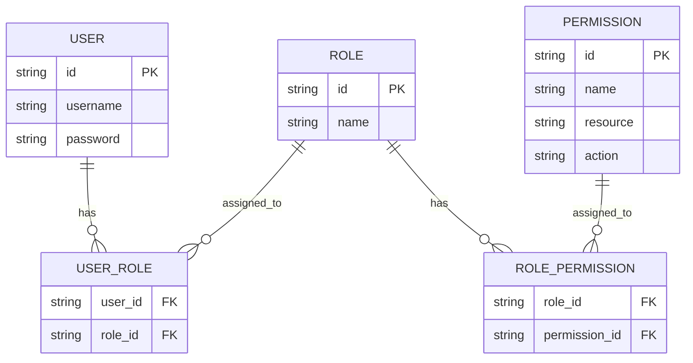
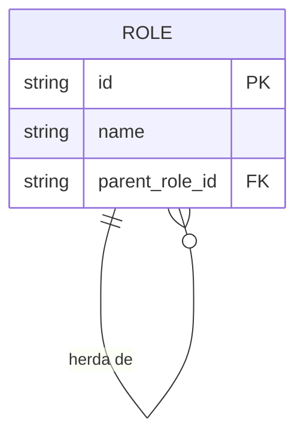
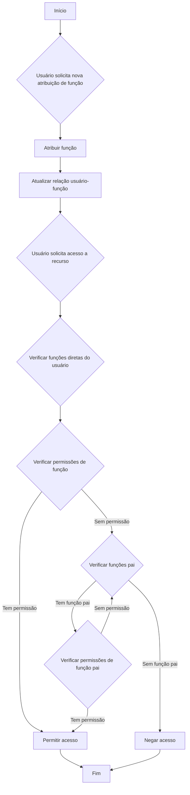
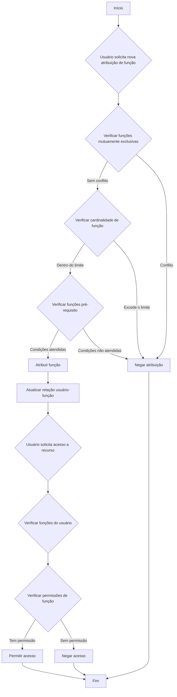

## O que é controle de acesso baseado em função (RBAC)?

O controle de acesso baseado em função (RBAC) é um modelo de controle de acesso amplamente adotado que introduz o conceito de "funções" para desvincular usuários de permissões, resultando em um sistema de gerenciamento de permissões flexível e eficiente.

A ideia central por trás do RBAC é simples, mas poderosa: em vez de atribuir permissões diretamente aos usuários, as permissões são atribuídas a funções, que são então atribuídas aos usuários. Este método indireto de alocação de permissões simplifica muito o processo de gerenciamento de direitos de acesso.

## Quais são os conceitos-chave no RBAC?

O modelo RBAC gira em torno de quatro elementos principais:

1. Usuários: Indivíduos dentro do sistema, tipicamente pessoas reais.
2. Funções: Representações de funções ou responsabilidades dentro de uma organização.
3. Permissões: Autorizações para realizar operações específicas em recursos particulares.
4. Sessões: Ambientes dinâmicos onde os usuários ativam certas funções.

O fluxo de trabalho básico do RBAC pode ser resumido da seguinte forma:
1. Definir funções com base na estrutura organizacional ou nos requisitos de negócios.
2. Atribuir permissões apropriadas a cada função.
3. Atribuir uma ou mais funções aos usuários com base em suas responsabilidades.
4. Quando um usuário tenta acessar um recurso, o sistema verifica se suas funções atribuídas têm as permissões necessárias.

## Como o RBAC é comumente usado em aplicações do mundo real?

Ao usar o RBAC em uma aplicação de negócios típica, você pode começar respondendo às três perguntas básicas a seguir:

1. Quais recursos precisam ser protegidos no sistema?
2. Quais operações precisam ser controladas nesses recursos?
3. Em cenários do mundo real, quais funções são responsáveis por executar esses recursos e operações?

Tome um sistema de e-commerce como exemplo.

Você pode primeiro identificar os recursos que precisam ser protegidos:

- Produto
- Pedido

Em seguida, você pode determinar quais operações precisam ser controladas nesses recursos, ou seja, definir as permissões para esses recursos:

- Produto
  - `read:product`
  - `create:product`
  - `delete:product`
- Pedido
  - `read:order`
  - `create:order`
  - `delete:order`

Com as permissões acima, você pode agora definir o seguinte modelo de gerenciamento de permissões com base nas funções em cenários do mundo real:

- Administrador de produto
  - Produto
    - `read:product`
    - `create:product`
    - `delete:product`
- Administrador de pedidos
  - Pedido
    - `read:order`
    - `create:order`
    - `delete:order`

Finalmente, atribua as funções aos usuários com base em suas responsabilidades:

- Alice: Administradora de produto
- Bob: Administrador de pedidos

Quando um usuário acessa um recurso, o sistema verificará se as funções atribuídas ao usuário têm as permissões necessárias.

Por exemplo, quando Alice tenta ler informações de produto, o sistema primeiro recupera suas informações de função e descobre que ela tem a função de administradora de produto.

Em seguida, o sistema consulta as permissões associadas a essa função, que incluem `read:product`, `create:product` e `delete:product`.

O sistema então verifica se a permissão necessária `read:product` existe em sua lista de permissões.

Como essa permissão existe, o sistema permite que Alice acesse a lista de produtos. Se a permissão necessária não estiver na lista, o sistema nega a solicitação de acesso.

## Por que você não deve usar funções diretamente para controle de acesso

Um erro comum na implementação do RBAC é usar funções diretamente para controle de acesso:

```typescript
// ❌ Abordagem problemática
if (user.hasRole('product_admin')) {
  await deleteProduct(productId);
}
```

Embora essa abordagem pareça simples, ela cria problemas à medida que seu sistema cresce. Por exemplo:
- Quando a equipe de marketing precisa atualizar descrições de produtos, você precisará modificar o código para verificar as funções de marketing.
- Quando você deseja que certos gerentes de produto apenas publiquem, mas não excluam produtos, você precisará criar novas verificações de função para operações relacionadas.
- Quando uma nova equipe de conteúdo precisa de acesso parcial ao produto, você novamente precisará atualizar seu código.

Em vez disso, você deve sempre verificar permissões específicas:

```typescript
// ✅ Abordagem recomendada
if (user.hasPermission('delete:product')) {
  await deleteProduct(productId);
}
```

Esta abordagem baseada em permissões oferece várias vantagens:

1. Controle de permissões detalhado: as permissões podem mapear precisamente para operações específicas de recursos:

- Criar produto: `create:product`
- Atualizar produto: `update:product`
- Excluir produto: `delete:product`
- Publicar produto: `publish:product`

2. Configuração flexível de funções: as permissões podem ser combinadas livremente em funções sem alterações no código:

```typescript
const roles = {
  product_admin: ['create:product', 'update:product', 'delete:product', 'publish:product'],
  content_editor: ['update:product'],
  publisher: ['publish:product']  // Novas funções podem ser facilmente adicionadas
};
```

Este design torna seu sistema adaptável ao crescimento dos negócios:
- Adicionar novas funções requer apenas configuração de permissões
- Ajustar permissões de funções é feito por meio de configuração
- Novos recursos precisam apenas de novas entradas de permissão

Lembre-se: as funções devem ser apenas contêineres de permissões, não a base para decisões de controle de acesso. Este design permite que o RBAC forneça o máximo valor.

## Modelos RBAC e sua evolução

### RBAC0: A fundação

RBAC0 é o modelo básico que define os conceitos centrais de usuários, funções, permissões e sessões. Ele serve como a base para todos os outros modelos RBAC.

Características principais:
- Associação usuário-função: Relação de muitos para muitos
- Associação função-permissão: Relação de muitos para muitos



Este diagrama ilustra a estrutura básica do RBAC0, mostrando as relações entre usuários, funções e permissões.

Operações principais:
1. Atribuir funções aos usuários
2. Atribuir permissões às funções
3. Verificar se um usuário tem uma permissão específica

Embora o RBAC0 forneça um ponto de partida sólido, ele tem algumas limitações:
1. Explosão de funções: À medida que a complexidade do sistema aumenta, o número de funções pode crescer rapidamente.
2. Redundância de permissões: Diferentes funções podem exigir conjuntos semelhantes de permissões, levando à duplicação.
3. Falta de hierarquia: Não pode representar relações de herança entre funções.

### RBAC1: Introduzindo hierarquias de funções

RBAC1 baseia-se no RBAC0 adicionando o conceito de herança de funções.

```plaintext
RBAC1 = RBAC0 + Herança de Funções
```

Características principais:
- Hierarquia de funções: As funções podem ter funções pai
- Herança de permissões: As funções filhas herdam todas as permissões de suas funções pai



Este diagrama mostra como as funções podem herdar de outras funções no RBAC1.

Operações principais:



Este fluxograma ilustra o processo de atribuição de funções e verificação de permissões no RBAC1, incluindo o aspecto de herança de funções.

O RBAC1 oferece várias vantagens:
1. Redução do número de funções: Menos funções base podem ser criadas por meio da herança
2. Gerenciamento simplificado de permissões: Mais fácil refletir hierarquias organizacionais

No entanto, o RBAC1 ainda tem algumas limitações:
1. Falta de mecanismos de restrição: Incapaz de restringir usuários de manter simultaneamente funções potencialmente conflitantes
2. Considerações de desempenho: As verificações de permissão podem exigir a travessia de toda a hierarquia de funções

### RBAC2: Implementando restrições

RBAC2 também é baseado no RBAC0, mas introduz o conceito de restrições.

```plaintext
RBAC2 = RBAC0 + Restrições
```

Características principais:
1. Funções mutuamente exclusivas: Os usuários não podem ser atribuídos a essas funções simultaneamente
2. Cardinalidade de função: Limita o número de usuários que podem ser atribuídos a uma função específica
3. Funções pré-requisito: Os usuários devem ter uma função específica antes de serem atribuídos a outra



Este fluxograma demonstra o processo de atribuição de funções e controle de acesso no RBAC2, incorporando as várias restrições.

O RBAC2 melhora a segurança ao prevenir a concentração excessiva de permissões e permite um controle de acesso mais preciso. No entanto, aumenta a complexidade do sistema e pode impactar o desempenho devido à necessidade de verificar múltiplas condições de restrição para cada atribuição de função.

### RBAC3: O modelo abrangente

RBAC3 combina os recursos do RBAC1 e RBAC2, oferecendo tanto herança de funções quanto mecanismos de restrição:

```plaintext
RBAC3 = RBAC0 + Herança de Funções + Restrições
```

Este modelo abrangente oferece máxima flexibilidade, mas também apresenta desafios na implementação e otimização de desempenho.

## Quais são as vantagens do RBAC (controle de acesso baseado em função)?

1. Gerenciamento simplificado de permissões: A autorização em massa por meio de funções reduz a complexidade de gerenciar permissões de usuários individuais.
2. Segurança aprimorada: Controle mais preciso sobre permissões de usuários reduz riscos de segurança.
3. Custos administrativos reduzidos: Modificar permissões de funções afeta automaticamente todos os usuários associados.
4. Alinhamento com a lógica de negócios: As funções geralmente correspondem a estruturas organizacionais ou processos de negócios, tornando-as mais fáceis de entender e gerenciar.
5. Suporte para separação de deveres: Responsabilidades críticas podem ser separadas por meio de restrições como funções mutuamente exclusivas.

## Quais são as considerações práticas de implementação?

Ao implementar o RBAC em cenários do mundo real, os desenvolvedores devem considerar esses aspectos-chave:

1. Design de banco de dados: Utilize bancos de dados relacionais para armazenar e consultar efetivamente estruturas RBAC.
2. Otimização de desempenho: Implemente estratégias de cache e otimize verificações de permissões, especialmente para modelos RBAC3 complexos.
3. Integração de API e frontend: Projete APIs claras para gerenciar usuários, funções e permissões, e considere como usar o RBAC em aplicações frontend.
4. Segurança e auditoria: Garanta a segurança do próprio sistema RBAC e implemente funções detalhadas de registro e auditoria.
5. Escalabilidade: Projete com expansões futuras em mente, como suportar regras de permissão mais complexas ou integrar com outros sistemas.
6. Experiência do usuário: Projete interfaces intuitivas para administradores do sistema configurarem e manterem facilmente a estrutura RBAC.

<SeeAlso slugs={['abac', 'access-control']} />

<Resources
  urls={[
    "https://blog.logto.io/rbac-and-abac",
    "https://blog.logto.io/mastering-rbac",
    "https://blog.logto.io/organization-and-role-based-access-control",
    "https://docs.logto.io/docs/recipes/rbac/",
    "https://en.wikipedia.org/wiki/Role-based_access_control"
  ]}
/>