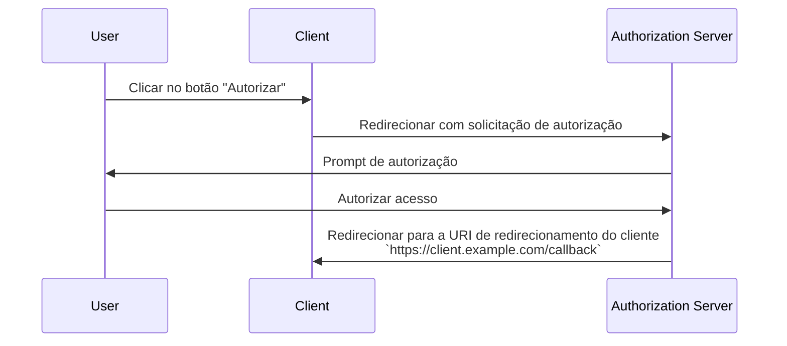

## O que é uma URI de redirecionamento?

Uma URI de redirecionamento, também conhecida como URL de callback ou URL de redirecionamento, é uma URI para indicar onde o <Ref slug="authorization-server" /> deve redirecionar o agente do usuário após a conclusão da <Ref slug="authorization-request" />.

> Universal Resource Identifier (URI) são frequentemente confundidos com URL (Uniform Resource Locator). Para mais informações, confira [Desvendando URI, URL e URN](https://blog.logto.io/unveiling-uri-url-and-urn).

Vamos dar uma olhada em um exemplo de uma solicitação de autorização que inclui uma URI de redirecionamento:

```http
GET /authorize?response_type=code
  &client_id=YOUR_CLIENT_ID
  &redirect_uri=https%3A%2F%2Fclient.example.com%2Fcallback
  &scope=openid%20profile%20email
  &state=abc123
  &nonce=123456 HTTP/1.1
```

Neste exemplo, o valor bruto do parâmetro `redirect_uri` é `https%3A%2F%2Fclient.example.com%2Fcallback`, que está codificado em URL. O valor real é `https://client.example.com/callback`.

## Como funciona uma URI de redirecionamento?

> No contexto do <Ref slug="openid-connect" />, o fluxo de trabalho para a <Ref slug="authorization-request" /> e o <Ref slug="authorization-server" /> do OAuth 2.0 aplica-se de forma semelhante. A URI de redirecionamento funciona da mesma maneira que no OAuth 2.0, tanto para a <Ref slug="authentication-request" /> quanto para o <Ref slug="openid-connect" headingId="openid-provider-op" />.

Vamos supor que o <Ref slug="client" /> inicie a solicitação de autorização a partir da URL `https://client.example.com`. Após o usuário completar o processo de autorização, o servidor de autorização redirecionará o agente do usuário (navegador) de volta para `https://client.example.com/callback`.



É claro que a URI de redirecionamento é essencial para que o servidor de autorização redirecione o agente do usuário de volta quando o processo de autorização estiver completo. Além disso, a URI de redirecionamento também é usada para receber o código de autorização ou tokens, dependendo do fluxo.

Aqui está um exemplo não normativo de como o redirecionamento real em um <Ref slug="authorization-code-flow" /> pode parecer:

```http
HTTP/1.1 302 Found
Location: https://client.example.com/callback?code=AUTHORIZATION_CODE&state=abc123
```

Note que os parâmetros de URL `code` e `state` que são anexados pelo servidor de autorização estão incluídos na URI de redirecionamento. O cliente precisa extrair os parâmetros `code` e `state` da URL para continuar o processo de autorização.

## Por que precisamos de uma URI de redirecionamento?

Como podemos ver no exemplo acima, o servidor de autorização precisa saber para onde redirecionar após uma solicitação de autorização bem-sucedida. Isso é especialmente útil quando há múltiplos clientes (ou seja, <Ref slug="single-sign-on" />), e cada cliente tem uma URI de redirecionamento diferente.

Com o <Ref slug="authorization-code-flow" />, a URI de redirecionamento também é usada para passar o código de autorização de volta para o cliente, em vez de usar o canal frontal (navegador) para evitar expor os tokens a potenciais ataques.

Era possível usar o [Resource Owner Password Credentials (ROPC) grant](https://datatracker.ietf.org/doc/html/rfc6749#section-4.3) para obter tokens para o usuário sem uma URI de redirecionamento. No entanto, ele está obsoleto no <Ref slug="oauth-2.1" /> devido a preocupações de segurança.

## Considerações de segurança

A URI de redirecionamento é um parâmetro crítico e é um alvo comum para atacantes. Aqui estão algumas considerações de segurança a serem lembradas:

- **Lista branca de URIs de redirecionamento**: O cliente deve aceitar apenas URIs de redirecionamento que estão registradas com o servidor de autorização. Isso impede que atacantes redirecionem usuários para sites maliciosos.
- **Use HTTPS**: Sempre use HTTPS para a URI de redirecionamento para proteger a comunicação entre o cliente e o servidor de autorização.
- **Correspondência exata**: A URI de redirecionamento deve corresponder exatamente à URI registrada. Servidores de autorização podem impor regras de correspondência estritas que desautorizam padrões de correspondência amplos.
- **Parâmetro de estado**: Use o parâmetro `state` para prevenir ataques de <Ref slug="csrf" />. O cliente deve validar o parâmetro `state` para garantir que ele corresponda ao valor enviado na solicitação de autorização.

<SeeAlso slugs={["csrf", "oauth-2.1", "authorization-code-flow"]} />

<Resources
  urls={[
    "https://blog.logto.io/oauth-2-1",
    "https://blog.logto.io/csrf",
    "https://blog.logto.io/redirect-uri-in-authorization-code-flow",
  ]}
/>