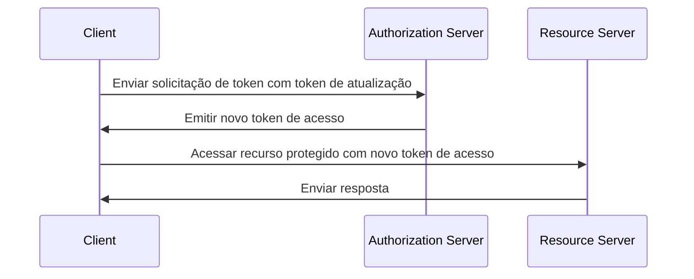

## O que é um token de atualização (refresh token)?

Um token de atualização (refresh token) é uma credencial de longa duração, tipicamente uma string aleatória, que é usada para obter novos <Ref slug="access-token">tokens de acesso (access tokens)</Ref> sem exigir que o usuário se autentique novamente. No contexto do OAuth 2.0 e OpenID Connect (OIDC), <Ref slug="authorization-server">servidores de autorização (authorization servers)</Ref> podem emitir tokens de atualização para clientes (aplicações) quando o cliente solicita <Ref slug="offline-access" />.

Embora o [RFC do OAuth 2.0](https://datatracker.ietf.org/doc/html/rfc6749#section-1.5) defina o ciclo de vida de alto nível de um token de atualização, os detalhes de implementação podem variar entre servidores de autorização e clientes. Vamos explorá-los nas seções subsequentes.

## Como funciona um token de atualização (refresh token)?

Um token de atualização é tipicamente emitido juntamente com um token de acesso quando o cliente solicita <Ref slug="offline-access" />. A norma da indústria para solicitar acesso offline é incluir o escopo `offline_access` na <Ref slug="authorization-request" />, enquanto o <Ref slug="openid-connect" /> define oficialmente o escopo `offline_access` para este propósito (disponível na <Ref slug="authentication-request" />).

Aqui está um exemplo não normativo de uma solicitação de autorização que inclui o escopo `offline_access`:

```http
GET /authorize?response_type=code
  &client_id=YOUR_CLIENT_ID
  &redirect_uri=https%3A%2F%2Fclient.example.com%2Fcallback
  &scope=openid%20profile%20email%20offline_access
  &state=abc123
  &nonce=123456 HTTP/1.1
```

Uma vez que o cliente recebe o token de atualização, ele pode usá-lo para solicitar novos tokens de acesso quando o token de acesso atual expirar. Aqui está um exemplo simplificado usando um token de atualização:



Como o diagrama de sequência ilustra, o uso de um token de atualização precisa ser suportado tanto pelo cliente quanto pelo servidor de autorização:

- O cliente deve armazenar o token de atualização de forma segura e usá-lo na <Ref slug="token-request" /> para obter um novo token de acesso.
- O servidor de autorização deve validar o token de atualização e emitir um novo token de acesso quando o cliente apresentar um token de atualização válido.

O token de atualização não deve ser compartilhado com o <Ref slug="resource-server" />. Tokens de acesso são os únicos tokens que o servidor de recursos deve verificar para autorização.

Aqui está um exemplo não normativo de uma solicitação de token usando um token de atualização:

```http
POST /token HTTP/1.1
Host: your-authorization-server.com
Content-Type: application/x-www-form-urlencoded

grant_type=refresh_token
  &refresh_token=YOUR_REFRESH_TOKEN
  &client_id=YOUR_CLIENT_ID
  &client_secret=YOUR_CLIENT_SECRET
  &scope=openid%20profile%20email
```

## Considerações de segurança ||security-considerations||

Como os tokens de atualização são de longa duração (por exemplo, dias, semanas) e podem ser usados para obter novos tokens de acesso sem interação do usuário, eles representam um risco de segurança maior do que tokens de acesso (por exemplo, minutos, horas). O uso de tokens de atualização deve ser cuidadosamente considerado e implementado para mitigar potenciais ameaças de segurança. Aqui estão algumas práticas recomendadas a considerar:

### Armazenamento seguro

Armazene tokens de atualização de forma segura no lado do cliente para prevenir acesso não autorizado. Esses mecanismos de armazenamento incluem:

- **Cookies HTTP-only**: Armazene tokens em cookies HTTP-only para evitar que o JavaScript do lado do cliente os acesse.
- **Armazenamento criptografado**: Use armazenamentos seguros como Keychain (iOS) ou KeyStore (Android) em dispositivos móveis, ou bancos de dados criptografados em aplicações web.

### Rotação de token de atualização ||refresh-token-rotation||

Embora os tokens de atualização possam ser de longa duração, rotacioná-los periodicamente ou com base em certas condições (por exemplo, após uma troca de token bem-sucedida) pode reduzir significativamente o risco de acesso não autorizado. A estratégia exata de rotação pode variar com base nos requisitos de segurança da aplicação e nas capacidades do servidor de autorização.

Aqui estão duas estratégias comuns de rotação de token:

- **Rotação baseada no tempo**: Rotacione tokens de atualização após um certo período (por exemplo, a cada 7 dias).
- **Rotação baseada em eventos**: Rotacione tokens de atualização após eventos específicos (por exemplo, troca de token bem-sucedida, mudança de senha).

Quando um token de atualização é rotacionado, o token de atualização anterior deve ser invalidado para prevenir seu reuso. Essas estratégias são frequentemente combinadas com o TTL (tempo de vida) da sessão para garantir que, após um certo período de tempo, independentemente da validade do token de atualização, o usuário deve se autenticar novamente.

### Tokens de atualização vinculados ao remetente ||sender-constrained-refresh-tokens||

Tokens de atualização vinculados ao remetente são um mecanismo de segurança para vincular o token de atualização ao cliente que o solicitou, caso o cliente não seja um <Ref slug="client" headingId="confidential-clients">cliente confidencial</Ref>. Métodos comuns são [DPoP](https://datatracker.ietf.org/doc/html/rfc9449) e [mTLS](https://datatracker.ietf.org/doc/html/rfc8705).

### Tipo de cliente

É uma boa prática limitar o uso de tokens de atualização a <Ref slug="client" headingId="confidential-clients">clientes confidenciais (privados)</Ref>.

- Clientes públicos (por exemplo, aplicações de página única) expõem o código-fonte ao lado do cliente, tornando mais fácil para atacantes extrair e abusar de tokens de atualização. Normalmente, mecanismos mais seguros como <Ref slug="pkce" /> e rotação de token de atualização são usados para clientes públicos se tokens de atualização forem necessários.
- Clientes confidenciais, por outro lado, operam em um ambiente de servidor seguro onde o código-fonte e o ambiente não são expostos ao lado do cliente. Tokens de atualização podem ser usados de forma mais segura em tais ambientes.

### Revogação de token

Como tokens de atualização são geralmente <Ref slug="opaque-token">tokens opacos</Ref> (ou seja, não têm significado para o cliente) e devem ser validados pelo servidor de autorização, o servidor de autorização pode facilmente implementar mecanismos de revogação de token para invalidar tokens de atualização quando necessário. Isso pode ser útil em cenários como logout do usuário, comprometimento de conta ou uso indevido de token.

<SeeAlso slugs={["access-token", "id-token", "jwt", "opaque-token"]} />

<Resources urls={[
  "https://blog.logto.io/understanding-refresh-token-rotation",
  "https://blog.logto.io/understanding-tokens-in-oidc",
  {
    url: "https://openid.net/specs/openid-connect-core-1_0.html#OfflineAccess",
    result: {
      ogTitle: "Acesso Offline no OpenID Connect Core 1.0",
    }
  },
  {
    url: "https://datatracker.ietf.org/doc/html/rfc6749#section-1.5",
    result: {
      ogTitle: "Token de Atualização no OAuth 2.0",
      ogDescription: "Tokens de atualização são credenciais usadas para obter tokens de acesso."
    },
  },
]} />
