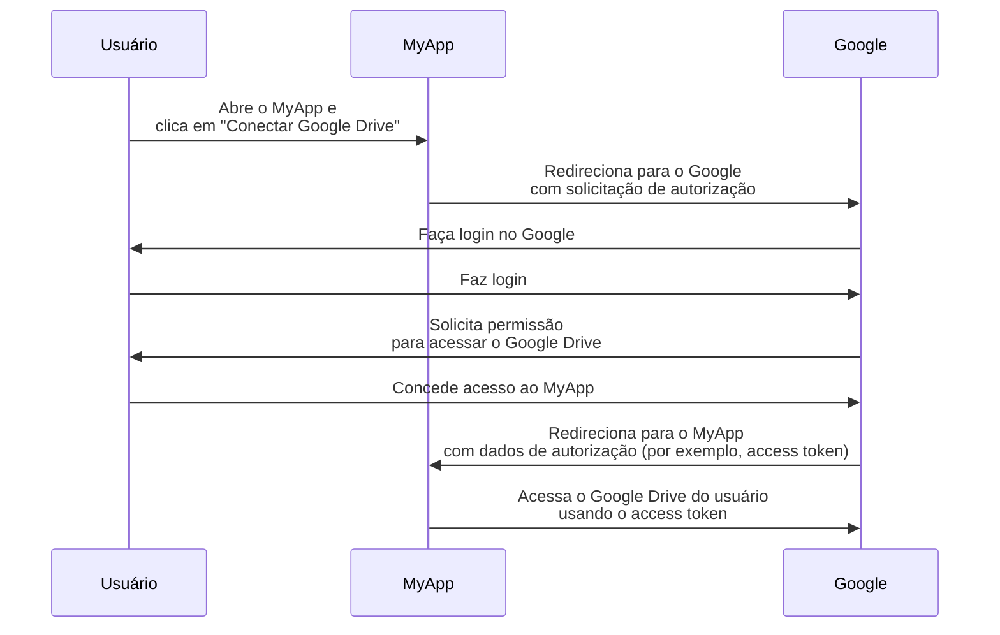

## O que é um proprietário do recurso?

No contexto de <Ref slug="oauth-2.0" />, um proprietário do recurso é uma identidade (tipicamente um usuário) que tem a capacidade de conceder acesso a um recurso protegido (por exemplo, dados, arquivos ou serviços).

Por exemplo, você tem um aplicativo web MyApp que deseja acessar o Google Drive do usuário. Aqui está um fluxo típico do OAuth 2.0:

Neste fluxo, o **usuário** é o **proprietário do recurso** que concede acesso ao seu Google Drive para o MyApp, enquanto o **MyApp** é o <Ref slug="client" /> que deseja acessar os recursos protegidos e o **Google** é tanto o <Ref slug="authorization-server" /> quanto o <Ref slug="resource-server" />.

Como o nome sugere, o proprietário do recurso possui alguns recursos em um <Ref slug="resource-server" /> e pode autorizar clientes a acessá-los em seu nome no contexto do <Ref slug="oauth-2.0" />.

## Por que o proprietário do recurso é importante?

Durante um processo de <Ref slug="authorization" />, o proprietário do recurso é indispensável porque é ele quem concede ou nega explicitamente o acesso aos seus recursos. O consentimento do proprietário do recurso é obrigatório por razões técnicas e de conformidade:

- **Técnico**: O consentimento do proprietário do recurso garante que o cliente tenha as permissões necessárias para acessar os recursos. Em vez de acesso total ou nenhum, o proprietário do recurso pode conceder acesso parcial de acordo com a solicitação do cliente. Por outro lado, o proprietário do recurso também pode revogar explicitamente o acesso a qualquer momento. Esta abordagem fornece uma maneira clara e auditável de <Ref slug="access-control" />.
- **Conformidade**: O consentimento do proprietário do recurso é um requisito legal em muitas jurisdições, especialmente ao lidar com dados sensíveis. Por exemplo, o Regulamento Geral sobre a Proteção de Dados (GDPR) exige que o titular dos dados (proprietário do recurso) forneça consentimento explícito para atividades de processamento de dados.

## Proprietário do recurso vs. servidor de recursos

<Ref slug="resource-server">Servidores de recursos</Ref> são responsáveis por hospedar e servir os **recursos protegidos**. Eles são os guardiões que verificam os access tokens e servem os recursos aos clientes.

O proprietário do recurso, por outro lado, pode ter controle total ou parcial sobre os recursos protegidos no servidor de recursos de acordo com as políticas de <Ref slug="access-control" />.

<SeeAlso slugs={["resource-server", "oauth-2.0", "resource-indicator", "access-control"]} />

<Resources
  urls={[
    "https://tools.ietf.org/html/rfc6749",
  ]}
/>