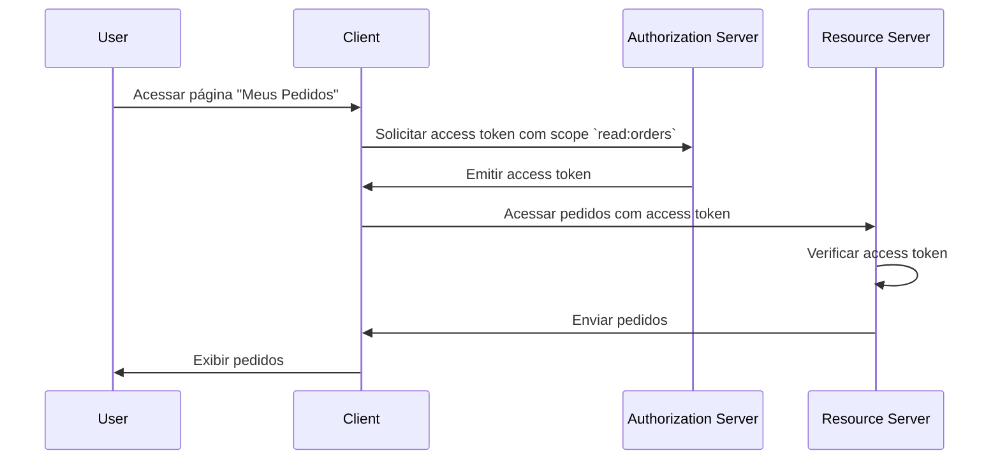

## O que é um servidor de recursos?

No contexto do <Ref slug="oauth-2.0" />, um **servidor de recursos** é um servidor que hospeda os **recursos protegidos** que o <Ref slug="client" /> deseja acessar. O servidor de recursos também é responsável por verificar o <Ref slug="access-token" /> e servir os recursos protegidos ao cliente de acordo com as políticas de <Ref slug="access-control" />.

Por exemplo, considere um aplicativo web MyApp que deseja acessar o Google Drive do usuário. Neste cenário:

- **MyApp** é o cliente que deseja acessar os recursos protegidos.
- **Google** é o servidor de recursos que hospeda o Google Drive do usuário.
- **Google** também é o <Ref slug="authorization-server" /> que emite o access token para o MyApp.

Vamos considerar outro exemplo onde um site de e-commerce deseja acessar o histórico de pedidos de um usuário a partir de um serviço de pedidos interno. Neste caso:

- **Site de e-commerce** é o cliente que deseja acessar os recursos protegidos.
- **Serviço de pedidos** é o servidor de recursos que hospeda o histórico de pedidos do usuário.
- Se o site de e-commerce se integra com um serviço OAuth 2.0 ou provedor OpenID, esse serviço (provedor) atua como o authorization server.

## Como funciona um servidor de recursos?

OAuth 2.0 define os papéis do servidor de recursos e do authorization server separadamente para fornecer uma clara separação de responsabilidades. No entanto, não define uma representação específica do servidor de recursos no framework, referindo-se a ele como um conceito virtual que hospeda os recursos protegidos; o <Ref slug="client" /> precisa especificar <Ref slug="scope">scopes</Ref> para os recursos protegidos que deseja acessar.

Digamos que o cliente deseja acessar o histórico de pedidos do usuário a partir do serviço de pedidos. Um exemplo não normativo de envio de um <Ref slug="token-request" /> para acessar os pedidos pode ser assim:



No diagrama de sequência acima, o cliente solicita um access token com o scope `read:orders` do authorization server. Assumimos que todas as partes concordaram sobre o significado do scope `read:orders`: ele especifica que o cliente deseja realizar ações de `leitura` nos `pedidos` servidos pelo servidor de recursos. O cliente então usa o access token para acessar os pedidos do servidor de recursos.

> [!Nota]
> O significado e a estrutura dos scopes não são definidos pelo OAuth 2.0 e devem ser acordados pelo cliente, authorization server e servidor de recursos.

O servidor de recursos é responsável por verificar o access token e determinar se o cliente tem as permissões necessárias para acessar os recursos solicitados de acordo com as políticas de <Ref slug="access-control" />. Dependendo da implementação, o access token pode ser um <Ref slug="opaque-token" /> ou um <Ref slug="jwt" />.

## Convenções de nomenclatura

É flexível nomear o servidor de recursos de acordo com o contexto da aplicação. Como o OAuth 2.0 não define uma representação específica do servidor de recursos no parâmetro <Ref slug="scope" />, você pode ver múltiplas convenções na indústria:

- Omitir o nome do servidor de recursos e usar apenas a ação: Por exemplo, `read` e `write`.
- `[verbo]:[recurso]`: Uma convenção comum é usar a combinação `verbo` e `recurso` para especificar as ações que o cliente pode realizar no recurso. Por exemplo, `read:orders` e `write:profile`. Às vezes, eles são invertidos como `orders:read` e `profile:write`.
- `[uri]:[ação]`: Outra convenção é usar o URI do recurso e a ação que o cliente pode realizar. Por exemplo, `https://api.example.com/orders:read` e `https://api.example.com/profile:write`.

## Indicadores de recursos

Vamos ver um exemplo do parâmetro scope em uma <Ref slug="authentication-request" /> (decodificada):

```plaintext
openid profile email https://api.example.com/orders:read
```

Neste exemplo, o parâmetro `scope` inclui os scopes `openid`, `profile` e `email`, que são scopes padrão do <Ref slug="openid-connect" />, juntamente com o scope `https://api.example.com/orders:read` que especifica a localização do servidor de recursos e a permissão para ler os recursos.

Parece adequado neste caso específico, mas à medida que o número de recursos e scopes cresce, pode se tornar desafiador gerenciar e entender os scopes. Para resolver esse problema, o OAuth 2.0 introduziu uma extensão chamada <Ref slug="resource-indicator">indicadores de recursos</Ref> (RFC 8707) que permite que os clientes usem URIs para especificar os recursos que desejam acessar, tornando os servidores de recursos mais explícitos no processo.

Após adicionar um parâmetro de indicador de recurso à solicitação de autenticação (`resource=https://api.example.com/orders`), o parâmetro scope pode ser simplificado para:

```plaintext
openid profile email read
```

O que parece mais limpo e é mais fácil de gerenciar.

> [!Nota]
> Nem todos os authorization servers (provedores OpenID) suportam a extensão de indicador de recurso. Por favor, verifique a documentação do seu authorization server antes de usá-la.

<SeeAlso slugs={["access-control", "resource-indicator", "resource-owner", "client"]} />

<Resources
  urls={[
    "https://datatracker.ietf.org/doc/html/rfc8707",
  ]}
/>