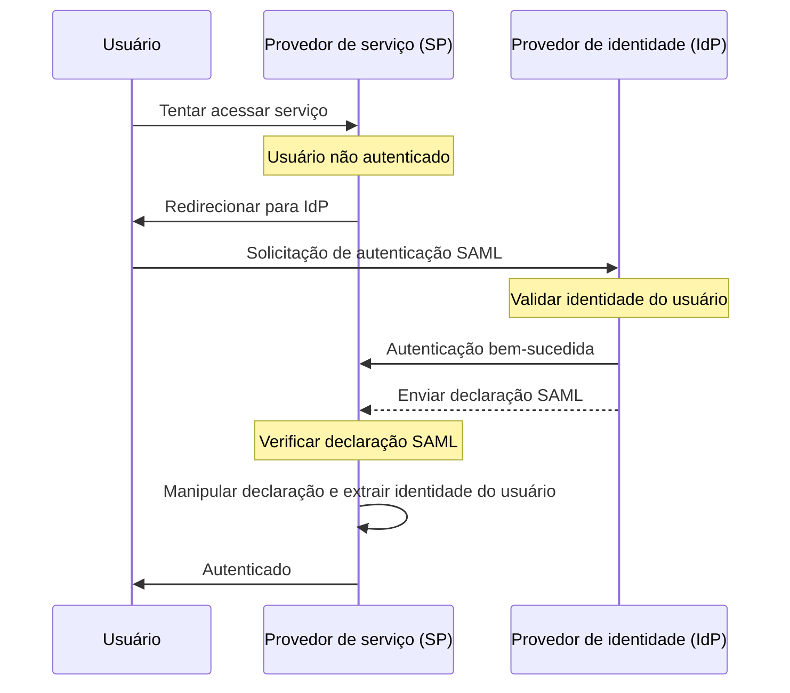

## O que é SAML?

SAML (geralmente referido como SAML 2.0) é um padrão baseado em XML para troca de dados de autenticação (authentication) e autorização (authorization) entre duas partes: o <Ref slug="identity-provider" /> e o <Ref slug="service-provider" />. É amplamente utilizado para federação de identidade e soluções de <Ref slug="enterprise-sso" />.

Como o nome sugere, SAML transmite declarações sobre a identidade e atributos do usuário. Essas declarações são assinadas digitalmente e, opcionalmente, criptografadas para garantir sua integridade e confidencialidade.

## Como o SAML funciona?

Antes de mergulhar no fluxo de autenticação (authentication) SAML, precisamos entender como provedores de identidade e provedores de serviço podem se reconhecer e confiar um no outro. Essa confiança é estabelecida por meio da troca de metadados, onde ambas as partes compartilham informações sobre:

- **ID da entidade**: Um identificador único para o provedor de identidade ou provedor de serviço.
- **Chave pública**: Usada para verificar as assinaturas digitais nas declarações SAML.
- **Endpoints**: URLs para diferentes operações SAML, como solicitações e respostas de autenticação (authentication requests).

Uma vez que a confiança é estabelecida, o fluxo de autenticação (authentication) SAML pode prosseguir:

### RelayState

No fluxo SAML, o parâmetro `RelayState` é usado para manter o estado do usuário durante o processo de autenticação (authentication). Ele atua como uma referência à solicitação original feita pelo usuário antes de ser redirecionado para o provedor de identidade. O provedor de serviço pode usar esse parâmetro para redirecionar o usuário de volta à página ou recurso original após a autenticação bem-sucedida.

RelayState também é usado para prevenir ataques de <Ref slug="csrf" />, garantindo que o usuário seja redirecionado de volta para a página correta após a autenticação (authentication).

### Declarações SAML

As declarações SAML são o componente central do protocolo SAML. Elas contêm informações sobre a identidade do usuário, atributos e status de autenticação (authentication). Existem três tipos de declarações SAML:

- **Declaração de autenticação (authentication assertion)**: Indica que o usuário foi autenticado pelo provedor de identidade.
- **Declaração de atributo (attribute assertion)**: Contém informações adicionais sobre o usuário, como funções, permissões e dados de perfil.
- **Declaração de decisão de autorização (authorization decision assertion)**: Especifica os direitos de acesso do usuário a recursos específicos.

## Considerações para adoção do SAML

O SAML é amplamente adotado em ambientes empresariais desde seu início no início dos anos 2000. Aqui estão algumas considerações importantes ao adotar o SAML para suas aplicações:

- Complexidade: Implementações de SAML podem ser complexas ao integrar com suas aplicações, especialmente em comparação com frameworks modernos como <Ref slug="oauth-2.0" /> e <Ref slug="openid-connect" />.
- Eficiência de transporte: Mensagens SAML podem ser grandes devido à formatação XML, o que pode impactar o desempenho da rede.
- Segurança: Declarações SAML devem ser protegidas contra adulteração e espionagem. Certifique-se de que sua implementação SAML siga as melhores práticas para criptografia e assinaturas digitais.

Apesar dessas considerações, o SAML continua sendo um padrão robusto e amplamente utilizado para federação de identidade segura e soluções de single sign-on em ambientes empresariais. No entanto, para novas aplicações ou serviços, você pode querer considerar alternativas modernas como OAuth 2.0 e OpenID Connect para uma abordagem mais leve e amigável ao desenvolvedor para autenticação (authentication) e autorização (authorization).

<SeeAlso slugs={["enterprise-sso", "oauth-2.0", "openid-connect"]} />

<Resources
  urls={[
    "https://blog.logto.io/saml-security-cheat-sheet",
    "https://blog.logto.io/picking-your-sso-method",
    "https://blog.logto.io/differences-between-saml-and-oidc",
  ]}
/>