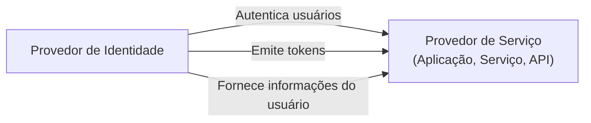

## O que é um provedor de serviço (SP)?

No domínio de <Ref slug="iam" />, um provedor de serviço (SP) (ou uma **parte confiável** no contexto de <Ref slug="openid-connect" />) é uma aplicação ou serviço que depende de um <Ref slug="identity-provider" /> para autenticação e autorização. Ele é responsável por fornecer serviços aos usuários e aplicar políticas de <Ref slug="access-control" /> com base nos tokens emitidos pelo provedor de identidade.

## Padrões de provedor de serviço

Não há um padrão estrito para provedores de serviço, pois eles podem ser qualquer tipo de aplicação ou serviço que requer gerenciamento de identidade. No entanto, os provedores de serviço geralmente seguem os padrões estabelecidos pelo provedor de identidade do qual dependem. Por exemplo, se o provedor de identidade suporta <Ref slug="openid-connect" />, o provedor de serviço normalmente usará OIDC para autenticação e autorização.

## Arquitetura do provedor de serviço

O termo "provedor de serviço" não especifica uma arquitetura ou implementação particular. Normalmente, os provedores de serviço precisam ser registrados com o provedor de identidade para estabelecer confiança e permitir comunicação segura. O processo de registro geralmente envolve a troca de metadados e credenciais de cliente.

Por exemplo, no contexto do OpenID Connect, os metadados do provedor de serviço geralmente incluem:

- **ID do Cliente**: Um identificador único para o provedor de serviço.
- **Segredo do Cliente**: Um segredo compartilhado usado para autenticar o provedor de serviço.
- **<Ref slug="redirect-uri">URIs de Redirecionamento</Ref>**: Os URIs para onde o provedor de identidade redirecionará os usuários após a autenticação e autorização.

Uma vez registrado, o provedor de serviço pode iniciar o processo de <Ref slug="authentication" /> redirecionando os usuários para o endpoint especificado do provedor de identidade.

Quando os provedores de serviço são construídos para casos de uso sem interação, eles são frequentemente referidos como <Ref slug="client">clientes</Ref> que requerem comunicação <Ref slug="machine-to-machine" />.

<SeeAlso slugs={["identity-provider", "openid-connect", "oauth-2.0"]} />

<Resources
  urls={[
    "https://blog.logto.io/secure-cloud-apps-with-oauth-and-openid-connect",
    "https://blog.logto.io/incorporate-identity-solution",
    "https://blog.logto.io/centralized-identity-system"
  ]}
/>