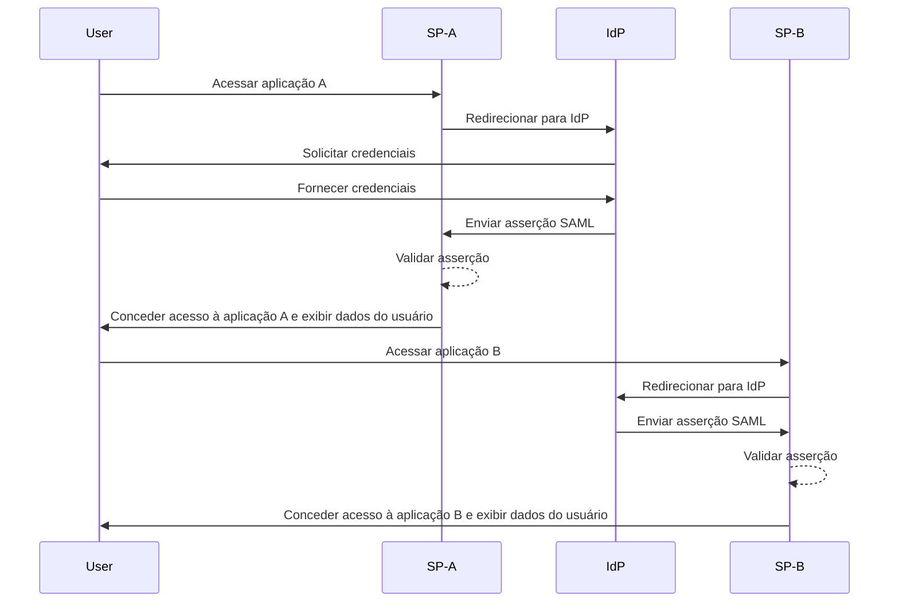
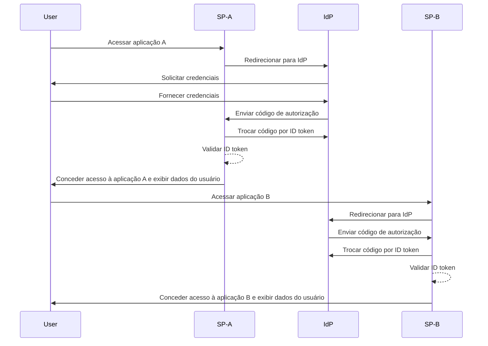

## O que é single sign-on (SSO)?

Single sign-on (SSO) é um método de <Ref slug="authentication" /> que permite aos usuários acessar múltiplas aplicações ou serviços com um único conjunto de credenciais. Em vez de gerenciar logins separados para cada sistema, os usuários se autenticam uma vez e são automaticamente conectados a todas as plataformas conectadas.

O SSO é comumente usado em ambientes pessoais e empresariais, especialmente em ambientes corporativos onde funcionários ou trabalhadores remotos dependem de várias aplicações SaaS para realizar seu trabalho. Ao implementar o SSO, as organizações podem aumentar a segurança, simplificar o gerenciamento de acesso e aumentar a produtividade dos usuários.

Um exemplo bem conhecido de SSO é o conjunto de serviços do Google, como Gmail, Google Drive e Google Calendar. Após fazer login em sua conta do Google, os usuários podem acessar facilmente todos esses serviços sem precisar inserir suas credenciais novamente.

## Como funciona o single sign-on?

O SSO opera em uma relação de confiança entre uma aplicação ou serviço, conhecido como <Ref slug="service-provider" /> e um <Ref slug="identity-provider" />. O IdP lida com a autenticação do usuário e compartilha de forma segura as informações necessárias com o SP para conceder acesso. Essa confiança é estabelecida através de um processo chamado federação, onde tanto o SP quanto o IdP concordam em padrões e protocolos específicos para trocar dados de autenticação de forma segura.

Quando um usuário tenta acessar uma aplicação habilitada para SSO, o SP o redireciona para o IdP para autenticação. O IdP solicita as credenciais do usuário, verifica sua identidade e gera um token de segurança ou asserção contendo as informações do usuário. Este token é enviado de volta para o SP, que então o utiliza para conceder acesso.

Se o usuário tentar acessar outra aplicação habilitada para SSO, o processo é repetido automaticamente sem exigir que ele faça login novamente. O IdP envia os dados de autenticação necessários diretamente para o SP, permitindo que o usuário acesse a nova aplicação de forma contínua.

<Ref slug="saml" /> e <Ref slug="openid-connect" /> são dois protocolos amplamente utilizados para implementar o SSO. Esses padrões definem como os dados de autenticação são trocados entre o IdP e o SP, garantindo uma comunicação segura e confiável.

### SSO baseado em SAML

No SSO baseado em SAML, uma vez que o usuário é autenticado pelo IdP, uma asserção SAML baseada em XML é gerada, assinada e enviada de forma segura para o SP. O SP então valida a asserção e concede acesso com base na identidade do usuário.

### SSO baseado em OIDC

OIDC, em contraste, é construído sobre o <Ref slug="oauth-2.0" /> e oferece uma abordagem mais moderna para o SSO. Ele usa <Ref slug="jwt" /> para trocar informações de identidade entre o IdP e o SP, proporcionando maior segurança e flexibilidade.

## Benefícios do single sign-on

1. **Segurança aprimorada**: O SSO reduz o risco de violações de segurança relacionadas a senhas, minimizando o número de credenciais que os usuários precisam lembrar. Ele também permite que as organizações imponham métodos de autenticação mais fortes, como <Ref slug="mfa" />, para proteger as contas dos usuários.

2. **Experiência do usuário melhorada**: Os usuários podem acessar múltiplas aplicações de forma contínua sem a necessidade de fazer login repetidamente, aumentando a produtividade e reduzindo a frustração. O SSO simplifica o processo de login e proporciona uma experiência de usuário consistente em diferentes plataformas.

3. **Gerenciamento centralizado de acesso**: As organizações podem gerenciar centralmente o acesso e as permissões dos usuários através do IdP, garantindo políticas de segurança consistentes e controles de acesso em todas as aplicações conectadas. Isso simplifica os processos de provisionamento, desprovisionamento e auditoria de usuários.

## Quando usar single sign-on

1. **Ambientes empresariais e organizacionais**: O SSO é particularmente benéfico para empresas que dependem de múltiplas aplicações e serviços para otimizar fluxos de trabalho. Ele simplifica o acesso dos usuários e reduz o fardo das equipes de TI em gerenciar contas de usuários individuais. Por exemplo, empresas que usam múltiplas aplicações SaaS, como CRM, RH e ferramentas de colaboração.
2. **Aplicações voltadas para o cliente**: O SSO também pode melhorar a experiência do usuário para clientes que acessam serviços online ou plataformas de e-commerce. Por exemplo, permitindo que os usuários façam login com suas contas de redes sociais ou endereços de e-mail em vez de criar novas contas para cada serviço.
3. **Serviços multi-produto**: Empresas que oferecem um conjunto de produtos ou serviços interconectados podem aproveitar o SSO para proporcionar uma experiência de usuário contínua em suas ofertas. Os usuários podem navegar entre diferentes aplicações sem o incômodo de logins repetidos. Por exemplo, o G Suite do Google. Os usuários podem fazer login uma vez em seu navegador Chrome e acessar múltiplos serviços do Google sem precisar inserir suas credenciais novamente.

O uso do SSO não se limita a esses cenários e pode ser adaptado a vários casos de uso com base nas necessidades específicas de uma organização ou aplicação. É amplamente considerado uma prática recomendada para melhorar a segurança, a experiência do usuário e a eficiência operacional em ambientes digitais modernos.

<SeeAlso slugs={["enterprise-sso"]} />