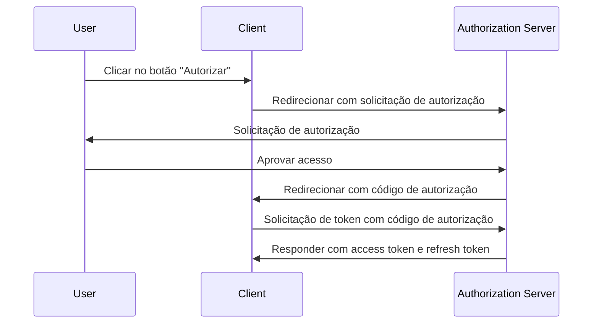
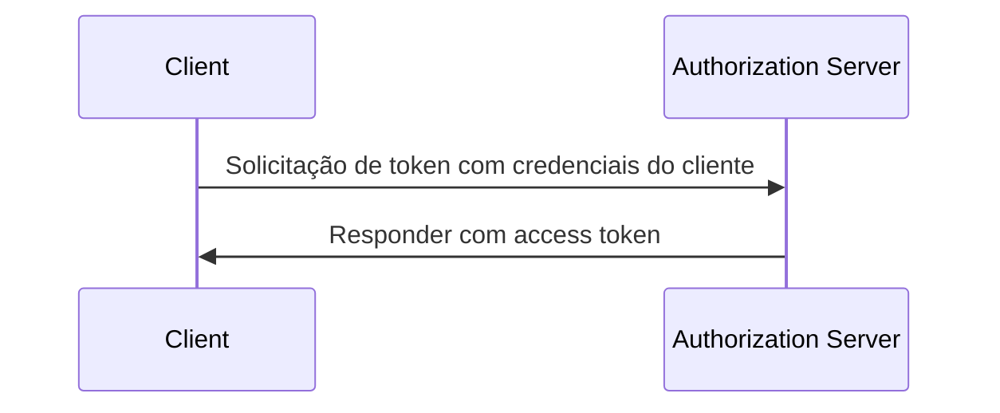

## O que é uma solicitação de token (token request)?

No <Ref slug="oauth-2.0" /> e <Ref slug="openid-connect" />, uma solicitação de token (token request) é uma solicitação ao <Ref slug="authorization-server" /> (ou <Ref slug="openid-connect" headingId="openid-provider-op" /> no OIDC) para troca de credenciais (por exemplo, código de autorização, refresh token) por um conjunto de tokens. O conjunto de tokens geralmente inclui um ou mais dos seguintes:

- <Ref slug="access-token" />: Um token que concede acesso a recursos protegidos.
- <Ref slug="id-token" />: Um token que contém informações do usuário (específico do OIDC).
- <Ref slug="refresh-token" />: Um token que pode ser usado para obter um novo access token sem interação do usuário.

Dependendo do <Ref slug="oauth-2.0-grant">tipo de concessão (grant type)</Ref> usado, a solicitação pode incluir diferentes parâmetros e retornar diferentes tokens.

Por exemplo, no <Ref slug="client-credentials-flow" />, o <Ref slug="client" /> solicita diretamente um <Ref slug="access-token" /> com credenciais do cliente. Aqui está um exemplo não normativo da solicitação de token:

```http
POST /token HTTP/1.1
Host: authorization-server.example.com
Content-Type: application/x-www-form-urlencoded

grant_type=client_credentials
  &client_id=client-id
  &client_secret=client-secret
  &scope=read
```

Se a solicitação for bem-sucedida, o authorization server responde com um access token:

```http
HTTP/1.1 200 OK
Content-Type: application/json

{
  "access_token": "eyJhbGci...zHg",
  "token_type": "Bearer",
  "expires_in": 3600,
  "scope": "read"
}
```

## Como funciona uma solicitação de token (token request)?

Como mostra o exemplo acima, a solicitação de token em si é direta. O client envia uma solicitação HTTP para o endpoint de token do authorization server com os parâmetros necessários. O authorization server valida a solicitação, processa-a e retorna os tokens na resposta.

No entanto, de acordo com o tipo de concessão (fluxo) específico usado, a solicitação de token pode precisar de mais preparação.

### Fluxo de código de autorização (Authorization code flow)

No <Ref slug="authorization-code-flow" />, o client primeiro obtém um código de autorização iniciando uma <Ref slug="authorization-request" /> (ou <Ref slug="authentication-request" /> no OIDC) com o authorization server. Uma vez que o usuário concede permissão, o client troca o código de autorização por um access token e, opcionalmente, um refresh token via a solicitação de token.

Aqui está um diagrama de sequência simplificado do fluxo de código de autorização:



### Fluxo de credenciais do cliente (Client credentials flow)

Como o exemplo na primeira seção mostra, o <Ref slug="client-credentials-flow" /> é muito mais simples. O client solicita diretamente um access token com suas credenciais de cliente. O authorization server valida as credenciais do cliente e emite um access token se for bem-sucedido.

Aqui está um diagrama de sequência não normativo do fluxo de credenciais do cliente:



### Refresh token

Em alguns tipos de concessão, o client também pode solicitar <Ref slug="offline-access" /> incluindo o escopo `offline_access` na solicitação de autorização. Se concedido, o authorization server emite um refresh token junto com o access token. O client pode usar o refresh token para obter um novo access token via a solicitação de token sem interação do usuário.

Aqui está um exemplo não normativo de uso de um refresh token para obter um novo access token:

```http
POST /token HTTP/1.1
Host: authorization-server.example.com
Content-Type: application/x-www-form-urlencoded

grant_type=refresh_token
  &refresh_token=refresh-token
  &client_id=client-id
  &client_secret=client-secret
```

---

Outros <Ref slug="oauth-2.0-grant">tipos de concessão (grant types)</Ref> também podem envolver solicitações de token, mas a ideia básica permanece a mesma.

## Parâmetros chave em uma solicitação de token

Aqui estão alguns parâmetros chave que são comumente usados em uma solicitação de token:

- **`grant_type`**: O tipo de concessão sendo solicitado. Valores comuns incluem `authorization_code`, `client_credentials`, `refresh_token`, etc.
- **`client_id`**: O identificador do client emitido pelo authorization server.
- **`client_secret`**: O segredo do client emitido pelo authorization server (para clients confidenciais).
- **`code`**: O código de autorização obtido do authorization server (para o fluxo de código de autorização).
- **`refresh_token`**: O refresh token obtido do authorization server (para atualização de access tokens).
- **`scope`**: Os <Ref slug="scope">escopos</Ref> (permissões) solicitados para o access token.
- **`redirect_uri`**: O URI onde o authorization server envia a resposta (para o fluxo de código de autorização).
- **`code_verifier`**: O verificador de código usado na extensão <Ref slug="pkce" /> (para o fluxo de código de autorização).

Os parâmetros reais e seus valores dependem do tipo de concessão e dos requisitos específicos da aplicação. Antes de fazer uma solicitação de token, você deve consultar a lista completa de parâmetros para o tipo de concessão específico que está usando.

<SeeAlso slugs={["oauth-2.0", "openid-connect", "authorization-request", "authentication-request"]} />