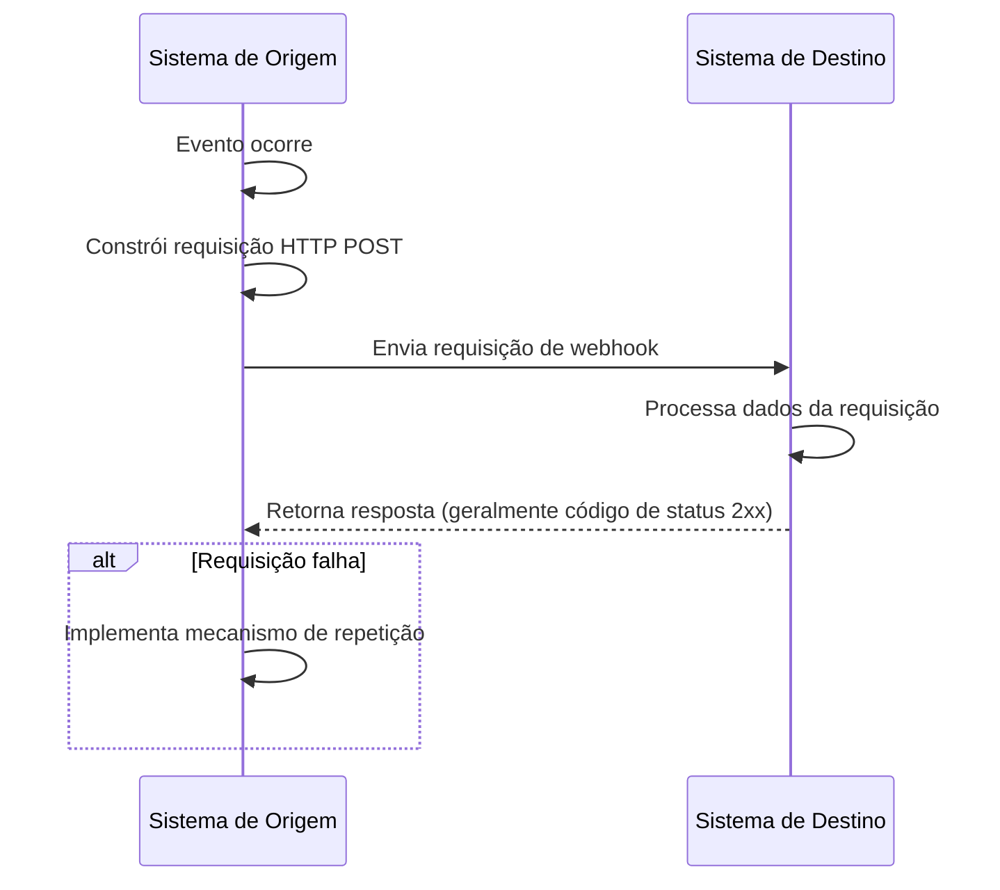
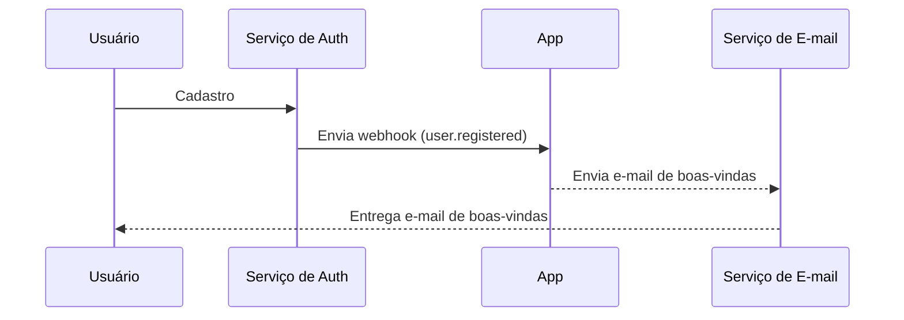

## O que é um webhook?

Um webhook é um mecanismo de callback HTTP que permite que aplicações enviem notificações em tempo real para URLs predefinidas quando eventos específicos ocorrem. Esse mecanismo possibilita a troca automatizada de dados e a comunicação em tempo real entre sistemas.

## Como funcionam os webhooks?



1. Um evento específico ocorre no sistema de origem
2. O sistema de origem constrói uma requisição HTTP POST contendo dados do evento
3. O sistema de origem envia a requisição para a URL do sistema de destino pré-configurada
4. O sistema de destino recebe a requisição e processa os dados
5. O sistema de destino retorna uma resposta ao sistema de origem
6. Se a requisição falhar, o sistema de origem pode implementar um mecanismo de repetição

## Como funcionam os webhooks em um cenário do mundo real?

Vamos tomar como exemplo uma aplicação integrada com um serviço de auth. Quando um novo usuário se cadastra, a aplicação enviará um e-mail de boas-vindas ao usuário.

Normalmente, o serviço de auth fornece um evento de webhook `user.registered` que é acionado quando um novo usuário completa o registro.

A carga útil do evento de webhook contém as informações do usuário, como e-mail e nome de usuário, que podem ser usadas para enviar o e-mail de boas-vindas:

```json
// Nota: a estrutura real da carga útil depende do serviço de auth.
{
  "event": "user.registered",
  "timestamp": "2024-03-21T08:00:00Z",
  "data": {
    "user_id": "u_1234567890",
    "email": "john@example.com",    // Endereço de e-mail para enviar o e-mail de boas-vindas
    "username": "johndoe",          // Nome de usuário para personalizar o e-mail
    "registered_at": "2024-03-21T08:00:00Z"
  }
}
```

Veja como funciona o fluxo do webhook:



## Quais são as melhores práticas para implementar webhooks?

Quando você é o remetente (produtor) de webhooks, considere os seguintes aspectos:

### Design de webhook

Projete estruturas de webhook claras e consistentes:

- Defina tipos de eventos claros: Por exemplo, `order.created`, `user.updated`, etc.
- Use formato JSON padrão: Garanta que a estrutura de dados seja clara e fácil de analisar.
- Controle de versão: Inclua informações de versão nos cabeçalhos da requisição ou na carga útil. Por exemplo:

  ```javascript
  // Nos cabeçalhos da requisição
  headers: {
    'Content-Type': 'application/json',
    'X-Webhook-Version': '1.0'
  }
  
  // Ou na carga útil
  {
    "version": "1.0",
    "event_type": "order.created",
    "data": {
      // Detalhes do evento
    }
  }
  ```

- Forneça contexto suficiente: Inclua timestamps de quando os eventos ocorreram, identificadores únicos para recursos relacionados, etc.
- Mantenha a consistência: Use convenções de nomenclatura e estruturas de dados consistentes em todos os tipos de eventos.

### Mecanismo de envio

Implemente um mecanismo de envio de webhook confiável:

- Use filas de tarefas assíncronas: Evite bloquear o programa principal e melhore a capacidade de resposta do sistema.
- Implemente mecanismos de repetição: Lide com falhas de rede ou indisponibilidade temporária do receptor.

### Estratégia de repetição

Desenhe uma estratégia de repetição apropriada:

- Implemente backoff exponencial: Evite repetições frequentes que possam sobrecarregar o sistema e o receptor.
- Defina um número máximo de repetições: Previna repetições infinitas que consumam recursos do sistema.
- Forneça mecanismos de repetição manual: Ofereça uma interface para repetições manuais para webhooks que falhem definitivamente.

### Implementação de segurança

Implemente um mecanismo de assinatura para permitir que os receptores verifiquem a autenticidade das requisições:

```javascript
const crypto = require('crypto');

function generateSignature(payload, secret) {
  return crypto.createHmac('sha256', secret)
    .update(JSON.stringify(payload))
    .digest('hex');
}

function sendWebhookWithSignature(url, payload, secret) {
  const signature = generateSignature(payload, secret);
  return axios.post(url, payload, {
    headers: { 'X-Webhook-Signature': signature }
  });
}
```

### Otimização de desempenho

Otimize o desempenho do envio de webhooks:

- Use pools de conexão: Reduza a sobrecarga de estabelecer conexões e melhore o desempenho.
- Implemente processamento em lote: Envie webhooks em lotes quando apropriado para reduzir o número de interações de rede.

### Documentação e ferramentas de teste

Forneça suporte para usuários de webhook:

- Documentação detalhada da API: Inclua todos os tipos de eventos possíveis, formatos de requisição e descrições de campos.
- Forneça ferramentas de teste: Implemente endpoints de teste de webhook para permitir que os usuários simulem o recebimento de notificações de webhook.
- Código de exemplo: Forneça exemplos de integração em várias linguagens de programação.

## Quais são as melhores práticas para usar webhooks?

Ao usar webhooks como receptor (consumidor), considere os seguintes aspectos:

### Segurança

Como os endpoints para receber webhooks geralmente são acessíveis publicamente, a segurança é uma preocupação primária. Preste atenção aos seguintes pontos:

- Verifique a autenticidade da requisição: Implemente um mecanismo de verificação de assinatura para garantir que as requisições venham de remetentes esperados.
  
  ```javascript
  const crypto = require('crypto');

  function verifySignature(payload, signature, secret) {
    const expectedSignature = crypto
      .createHmac('sha256', secret)
      .update(JSON.stringify(payload))
      .digest('hex');
    
    return crypto.timingSafeEqual(
      Buffer.from(signature),
      Buffer.from(expectedSignature)
    );
  }
  ```

- Use HTTPS: Garanta que seu endpoint de recebimento de webhook use HTTPS para evitar que os dados sejam interceptados ou adulterados durante a transmissão.
- Implemente lista de permissões de IP: Aceite apenas requisições de webhook de endereços IP confiáveis para reduzir o risco de ataques.

### Confiabilidade

Para garantir o manuseio confiável de webhooks recebidos:

- Implemente processamento idempotente: Projete seu sistema para lidar corretamente com notificações de webhook duplicadas, pois os remetentes podem repetir requisições falhadas.
- Responda rapidamente: Retorne uma resposta (geralmente um código de status 2xx) imediatamente após receber uma requisição de webhook para evitar que o remetente considere a requisição falhada e acione uma repetição.

### Desempenho

Mantenha a operação eficiente do sistema:

- Processamento assíncrono: Após receber um webhook, realize o processamento real dos dados em segundo plano sem bloquear a resposta.
- Defina limites de tempo: Estabeleça períodos de tempo razoáveis para o processamento de webhooks para evitar que tarefas de longa duração afetem o desempenho do sistema.

### Tratamento de erros

Lide adequadamente com situações de erro potenciais:

- Registro de logs: Mantenha registros detalhados de requisições de webhook recebidas e procedimentos de processamento para facilitar a investigação de problemas.
- Degradação graciosa: Tenha mecanismos de tratamento de erros apropriados quando não for possível processar webhooks para garantir que outras partes do sistema não sejam afetadas.

### Compatibilidade de versão

Como os formatos de webhook podem mudar ao longo do tempo:

- Lide com informações de versão: Esteja preparado para lidar com diferentes versões de formatos de webhook. As informações de versão geralmente são fornecidas na URL ou nos cabeçalhos da requisição.
- Compatibilidade retroativa: Ao atualizar sua lógica de manuseio de webhook, garanta suporte contínuo para versões de formatos mais antigas.

### Monitoramento

Monitore continuamente a recepção e o processamento de webhooks:

- Configure alertas: Implemente monitoramento em tempo real e alertas para situações anormais (como altas taxas de falha ou tráfego incomum).
- Métricas de desempenho: Acompanhe métricas de desempenho para o processamento de webhooks, como tempo de resposta e taxa de sucesso.

<Resources
  urls={[
    "https://docs.logto.io/docs/recipes/webhooks/",
    "https://docs.logto.io/docs/recipes/webhooks/securing-your-webhooks/",
    "https://en.wikipedia.org/wiki/Webhook"
  ]}
/>