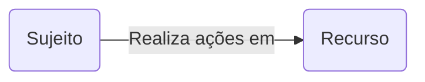
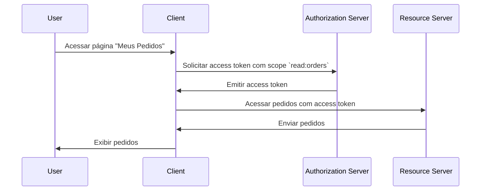

## O que é controlo de acesso?

O controlo de acesso envolve três componentes principais:

- **Sujeito**: Uma entidade que realiza ações em recursos. Os sujeitos podem ser utilizadores, serviços ou dispositivos.
- **Recurso**: Uma entidade que é protegida pelo controlo de acesso. Os recursos podem ser ficheiros, bases de dados, APIs ou quaisquer outros ativos digitais.
- **Ação**: Uma operação que um sujeito pode realizar em um recurso. As ações podem ser ler, escrever, executar ou qualquer outra operação.

> O controlo de acesso define a restrição seletiva de acesso a **recursos** com base no **sujeito** e **ação**.

Aqui estão alguns exemplos do mundo real de controlo de acesso:

- Um utilizador (sujeito) **pode** ler (ação) os seus pedidos (recurso) num sistema de e-commerce.
- Um utilizador (sujeito) **não pode** eliminar (ação) o perfil de outro utilizador (recurso) numa rede social.
- Um serviço (sujeito) **pode** escrever (ação) dados numa base de dados (recurso) numa arquitetura de microserviços.

Às vezes, o recurso é ignorado em implementações técnicas e o controlo de acesso é definido como a restrição de quem (sujeito) pode realizar quais ações. Por exemplo, o framework básico do OAuth 2.0 apenas especifica ações usando scopes (permissões) e não define recursos.

O suporte para controlo de acesso pode variar dependendo do <Ref slug="authorization-server" /> ou do <Ref slug="identity-provider" />. Alguns sistemas podem suportar [Resource Indicators for OAuth 2.0](https://datatracker.ietf.org/doc/html/rfc8707), uma extensão do OAuth 2.0 que permite aos clientes especificar os recursos que desejam acessar.

## Modelos de controlo de acesso ||access-control-models||

Decidir restrições entre poucos sujeitos e recursos é simples, mas não escalável. Portanto, a indústria desenvolveu muitos modelos de controlo de acesso para gerenciá-lo de forma eficaz. No contexto de <Ref slug="iam" />, os seguintes são alguns modelos comuns de controlo de acesso:

- <Ref slug="rbac" />: Um modelo que atribui permissões a roles, e depois atribui roles a sujeitos. Por exemplo, um role de administrador pode ter acesso a todos os recursos, enquanto um role de utilizador pode ter acesso a recursos limitados.
- <Ref slug="abac" />: Um modelo que usa atributos (propriedades) do sujeito, recurso e ambiente para tomar decisões de controlo de acesso. Por exemplo, um utilizador com o atributo "departamento=engenharia" pode ter acesso a recursos de engenharia.

Existem também outros modelos de controlo de acesso, como [controlo de acesso baseado em políticas (PBAC)](https://csrc.nist.gov/glossary/term/policy_based_access_control). Cada modelo tem seus próprios pontos fortes e fracos, e a escolha do modelo depende do seu caso de uso e requisitos.

## Controlo de acesso no OAuth 2.0

No contexto do OAuth 2.0, o controlo de acesso é tipicamente implementado usando <Ref slug="scope">scopes</Ref>. Normalmente, o valor de um scope é uma string que combina o recurso e a ação. Por exemplo, `read:orders` ou `write:profile`.

> [!Note]
> O termo "scopes" é intercambiável com "permissões" na maioria dos casos.

Vale a pena notar que o OAuth 2.0 não define a estrutura e o significado dos scopes. A interpretação dos scopes é deixada para o <Ref slug="resource-server" />, e a emissão dos scopes é deixada para o <Ref slug="authorization-server" />.

Por exemplo, um utilizador (sujeito) precisa acessar os seus pedidos (recurso) num sistema de e-commerce. Ao utilizar o OAuth 2.0, pode-se definir um scope `read:orders` e uma aplicação web (client) solicitará este scope ao authorization server. Aqui está um fluxo simplificado:

Neste fluxo, dependendo da arquitetura técnica, o resource server pode ser um serviço de API ou pode ser o próprio client (aplicação web) desde que tenha a capacidade de acessar o recurso (pedidos).

### O parâmetro resource indicator

Embora as pessoas frequentemente definam scopes com recurso e ação (por exemplo, `read:orders`, enquanto `orders` é o recurso e `read` é a ação), a escalabilidade desta abordagem é limitada quando o número de recursos e ações cresce. O RFC 8707 introduz o parâmetro `resource` (ou seja, <Ref slug="resource-indicator">resource indicators</Ref>) para o OAuth 2.0, que permite aos clientes especificar os recursos que desejam acessar.

O RFC especifica que o parâmetro `resource` deve ser um URI representando o recurso. Por exemplo, em vez de simplesmente usar `orders`, você poderia usar `https://api.example.com/orders`. Este método ajuda a prevenir conflitos de nomenclatura e melhora a precisão da correspondência de recursos ao permitir o uso do URL real do recurso.

### Suporte do authorization server

O OAuth 2.0 não define como o authorization server deve conduzir o controlo de acesso. Ele deixa os detalhes de implementação a critério do authorization server. Assim, a escolha do authorization server pode afetar significativamente o mecanismo de controlo de acesso. Por exemplo, alguns authorization servers podem suportar resource indicators, enquanto outros podem não suportar. É importante decidir qual modelo de controlo de acesso usar com base nos seus requisitos de negócio, e então escolher um authorization server que suporte esse modelo. Se você não tem certeza sobre o modelo de controlo de acesso, <Ref slug="rbac" /> é suficiente para a maioria dos casos.

<SeeAlso slugs={["rbac", "abac", "resource-indicator", "authorization"]} />

<Resources
  urls={[
    "https://blog.logto.io/mastering-rbac",
    "https://blog.logto.io/rbac-and-abac",
    "https://datatracker.ietf.org/doc/html/rfc8707",
    "https://blog.logto.io/organization-and-role-based-access-control",
  ]}
/>
