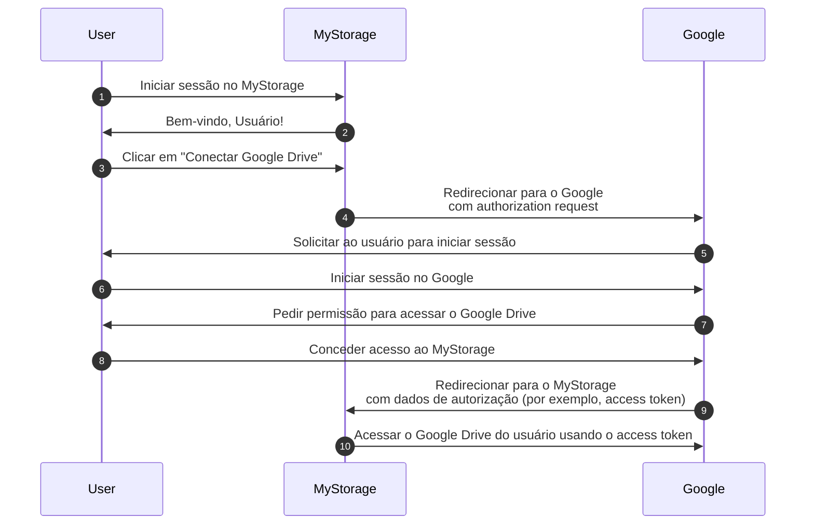

## Auth

Esta página é uma desambiguação para o termo "auth". Ele é frequentemente usado como uma abreviação para:

- <Ref slug="authentication" />: O processo de verificar a propriedade da identidade (por exemplo, usuário ou serviço). Responde à pergunta "Qual identidade você possui?"
- <Ref slug="authorization" />: O processo de determinar quais ações uma identidade pode realizar em um recurso. Responde à pergunta "O que você pode fazer?"

> [!Note]
> Às vezes, authentication (autenticação) e authorization (autorização) são referidos como "AuthN" e "AuthZ", respectivamente.

Esses dois conceitos são ambos essenciais no domínio de <Ref slug="iam" />, mas são fundamentalmente diferentes. Vamos ver um exemplo: Uma aplicação web MyStorage tem a capacidade de fazer upload de arquivos e conectar-se ao Google Drive. Um fluxo típico de usuário seria:

Neste fluxo, o usuário realiza dois passos de authentication (autenticação): um com o MyStorage (passo 1) e outro com o Google (passo 6); e um passo de authorization (autorização): concedendo acesso ao Google Drive (passo 8).

## A qual você se refere?

Quando você vê o termo "auth", é importante esclarecer se está se referindo a authentication (autenticação) ou authorization (autorização); caso contrário, você pode esperar que ambos os processos sejam abordados (assim como este site faz).

<SeeAlso slugs={["authentication", "authorization", "iam", "oauth-2.0", "openid-connect"]} />