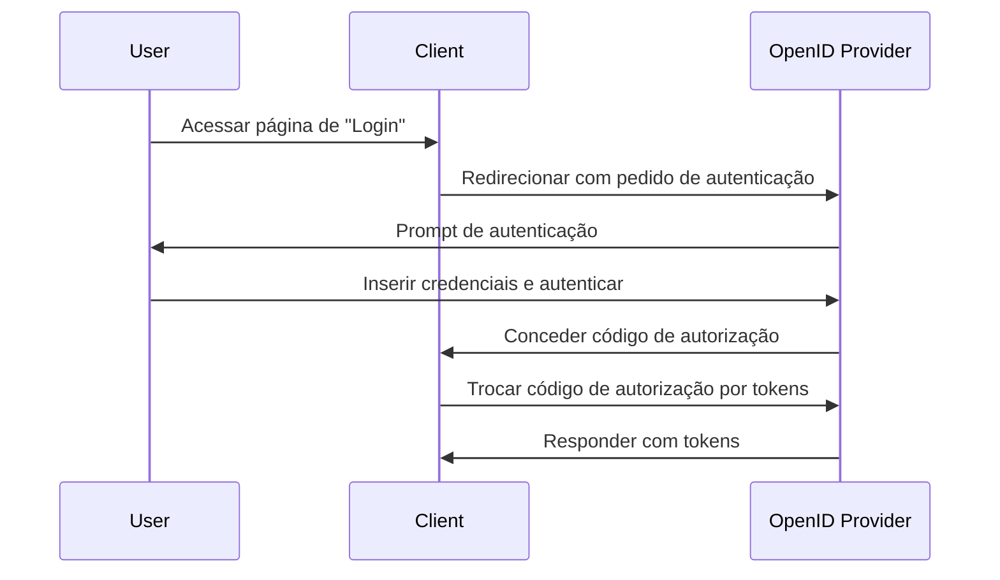

## O que é um pedido de autenticação (authentication request)?

Embora o significado de um pedido de autenticação (authentication request) possa variar dependendo do contexto, vamos focar-nos na definição da especificação OpenID Connect (OIDC). No OIDC, um pedido de autenticação é um <Ref slug="authorization-request" /> para o servidor de autorização (authorization server) para autenticar um utilizador.

A definição padrão parece muito confusa porque termos semelhantes, como "pedido de autorização (authorization request)", são usados. Isso ocorre porque o OIDC é construído sobre o OAuth 2.0, que é projetado principalmente para autorização, e o OIDC herda a terminologia do OAuth 2.0 e estende-a para suportar autenticação.

Para esclarecer, vamos adicionar algum contexto à definição:

> Um pedido de autenticação (OpenID Connect) é um pedido de autorização (OAuth 2.0 authorization) para o servidor de autorização (OpenID Connect authorization) para autenticar um utilizador.

Fica ainda mais longo! Agora vamos remover todos os parênteses:

> Um pedido de autenticação é um pedido para o servidor para autenticar um utilizador.

Após remover todos os atributos, a definição torna-se direta. Aqui estão as divisões dos termos:

- **Pedido de autenticação (Authentication request)**: O termo da especificação OIDC.
- <Ref slug="authorization-request" />: O termo da especificação OAuth 2.0. O OIDC reutiliza a especificação e estende-a.
- <Ref slug="authorization-server" />: O termo da especificação OAuth 2.0. O OIDC também usa o termo <Ref slug="openid-connect" headingId="openid-provider-op" /> para se referir à mesma entidade que é capaz de autenticar utilizadores.

Nas seções seguintes, usaremos "OpenID Provider (OP)" para nos referirmos ao servidor de autorização que suporta OIDC.

## Como funciona um pedido de autenticação (authentication request)?

Quando uma aplicação cliente deseja autenticar um utilizador, inicia um pedido de autenticação para o OpenID Provider (OP). Como mencionámos anteriormente, o pedido de autenticação também é um pedido de autorização no OAuth 2.0; assim, certos tipos de concessão (grant types) do OAuth 2.0 podem ser usados para completar o processo de autenticação.

O OIDC define três tipos de concessão (grant types) para suportar autenticação:

1. <Ref slug="authorization-code-flow" />: O fluxo de autenticação mais recomendado. É geralmente usado com <Ref slug="pkce" /> para melhor segurança e é adequado para a maioria das aplicações.
2. <Ref slug="implicit-flow" />: Um fluxo simplificado que está obsoleto no <Ref slug="oauth-2.1" /> devido a preocupações de segurança.
3. <Ref slug="hybrid-flow" />: Uma combinação do fluxo de código de autorização e do fluxo implícito.

O pedido de autenticação é o primeiro passo no fluxo de autenticação OIDC. Os parâmetros reais a incluir e os passos a seguir dependem do fluxo que escolher. Clique nos nomes dos fluxos acima para saber mais sobre cada fluxo.

Aqui está um exemplo simplificado de um pedido de autenticação usando o fluxo de código de autorização:

Uma vez que o cliente recebe os tokens, pode usá-los (por exemplo, <Ref slug="access-token" />) para acessar recursos protegidos (por exemplo, uma API) em nome do utilizador.

### Parâmetros chave num pedido de autenticação (authentication request)

Aqui estão alguns parâmetros chave num pedido de autenticação:

- **`response_type`**: O tipo de resposta que o cliente espera do servidor de autorização. Pode ser `code` para o fluxo de código de autorização, `id_token` para o fluxo implícito, ou `code id_token` para o fluxo híbrido.
- **`client_id`**: O identificador do cliente emitido pelo OpenID Provider (OP).
- **`redirect_uri`**: O URI para o qual o servidor de autorização redirecionará o agente do utilizador após o pedido de autenticação.
- **`scope`**: Os <Ref slug="scope">escopos</Ref> (permissões) solicitados para o <Ref slug="id-token" /> e <Ref slug="access-token" />.
- **`resource`**: O parâmetro opcional que especifica o <Ref slug="resource-indicator" /> para os recursos solicitados. O servidor de autorização precisa suportar [RFC 8707](https://datatracker.ietf.org/doc/html/rfc8707) para usar este parâmetro.

Note que os parâmetros acima não são exaustivos. Antes de fazer um pedido de autenticação, deves consultar a lista completa de parâmetros para o fluxo específico que estás a usar.

<SeeAlso slugs={["openid-connect", "oauth-2.0", "authorization-code-flow", "implicit-flow", "hybrid-flow"]} />

<Resources
  urls={[
    "https://openid.net/specs/openid-connect-core-1_0.html",
  ]}
/>