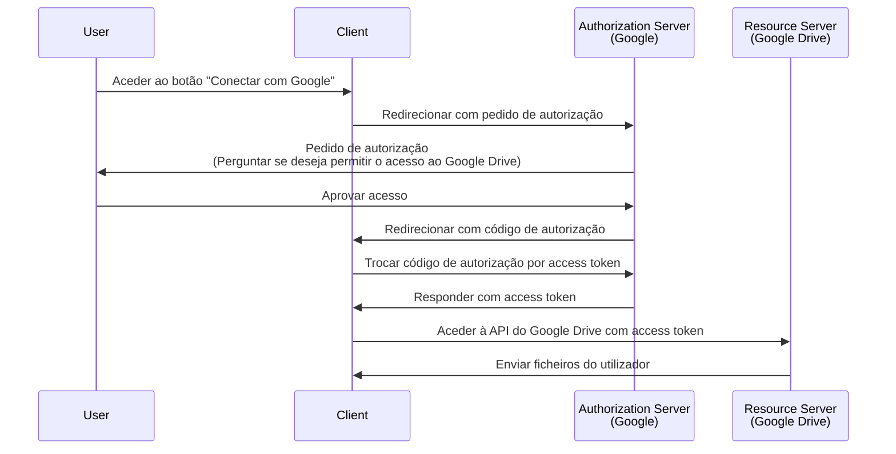

## O que é um pedido de autorização (authorization request)?

Dependendo do contexto, o termo "pedido de autorização (authorization request)" pode referir-se a diferentes coisas. Neste artigo, vamos focar-nos na definição na especificação <Ref slug="oauth-2.0" />.

No OAuth 2.0, existem vários tipos de concessão (fluxos) que definem como um <Ref slug="client" /> pode obter autorização de um utilizador para aceder a recursos protegidos.

> ![Nota]
> "Pedidos de autorização (authorization requests)" são frequentemente confundidos com "pedidos de autenticação (authentication requests)" no contexto do <Ref slug="openid-connect" />. Veja <Ref slug="authentication-request" /> para detalhes específicos do OIDC.

## Como funciona um pedido de autorização (authorization request)?

Quando um cliente (aplicação) quer aceder a recursos protegidos em nome de um utilizador, inicia um pedido de autorização (authorization request) para o <Ref slug="authorization-server" />. O cliente deve indicar o tipo de concessão solicitado juntamente com os parâmetros necessários no pedido.

Aqui estão alguns tipos de concessão (fluxos) típicos para autorização de utilizadores finais no OAuth 2.0:

- <Ref slug="authorization-code-flow" />: O fluxo mais recomendado para autorização de utilizadores finais. É geralmente usado com <Ref slug="pkce" /> para melhor segurança e é adequado para a maioria das aplicações.
- <Ref slug="implicit-flow" />: Um fluxo simplificado que está obsoleto no <Ref slug="oauth-2.1" /> devido a preocupações de segurança.
- [Concessão de credenciais de senha do proprietário do recurso (ROPC)](https://datatracker.ietf.org/doc/html/rfc6749#section-4.3): Um tipo de concessão (fluxo) onde as credenciais do utilizador são trocadas diretamente por um access token. Este fluxo não é recomendado devido a riscos de segurança.

Existem também outras extensões, como o <Ref slug="device-flow" /> para dispositivos com capacidades de entrada limitadas. Cada fluxo tem as suas próprias características e casos de uso. Para a maioria das aplicações web, o fluxo de código de autorização é a escolha recomendada.

> A autorização <Ref slug="machine-to-machine" /> é tipicamente feita usando o <Ref slug="client-credentials-flow" />, que não envolve interação do utilizador.

Por exemplo, um cliente (aplicação) pode solicitar autorização para aceder aos ficheiros do Google Drive de um utilizador. Aqui está um diagrama de sequência simplificado do fluxo de código de autorização:

Uma vez obtido o <Ref slug="access-token" />, o cliente pode usá-lo para aceder aos ficheiros do Google Drive do utilizador em nome do utilizador.

### Parâmetros chave num pedido de autorização (authorization request)

O pedido de autorização OAuth 2.0 tipicamente inclui os seguintes parâmetros:

- **`response_type`**: O tipo de resposta que o cliente espera. Valores comuns são `code` para o fluxo de código de autorização e `token` para o fluxo implícito.
- **`client_id`**: O identificador do cliente emitido pelo servidor de autorização.
- **`redirect_uri`**: O URI para onde o servidor de autorização envia o utilizador após o processo de autorização.
- **`scope`**: Os <Ref slug="scope">escopos</Ref> (permissões) solicitados para o access token.
- **`resource`**: O parâmetro opcional que especifica o <Ref slug="resource-indicator" /> para os recursos solicitados. O servidor de autorização precisa suportar [RFC 8707](https://datatracker.ietf.org/doc/html/rfc8707) para usar este parâmetro.

Os parâmetros acima não são exaustivos. Os parâmetros reais e os seus valores dependem do tipo de concessão e dos requisitos específicos da aplicação.

<SeeAlso slugs={["oauth-2.0", "authentication-request", "authorization-code-flow", "implicit-flow", "device-flow"]} />

<Resources
  urls={[
    { url: "https://datatracker.ietf.org/doc/html/rfc6749#section-4", result: {
      ogTitle: "Obtaining Authorization in OAuth 2.0",
      ogDescription: "Para solicitar um access token, o cliente obtém autorização do proprietário do recurso."
    } }
  ]}
/>