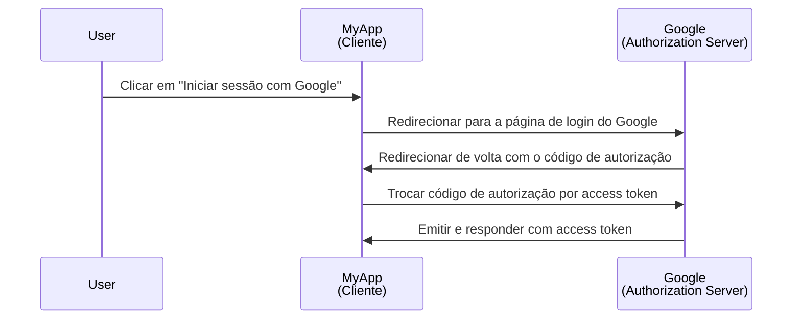
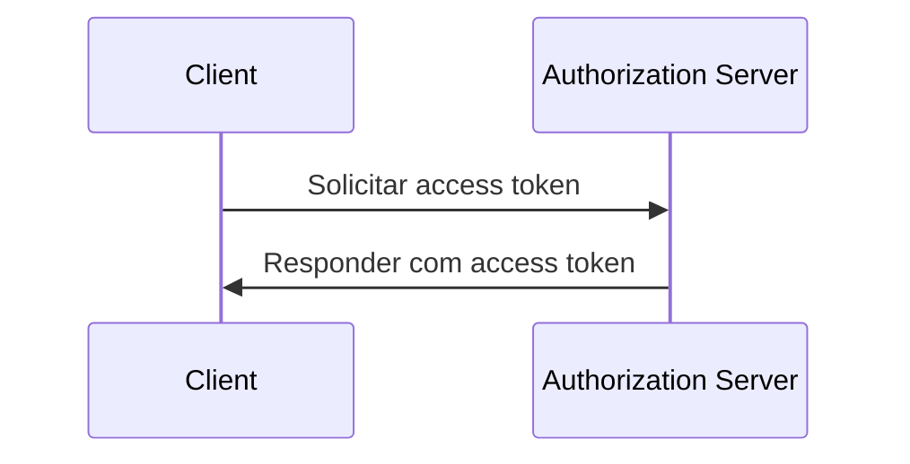

## O que é um cliente?

Um cliente, no contexto de <Ref slug="oauth-2.0" /> e <Ref slug="openid-connect" />, é uma aplicação que solicita autenticação (authentication) ou autorização (authorization). Por exemplo, quando um utilizador clica em "Iniciar sessão com Google" numa aplicação, a aplicação está a atuar como um **cliente** que solicita autorização ao Google.

> "Cliente" e "aplicação" são frequentemente usados de forma intercambiável no contexto de <Ref slug="iam" />.

Existem várias categorizações de clientes com base nas suas capacidades e níveis de confiança, mas para os frameworks, uma distinção significativa é entre clientes públicos e confidenciais. Isso afeta como o cliente pode obter tokens e os tipos de concessão que pode usar.

### Clientes públicos ||public-clients||

Clientes públicos são aplicações que não conseguem manter as suas credenciais confidenciais, o que significa que o proprietário do recurso (utilizador) pode aceder a elas. Exemplos de clientes públicos incluem:

- Aplicações de página única (SPAs)
- Aplicações móveis
- Aplicações de desktop

Pode-se argumentar que aplicações móveis e de desktop têm capacidades de armazenamento seguro, mas a maioria dos frameworks considera-as clientes públicos porque são distribuídas aos utilizadores finais e assume-se que os utilizadores finais podem aceder às credenciais.

### Clientes confidenciais ||confidential-clients||

Clientes confidenciais (privados) são aplicações que podem armazenar informações sensíveis de forma confidencial sem as expor aos proprietários dos recursos (utilizadores finais). Exemplos de clientes confidenciais incluem:

- Servidores web
- Serviços de backend

## Como funciona um cliente?

### Autenticação (authentication) e autorização (authorization) do utilizador

Quando um cliente deseja autenticar um utilizador, um cliente inicia um <Ref slug="authorization-request" /> para o <Ref slug="authorization-server" /> para obter um <Ref slug="access-token" />. O cliente deve incluir os parâmetros necessários no pedido, como o ID do cliente, URI de redirecionamento e scopes. Aqui está um diagrama de sequência simplificado do fluxo de código de autorização (authorization code flow):

Neste exemplo, o Google atua como o **authorization server** que emite um access token para o **cliente** (MyApp) após o utilizador iniciar sessão com sucesso. O cliente pode então usar o **access token** para buscar o perfil do utilizador (recurso protegido) no Google.

Para clientes OpenID Connect (OIDC), o cliente precisa iniciar um <Ref slug="authentication-request" /> para autenticar o utilizador. Usa o mesmo endpoint que o pedido de autorização, mas os parâmetros e a resposta são diferentes.

### Comunicação máquina a máquina

Para comunicação <Ref slug="machine-to-machine" />, o cliente pode usar o <Ref slug="client-credentials-flow" /> para enviar diretamente um <Ref slug="token-request" /> para o authorization server. O cliente deve incluir o ID do cliente, segredo do cliente e scopes no pedido. Aqui está um diagrama de sequência simplificado do fluxo de credenciais do cliente (client credentials flow):

O authorization server validará as credenciais do cliente e emitirá um access token se o cliente estiver autorizado. Como o cliente precisa enviar o segredo do cliente, é importante usar o fluxo de credenciais do cliente apenas para clientes confidenciais.

## Considerações de segurança

### Tipos de cliente

O tipo de cliente (público ou privado) afeta as considerações de segurança para o cliente.

- Clientes públicos não devem usar o fluxo de credenciais do cliente porque não podem armazenar o segredo do cliente de forma segura. Em vez disso, o <Ref slug="authorization-code-flow" /> com <Ref slug="pkce" /> é recomendado para clientes públicos para autenticar utilizadores.
- Clientes confidenciais podem usar o fluxo de credenciais do cliente para comunicação máquina a máquina. Devem armazenar o segredo do cliente de forma segura e usá-lo apenas em ambientes seguros.

### Armazenamento de tokens

Os clientes devem usar o mais alto nível de segurança possível para armazenar tokens. Por exemplo, em aplicações web, cookies HTTP-only são recomendados para armazenar access tokens para prevenir ataques XSS.

### Expiração de tokens

Access tokens têm um tempo de vida limitado para reduzir o risco de acesso não autorizado. Os clientes devem lidar com a expiração de tokens de forma adequada usando <Ref slug="refresh-token">refresh tokens</Ref> para obter novos access tokens.

### Revogação de tokens

Os clientes devem estar preparados para lidar com a revogação de tokens. Se o utilizador sair ou o authorization server revogar o token, o cliente deve limpar o token do armazenamento do lado do cliente.

<SeeAlso slugs={["oauth-2.0", "oauth-2.0-grant", "openid-connect", "authorization-request", "authentication-request"]} />

<Resources
  urls={[
    "https://blog.logto.io/secure-cloud-apps-with-oauth-and-openid-connect",
    "https://datatracker.ietf.org/doc/html/rfc6749",
    "https://openid.net/specs/openid-connect-core-1_0.html"
  ]}
/>
