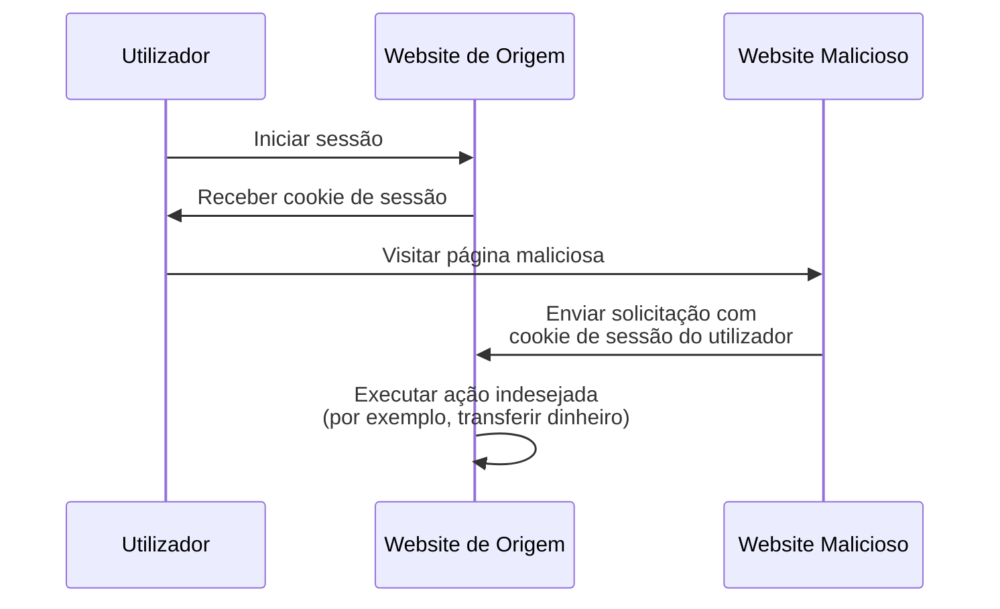

## O que é a falsificação de solicitação entre sites (CSRF)?

Ao desenvolver aplicações web, CSRF é um termo frequentemente ouvido que traz medo aos desenvolvedores e profissionais de segurança. É um tipo de ataque que engana (ou ilude) utilizadores autenticados para executar ações indesejadas numa aplicação web sem consentimento.

CSRF também é conhecido como um "ataque de um clique" ou "cavalgar de sessão" porque depende da sessão ativa do utilizador para realizar ações maliciosas.

## Como funciona o CSRF?

O ataque CSRF funciona explorando a confiança que uma aplicação web tem no navegador do utilizador. Aqui está como isso normalmente acontece:



Podes ter algumas perguntas sobre esta sequência. Vamos explorar as razões por trás.

### Por que o website malicioso pode enviar uma solicitação para o website de origem?

A Política de Mesma Origem (SOP) é uma funcionalidade de segurança nos navegadores web que restringe como um documento ou script carregado de uma origem pode interagir com um recurso (por exemplo, cookies, DOM) de outra origem. No entanto, a SOP não impede que o navegador envie solicitações para outra origem.

Assim, embora o website malicioso não possa ler ou modificar diretamente o cookie de sessão, ainda pode enviar solicitações para o website de origem usando a sessão ativa do utilizador.

Podes argumentar que a maioria das aplicações web também usa [CORS](https://developer.mozilla.org/en-US/docs/Web/HTTP/CORS) para prevenir solicitações não autorizadas entre origens, mas o CSRF ainda tem uma maneira de contorná-lo:

1. Ataques baseados em GET: O website malicioso pode enganar o utilizador para visitar um URL que executa uma ação no website de origem:

    - Um redirecionamento para `https://example.com/transfer?amount=1000&to=attacker`.
    - Uma tag de imagem que carrega `https://example.com/transfer?amount=1000&to=attacker`.

    Essa é uma razão importante pela qual as solicitações GET não devem ter efeitos colaterais.

2. Ataques baseados em formulários: O website malicioso pode criar um formulário oculto que envia dados para o website de origem. Por exemplo, uma solicitação POST para `https://example.com/transfer` com campos de formulário ocultos.

### Por que o website malicioso tem o cookie de sessão do utilizador?

O navegador do utilizador envia automaticamente cookies para o website de origem ao fazer solicitações. É assim que o website de origem sabe que o utilizador está autenticado e pode realizar ações em seu nome.

Na verdade, o website malicioso não "tem" o cookie de sessão; ele apenas explora o comportamento do navegador para enviar o cookie junto com a solicitação.

## Como prevenir ataques CSRF?

Prevenir ataques CSRF requer uma abordagem em camadas que envolve tanto o servidor quanto o cliente. Aqui estão algumas técnicas comuns para mitigar vulnerabilidades CSRF:

### Use tokens anti-CSRF

Tokens anti-CSRF são valores aleatórios gerados pelo servidor e incorporados nos formulários da aplicação web. Quando o formulário é enviado, o servidor valida o token para garantir que a solicitação é legítima.

Por exemplo, um campo de entrada oculto num formulário HTML:

```html
<form action="/transfer" method="post">
  <input type="hidden" name="csrf_token" value="random_token_here" />
  <!-- Outros campos do formulário -->
  <button type="submit">Transferir</button>
</form>
```

Com esta abordagem, o website malicioso não pode forjar uma solicitação porque não conhece o token anti-CSRF. O parâmetro `state` em <Ref slug="redirect-uri" /> é um conceito semelhante.

### Use cookies SameSite

O atributo `SameSite` em cookies pode prevenir ataques CSRF restringindo quando os cookies são enviados para o servidor:

| Valor `SameSite` | Descrição                                                                          |
|------------------|-------------------------------------------------------------------------------------|
| `Strict`         | Cookies são enviados apenas num contexto de primeira parte.                         |
| `Lax`            | Cookies são enviados num contexto de primeira parte e com solicitações GET de sites externos. |
| `None`           | Cookies são enviados em todos os contextos. Requer o atributo `Secure`.             |

Ao definir o atributo `SameSite` para `Strict` ou `Lax` sem efeitos colaterais nas tuas solicitações GET, podes prevenir ataques CSRF.

Além disso, o atributo `Secure` deve ser sempre definido para garantir que o cookie é enviado apenas através de conexões HTTPS.

### Verifique os cabeçalhos

1. **Cabeçalho Origin**: O cabeçalho `Origin` é enviado pelo navegador para indicar a origem da solicitação. O servidor pode verificar este cabeçalho para garantir que a solicitação está vindo de uma origem esperada.
2. **Cabeçalho Referer**: O cabeçalho `Referer` contém o URL da página anterior. Embora possa ser falsificado, ainda pode ser usado como uma camada adicional de proteção.

<SeeAlso slugs={["authorization-code-flow", "redirect-uri"]} />

<Resources
  urls={[
    'https://blog.logto.io/csrf',
    "https://cheatsheetseries.owasp.org/cheatsheets/Cross-Site_Request_Forgery_Prevention_Cheat_Sheet.html",
  ]}
/>