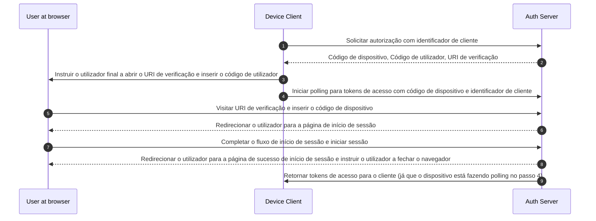

## O que é o fluxo de dispositivo (device flow)?

O [Fluxo de Autorização de Dispositivo OAuth](https://www.rfc-editor.org/rfc/rfc8628), também conhecido como fluxo de dispositivo (device flow), é um <Ref slug="oauth-2.0-grant" /> projetado para dispositivos com capacidades de entrada limitadas (por exemplo, smart TVs, dispositivos IoT, consolas de jogos) ou aplicações sem interface (por exemplo, ferramentas CLI). Permite que os utilizadores iniciem <Ref slug="authorization-request">pedidos de autorização</Ref> nestes dispositivos e depois completem o processo usando um dispositivo com mais capacidade de entrada, como um smartphone ou laptop.

## Quando usar o fluxo de dispositivo (device flow)?

1. **Dispositivos com entrada limitada**
    - Iniciar sessão em Smart TVs (por exemplo, aplicações de media)
    - Iniciar sessão em Consolas de Jogos (por exemplo, sistema de jogos ou aplicações de media)
    - Iniciar sessão em Dispositivos de Reunião (por exemplo, aplicações oficiais ou aplicações de videoconferência)
    - Iniciar sessão em Dispositivos Vestíveis (por exemplo, smartwatches com entrada limitada)
    - Acessar dispositivos IoT (por exemplo, impressoras, codificadores de vídeo ou altifalantes)
2. **Aplicações sem interface**
    - Login na Interface de Linha de Comando (por exemplo, GitHub CLI ou Stripe CLI)
3. **Login por Código QR para Aplicações de Desktop**
    - Iniciar sessão rápida e segura em aplicações de desktop ao escanear um código QR com o teu smartphone (por exemplo, Telegram, Steam sign-ins no desktop). Este fluxo de login por código QR pode ser considerado como uma variante do fluxo de dispositivo tradicional OAuth 2.0.

## Como é o fluxo de utilizador final do fluxo de dispositivo (device flow)?

Ignorando a variante de login por código QR, vamos focar no fluxo de dispositivo padrão OAuth 2.0. Existem dois tipos de dispositivos envolvidos:

### Dispositivo de exibição de código de dispositivo

Este é o dispositivo com entrada limitada ou aplicação sem interface onde o utilizador precisa autorizar o acesso. Ele exibe o [código de dispositivo e URI de verificação](#what-does-device-flow-workflow-look-like), orientando o utilizador sobre como proceder.

A interface básica é:


Para melhorar a experiência do utilizador, os serviços frequentemente geram um código QR para o URL de Verificação:


Para ainda mais eficiência, substitua o recurso de código QR no `verification_uri` (por exemplo, `https://example.com/device`) por `verification_uri_complete` (por exemplo, `https://example.com/device?user_code=DSHP-SNCT`), que inclui o código de dispositivo no URL, ajudando os utilizadores a pré-preencher o código de dispositivo nos campos.

### Dispositivo de autorização

Seguindo as instruções no dispositivo alvo de início de sessão, o utilizador irá:

1. Usar outro dispositivo com acesso ao navegador e capacidades de entrada para abrir o URL de Verificação.
2. Inserir o código de dispositivo exibido (que pode estar pré-preenchido) e continuar.
3. Se não houver sessões existentes no navegador, o utilizador irá primeiro iniciar sessão no serviço.
4. Uma página de consentimento solicitará aos utilizadores que autorizem o início de sessão do dispositivo.
5. Finalmente, uma página de sucesso será exibida após a autorização.


Aqui estão alguns URLs de Verificação de fluxo de dispositivo de produtos estabelecidos para o teu teste:

- Iniciar sessão no [Youtube em smart TVs](https://www.youtube.com/watch?v=yTcuazSy5Cs): [youtube.com/activate](https://youtube.com/activate)
- Iniciar sessão no Disney+ em smart TV: [disneyplus.com/begin](https://disneyplus.com/begin)
- Iniciar sessão no [Shopify no Samsung Galaxy Watch](https://www.drmare.com/spotify-music/spotify-on-galaxy-watch.html): [spotify.com/pair](https://spotify.com/pair)
- Iniciar sessão no [Zoom em dispositivos de reunião](https://developers.zoom.us/blog/device-authorization/): [zoom.us/oauth_device](https://zoom.us/oauth_device)
- Iniciar sessão no [GitHub CLI](https://docs.github.com/en/apps/oauth-apps/building-oauth-apps/authorizing-oauth-apps#device-flow): [github.com/login/device](https://github.com/login/device)
- Utilizar [Google device flow](https://www.oauth.com/oauth2-servers/device-flow/user-flow/): https://www.google.com/device

## Como é o fluxo de trabalho do fluxo de dispositivo (device flow)?

Primeiro, deves entender os parâmetros da resposta de autorização de dispositivo, que é usada para lidar com as informações exibidas no dispositivo de exibição de código de dispositivo:

| Parâmetro                              | Descrição                                                                                                                                                                    |
| -------------------------------------- | ---------------------------------------------------------------------------------------------------------------------------------------------------------------------------- |
| `device_code`                          | O código de verificação do dispositivo.                                                                                                                                      |
| `user_code`                            | O código de verificação do utilizador final.                                                                                                                                 |
| `verification_uri`                     | O URI de verificação do utilizador final no servidor de autorização. O URI deve ser curto e fácil de lembrar, pois os utilizadores finais serão solicitados a digitá-lo manualmente no seu agente de utilizador. |
| `verification_uri_complete` (opcional) | Um URI de verificação que inclui o "user_code" (ou outras informações com a mesma função que o "user_code"), que é projetado para transmissão não textual.                   |
| `expires_in`                           | O tempo de vida em segundos do "device_code" e "user_code".                                                                                                                  |
| `interval`                             | A quantidade mínima de tempo em segundos que o cliente DEVE esperar entre pedidos de polling para o endpoint de token. Se nenhum valor for fornecido, os clientes DEVEM usar 5 como padrão. |

```json
{
    "device_code": "GmRhmhcxhwAzkoEqiMEg_DnyEysNkuNhszIySk9eS",
    "user_code": "WDJBMJHT",
    "verification_uri": "https://custom.domain.com/device",
    "verification_uri_complete":
        "https://custom.domain.com/device?user_code=WDJB-MJHT",
    "expires_in": 900,
    "interval": 5
}
```

Quando um utilizador usa o fluxo de dispositivo para autenticação, inclui principalmente os seguintes passos:



1. O cliente do dispositivo solicita autorização do servidor de auth com um identificador de cliente (geralmente o id do cliente na plataforma do servidor de auth).
2. O servidor de auth responde ao cliente do dispositivo com código de dispositivo, código de utilizador e URI de verificação.
3. O cliente do dispositivo exibe o URI de verificação e o código de utilizador para o utilizador na forma de texto (ou um código QR, etc.), instruindo o utilizador a visitar o URI e inserir o código.
4. Ao mesmo tempo que o passo 3, o cliente do dispositivo inicia o polling para tokens de acesso com código de dispositivo e identificador de cliente do servidor de auth e começa a esperar que o utilizador reveja o <Ref slug="authorization-request" /> e complete a autorização do utilizador.
5. O utilizador visita o URI de verificação hospedado pelo servidor de auth, através de um navegador em outro dispositivo, e insere o código de utilizador.
6. O servidor de auth redireciona o utilizador para a página de início de sessão e instrui o utilizador a completar o início de sessão.
7. O utilizador completa o fluxo de início de sessão e inicia sessão com sucesso.
8. O servidor de auth redireciona o utilizador para a página de sucesso de início de sessão e instrui o utilizador a fechar o navegador.
9. Ao mesmo tempo que o passo 8, o servidor de auth retorna tokens de acesso para o cliente do dispositivo, já que o cliente está fazendo polling desde o passo 4.

Após esses processos, o cliente do dispositivo poderá obter o <Ref slug="access-token" /> para serviços subsequentes.

Para mais detalhes, leia [RFC 8628 OAuth 2.0 Device Authorization Grant](https://datatracker.ietf.org/doc/html/rfc8628#autoid-3).

## Quais são as considerações de segurança para o fluxo de dispositivo (device flow)?

O fluxo de dispositivo envolve interação entre dois dispositivos, expondo-o a potenciais riscos de segurança como exposição de código de dispositivo, ataques de força bruta ou ataques man-in-the-middle (MitM).

Embora obter um código de dispositivo sozinho não conceda imediatamente autorização (já que o utilizador ainda deve autenticar e autorizar), um atacante poderia tentar reproduzir um pedido de código de dispositivo durante seu período de validade. Isso poderia resultar em acesso repetido não autorizado. Para aumentar a segurança, considere as seguintes precauções:

- **Reduzir a duração de `expires_in`:** Reduzir a janela de oportunidade para ataques minimizando o período de validade do código de dispositivo.
- **Limitar tentativas falhadas:** Restringir o número de entradas de código incorretas para prevenir ataques de força bruta.
- **Impor HTTPS:** Garantir que toda a comunicação entre o dispositivo e o servidor de autorização seja criptografada usando HTTPS para prevenir ataques man-in-the-middle.
- **Limitar códigos de dispositivo de uso único:** Restringir cada código de dispositivo a **uma única sessão** para prevenir seu reuso por partes não autorizadas.

Note que o uso único para códigos de dispositivo não é um requisito embutido do Fluxo de Dispositivo OAuth 2.0. É uma prática recomendada opcional. Alguns desenvolvedores podem intencionalmente projetar para autorizações de dispositivo concorrentes com o mesmo código (por exemplo, em centenas de dispositivos), mas essa abordagem aumenta os riscos de segurança e deve ser cuidadosamente avaliada.

## Os fornecedores de OIDC suportam o fluxo de dispositivo (device flow)?

Embora o fluxo de dispositivo seja tradicionalmente associado ao OAuth, os fornecedores de <Ref slug="openid-connect" /> também podem suportá-lo. O OIDC oferece vantagens adicionais além do foco principal do OAuth na autorização. Ele se estende à autenticação, permitindo que as aplicações obtenham tanto o <Ref slug="access-token" /> quanto o <Ref slug="id-token" /> em um único fluxo.

A gestão de identidade unificada robusta do OIDC, incluindo validação de token e <Ref slug="refresh-token">atualização</Ref>, torna-o bem adequado para <Ref slug="authentication" /> segura e confiável e <Ref slug="authorization" /> entre dispositivos e aplicações, particularmente aqueles com capacidades de entrada limitadas.

<SeeAlso slugs={['oauth-2.0-grant', 'authorization-code-flow', 'implicit-flow', 'client-credentials-flow']} />

<Resources urls={['https://blog.logto.io/a-brief-introduction-to-oauth2-device-flow', 'https://datatracker.ietf.org/doc/html/rfc8628']} />