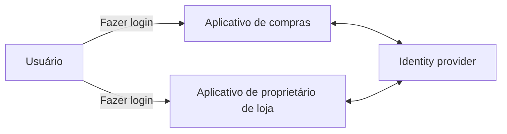
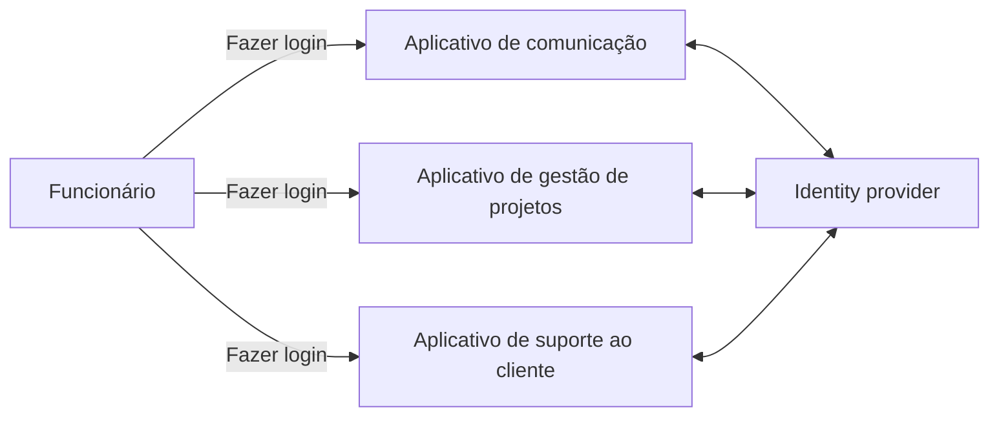
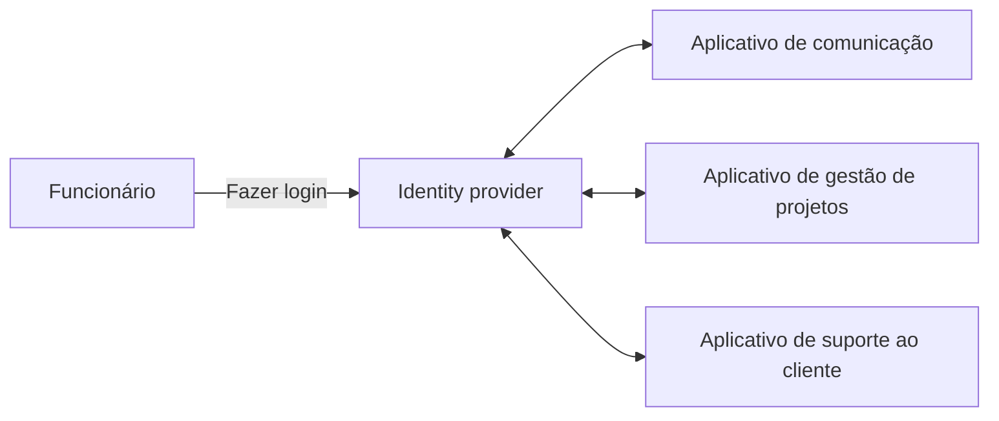
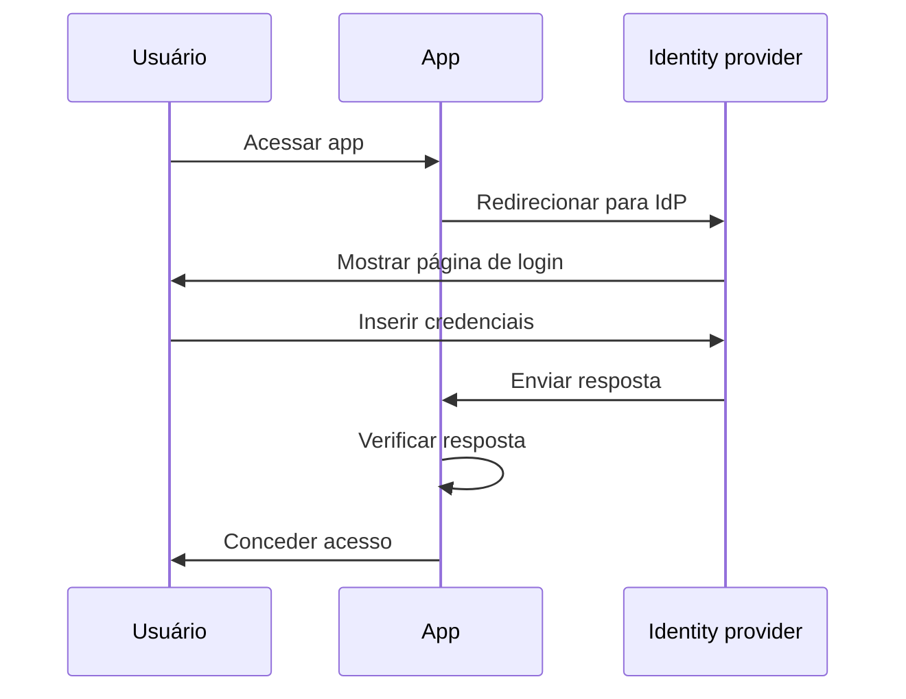
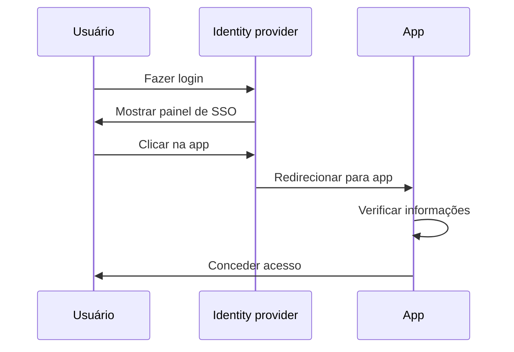
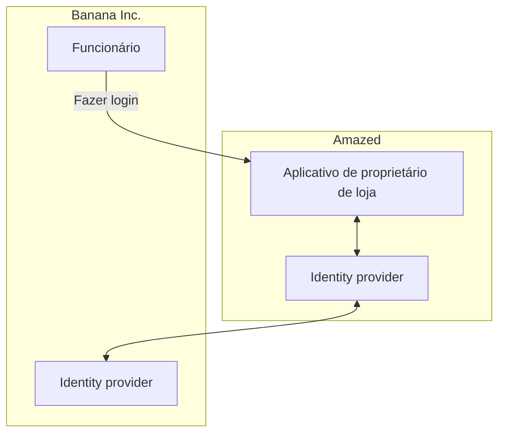

## O que é SSO Empresarial?

Antes de mergulhar na definição, é importante esclarecer a diferença entre SSO e SSO Empresarial, pois isso pode causar confusão.

- <Ref slug="single-sign-on" /> é um termo geral que se refere à capacidade de um usuário de fazer login uma vez e acessar múltiplas aplicações ou recursos sem precisar fazer login novamente.
- O SSO Empresarial é um tipo específico de SSO projetado para funcionários dentro de uma organização.

Ainda está em dúvida? Vamos ver um exemplo:

Um site de compras online chamado _Amazed_ tem duas aplicações web: uma para clientes e outra para proprietários de lojas. Os clientes fazem login no aplicativo de compras para comprar produtos, enquanto os proprietários de lojas fazem login no aplicativo de proprietários para gerenciar suas lojas. Ambos os aplicativos usam o mesmo identity provider (fornecedor de identidade) para authentication (autenticação). Como resultado, os usuários só precisam fazer login uma vez para acessar ambos os aplicativos, proporcionando uma experiência de single sign-on.

Internamente, a _Amazed_ usa múltiplas aplicações para comunicação em equipe, gestão de projetos e suporte ao cliente. Para simplificar os fluxos de trabalho diários, a _Amazed_ implementa o SSO Empresarial para seus funcionários. Com o SSO Empresarial, os funcionários podem acessar todas as aplicações internas com um único login.

Tipicamente, as soluções de SSO Empresarial também fornecem um painel centralizado para que os funcionários acessem todas as aplicações com um clique. Este painel é frequentemente chamado de painel de SSO.

Em resumo, ambos os cenários são exemplos de single sign-on. A diferença é que o primeiro exemplo é um SSO genérico, enquanto o segundo é um SSO Empresarial. Estes são casos de uso típicos para Customer IAM (Gestão de Identidade e Acesso) e Workforce IAM, respectivamente.

## Como funciona o SSO Empresarial?

O SSO Empresarial funciona conectando múltiplas aplicações a um identity provider centralizado. A conexão pode ser unidirecional (da aplicação para o identity provider) ou bidirecional (entre a aplicação e o identity provider). Vários padrões e protocolos, como SAML, OpenID Connect e OAuth 2.0, são usados para essas conexões.

Independentemente do protocolo, o fluxo básico geralmente é semelhante:

1. O usuário acessa uma aplicação (por exemplo, aplicativo de comunicação) que requer authentication (autenticação).
2. A aplicação redireciona o usuário para o identity provider para authentication.
3. O usuário faz login no identity provider.
4. O identity provider envia uma resposta de authentication de volta para a aplicação.
5. A aplicação verifica a resposta e concede acesso ao usuário.

Quando o usuário acessa outra aplicação (por exemplo, aplicativo de gestão de projetos) conectada ao mesmo identity provider, ele é automaticamente logado sem precisar inserir suas credenciais novamente. Neste caso, o passo 3 é pulado, e como os passos 2, 4 e 5 ocorrem em segundo plano, o usuário pode nem perceber o processo de authentication.

Este processo é chamado de SSO Iniciado pelo Service Provider (SP), onde a aplicação (SP) inicia o processo de authentication.

Em outro cenário, o identity provider fornece um painel centralizado para que os usuários acessem todas as aplicações conectadas. Um fluxo simplificado é:

1. O usuário faz login no identity provider.
2. O identity provider exibe uma lista de aplicações que o usuário pode acessar.
3. O usuário clica em uma aplicação (por exemplo, aplicativo de suporte ao cliente) para acessá-la.
4. O identity provider redireciona o usuário para a aplicação com informações de authentication.
5. A aplicação verifica as informações e concede acesso ao usuário.

Este processo é chamado de SSO Iniciado pelo Identity Provider (IdP), onde o identity provider (IdP) inicia o processo de authentication.

## Por que o SSO Empresarial é importante?

### SSO Empresarial no Workforce IAM

#### Gestão centralizada

O principal benefício do SSO Empresarial não é apenas a conveniência para os funcionários, mas também a segurança e conformidade aprimoradas para as organizações. Em vez de gerenciar múltiplas credenciais para diferentes aplicações e configurar authentication e authorization separadamente para cada uma, as organizações podem centralizar a gestão de identidades de usuários, políticas de access control e logs de auditoria.

Por exemplo, quando um funcionário sai da empresa, o departamento de TI pode desativar a conta do funcionário no identity provider, revogando imediatamente o acesso a todas as aplicações. Isso é crucial para prevenir accesso não autorizado e violações de dados, um processo conhecido como gestão de ciclo de vida.

#### Access control

As soluções de SSO Empresarial frequentemente incluem recursos de access control, como role-based access control (RBAC) e attribute-based access control (ABAC). Esses recursos permitem que as organizações definam políticas de acesso detalhadas com base em funções de usuário, atributos e outras informações contextuais, garantindo que os funcionários tenham o nível certo de acesso aos recursos certos.

Para uma comparação detalhada entre RBAC e ABAC, confira [RBAC e ABAC: Os modelos de access control que você deve conhecer](https://blog.logto.io/rbac-and-abac).

#### Segurança aprimorada

Outro benefício é a capacidade de impor métodos de authentication fortes, como multi-factor authentication (MFA), passwordless authentication e adaptive authentication, em todas as aplicações. Esses métodos ajudam a proteger dados sensíveis e a cumprir com regulamentações da indústria.

Para mais informações sobre MFA, consulte [Explorando MFA: Olhando para authentication de uma perspectiva de produto](https://blog.logto.io/elaborate-mfa).

### SSO Empresarial no Customer IAM

O termo "SSO Empresarial" também aparece em soluções de Customer IAM. O que isso significa neste contexto? Vamos revisitar o exemplo da _Amazed_: Alguns proprietários de lojas são incorporados como empresas. Um proprietário de loja, _Banana Inc._, implementa o SSO Empresarial para seus funcionários. Como parte do acordo, a _Banana Inc._ exige que a _Amazed_ imponha o SSO Empresarial para todos os endereços de e-mail da _Banana Inc._ (por exemplo, `*@banana.com`) ao acessar o aplicativo de proprietário de loja.

Neste caso, a _Amazed_ precisa integrar seu identity provider com o identity provider da _Banana Inc._ para habilitar o SSO Empresarial para os funcionários da _Banana Inc._. Esta integração, frequentemente feita através de protocolos padrão como SAML, OpenID Connect ou OAuth, é comumente referida como conexão de SSO Empresarial, conector de SSO Empresarial ou federação de SSO.

Para uma explicação aprofundada sobre Customer IAM, confira a série CIAM:

- [CIAM 101: Authentication, Identity, SSO](https://blog.logto.io/ciam-101-intro-authn-sso)
- [CIAM 102: Authorization & Role-Based Access Control](https://blog.logto.io/ciam-102-authz-and-rbac)

#### Esteja pronto para a empresa

Em cenários B2B (business-to-business), o SSO Empresarial é um recurso indispensável para provedores de SaaS como a _Amazed_ para apoiar seus clientes empresariais. Não se trata apenas de conveniência; trata-se de segurança e conformidade para ambas as partes. O SSO Empresarial pode impor que todas as identidades geridas pelo cliente empresarial sejam autenticadas através do identity provider empresarial, garantindo que a empresa mantenha o controle sobre seus usuários, dados, políticas de acesso e segurança.

O SSO Empresarial é um fator chave para alcançar a _prontidão empresarial_, significando a capacidade de atender às necessidades dos clientes empresariais. No entanto, a gestão de identidade e acesso, especialmente no contexto de clientes empresariais, é complexa e requer um investimento significativo em tempo, recursos e expertise. Provedores modernos de SaaS frequentemente escolhem plataformas de IAM para lidar com essas complexidades.

<SeeAlso slugs={['single-sign-on']} />