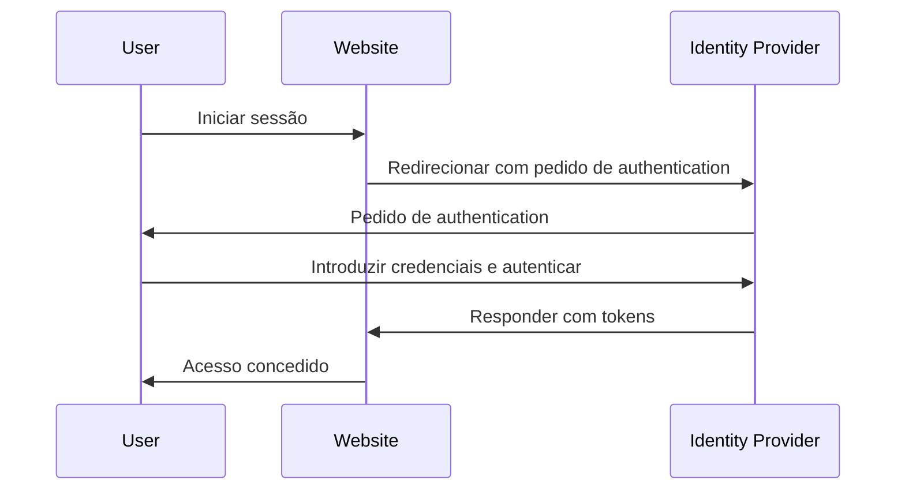

## O que é gestão de identidade e acesso (IAM)?

Como a definição sugere, a gestão de identidade e acesso (IAM) é um conceito amplo que envolve muitos aspetos da gestão de identidades digitais e da realização de <Ref slug="access-control" />. Vamos primeiro decompor os termos:

- **Identidade**: Uma representação digital de um utilizador, serviço ou dispositivo. Uma identidade pode incluir atributos como identificadores, funções e permissões.
- **Acesso**: A capacidade de interagir com recursos, realizar ações ou usar serviços. Resumindo, o acesso diz respeito a quais ações realizar em determinados recursos.

### Gestão de identidade

A gestão de identidade é o processo de gerir, autenticar e proteger identidades digitais. Envolve as seguintes atividades principais:

- **Registo de identidade**: Criação de novas identidades para utilizadores, serviços ou dispositivos.
- **Autenticação de identidade**: Verificação da propriedade de uma identidade através de vários mecanismos, como senhas, biometria ou autenticação multifator.
- **Segurança de identidade**: Proteção de identidades contra acesso não autorizado, uso indevido ou divulgação.

Cada tópico é vasto e pode ser ainda dividido em subtópicos, como gestão de senhas, federação de identidade e gestão do ciclo de vida da identidade.

### Gestão de acesso

A gestão de acesso (ou <Ref slug="access-control" />) é o processo de controlar quem pode realizar quais ações em determinados recursos. Envolve as seguintes atividades principais:

- **Políticas de controlo de acesso**: Definição de regras e políticas que ditam quem pode aceder a quais recursos e quais ações podem realizar.
- **Aplicação de acesso**: Aplicação de políticas de controlo de acesso através de mecanismos como autenticação, autorização e auditoria.
- **Governança de acesso**: Monitorização e gestão dos direitos de acesso para garantir a conformidade com regulamentos e melhores práticas de segurança.

Cada atividade desempenha um papel importante em aplicações e sistemas modernos para garantir que apenas identidades autorizadas (utilizadores, serviços ou dispositivos) possam aceder a recursos com base nas políticas definidas.

## Quais são os componentes do IAM?

Na aplicação, o IAM é implementado usando uma combinação de software, serviços e melhores práticas. Dois componentes importantes do IAM são:

- **<Ref slug="identity-provider" />**: Um serviço que gere identidades de utilizadores e autenticação.
- **<Ref slug="service-provider" />**: Um serviço que depende de um fornecedor de identidade para autenticação e autorização. Na maioria dos casos, é a aplicação ou serviço que estás a desenvolver.

Uma separação clara entre o fornecedor de identidade e o fornecedor de serviço ajudará a desacoplar o IAM da lógica da aplicação, tornando-o mais fácil de gerir e escalar.

## Gestão de identidade e acesso na prática

Vamos ver um exemplo de como o IAM funciona: quando inicias sessão num site, o processo de verificar quem és e conceder-te acesso ao site pode ser considerado um processo de gestão de identidade e acesso.

Normalmente, o processo de IAM envolve dois passos principais: authentication e authorization:

- <Ref slug="authentication" /> responde à pergunta “Qual identidade possuis?”
- <Ref slug="authorization" /> responde à pergunta “O que podes fazer?”

> Às vezes, authentication será interpretada como "Quem és tu?" No entanto, ao discutir identidades digitais, é mais preciso demonstrar authentication provando a propriedade da identidade.

Além disso, o conceito de gestão de identidade e acesso é suficientemente grande para dar origem a novos conceitos, como WIAM (Workforce IAM) e CIAM (Customer IAM).

Embora WIAM e CIAM partilhem a mesma base, têm casos de uso distintos: WIAM é tipicamente usado para utilizadores internos, enquanto CIAM é usado para clientes externos. Alguns exemplos:

- **WIAM**: A tua empresa tem um sistema de identidade unificado para funcionários, assim todos podem usar a mesma conta para aceder a recursos da empresa, como assinaturas de software, serviços de computação em nuvem, etc.
- **CIAM**: A tua livraria online requer um sistema de identidade de utilizador para clientes e vendedores. A experiência de início de sessão é uma parte crítica da integração, pois está localizada no topo do funil de conversão.

Para saber mais sobre o conceito de CIAM e tópicos relacionados, podes consultar [CIAM 101: Authentication, Identity, SSO](https://blog.logto.io/ciam-101-intro-authn-sso).

### Authentication

Aqui estão alguns métodos comuns de authentication usados no IAM:

- **Authentication baseada em senha**: O método mais comum, onde os utilizadores fornecem um nome de utilizador e senha para provar a sua identidade.
- **Authentication <Ref slug="passwordless" />**: Um método que permite aos utilizadores iniciar sessão sem uma senha, como usar um código único enviado para o seu e-mail ou telefone. Note que authentication passwordless também pode referir-se a outros métodos, como authentication biométrica.
- **Login social**: Um método que permite aos utilizadores iniciar sessão usando as suas contas de redes sociais, como Google, Facebook ou Twitter.
- **<Ref slug="passkey" /> (WebAuthn)**: Um método que permite aos utilizadores iniciar sessão usando uma chave de segurança, como uma chave USB ou um smartphone que suporta WebAuthn.
- **Authentication biométrica**: Um método que usa características físicas, como impressões digitais, reconhecimento facial ou reconhecimento de voz, para verificar a identidade de um utilizador.
- **Authentication <Ref slug="machine-to-machine" />**: Um método que permite que serviços ou dispositivos autentiquem-se mutuamente sem intervenção humana, como usar chaves de API ou certificados.

Para uma camada adicional de segurança, <Ref slug="mfa" /> pode ser usado em combinação com esses métodos de authentication. MFA requer que os utilizadores forneçam dois ou mais fatores para provar a sua identidade, como algo que sabem (senha), algo que têm (chave de segurança ou <Ref slug="totp" />), ou algo que são (dados biométricos).

### Authorization

Com authentication em vigor, authorization determina quais ações uma identidade pode realizar. Authorization pode ser baseada em vários fatores, como a função da identidade, associação a grupos, permissões, atributos, políticas, etc. Existem vários modelos comuns de authorization:

- **<Ref slug="rbac" />**: Um modelo que atribui permissões a funções, e depois atribui funções a identidades. Por exemplo, uma função de funcionário pode ter acesso a certos recursos, enquanto uma função de administrador pode ter acesso a todos os recursos.
- **<Ref slug="abac" />**: Um modelo que usa atributos (propriedades) da identidade, recurso e ambiente para tomar decisões de controlo de acesso. Por exemplo, uma identidade com o atributo "departamento=engenharia" pode ter acesso a recursos de engenharia.
- **Controlo de acesso baseado em políticas (PBAC)**: Um modelo que usa políticas para definir regras de controlo de acesso. As políticas podem ser baseadas em vários fatores, como hora do dia, localização, tipo de dispositivo, etc.
- **Controlo de acesso granular**: Um modelo que fornece um controlo mais granular sobre o acesso, permitindo que permissões sejam definidas ao nível de recursos ou ações individuais.

## Quais são os padrões abertos amplamente utilizados para IAM?

Existem vários padrões e protocolos abertos que são amplamente utilizados no IAM:

- **<Ref slug="oauth-2.0" />**: Um protocolo que permite que aplicações acedam a recursos em nome de um utilizador sem compartilhar as credenciais do utilizador. OAuth 2.0 é comumente usado para authorization, como permitir que uma aplicação de terceiros aceda aos arquivos do Google Drive de um utilizador.
- **<Ref slug="openid-connect" />**: Uma camada de identidade construída sobre o OAuth 2.0 que permite que aplicações verifiquem a identidade de um utilizador e obtenham informações básicas de perfil sobre o utilizador. Single sign-on (SSO) é um caso de uso comum para OpenID Connect. Combinar OAuth 2.0 e OpenID Connect é uma prática comum para IAM moderno.
- **<Ref slug="saml" />**: Um padrão baseado em XML para troca de dados de authentication e authorization entre fornecedores de identidade e fornecedores de serviço. SAML é comumente usado para SSO em ambientes empresariais.
- **SCIM (System for Cross-domain Identity Management)**: Um padrão para automatizar a troca de informações de identidade de utilizador entre fornecedores de identidade e fornecedores de serviço. SCIM é comumente usado para provisionamento e desprovisionamento de utilizadores em aplicações baseadas na nuvem.

## Quais são as principais considerações de design para IAM?

Ao projetar um sistema IAM, há várias considerações chave a ter em mente:

- **Segurança**: A segurança é primordial no IAM. Certifica-te de que os métodos de authentication estão a seguir as melhores práticas, como usar hashing de senha forte, aplicar MFA e proteger contra ataques comuns como phishing e força bruta.
- **Privacidade**: Respeita a privacidade do utilizador coletando apenas as informações necessárias e obtendo o consentimento do utilizador quando necessário.
- **Escalabilidade**: Torna o sistema IAM escalável para lidar com um grande número de utilizadores e aplicações. Considera usar fornecedores de identidade baseados na nuvem para escalabilidade.
- **Interoperabilidade**: Um benefício de usar padrões abertos é que permite a interoperabilidade entre diferentes sistemas. Por exemplo, a maioria dos fornecedores de identidade populares como Google, Facebook e Microsoft suportam OAuth 2.0 e OpenID Connect.
- **Experiência do utilizador**: A experiência do utilizador para authentication e authorization impacta muito a conversão e retenção de utilizadores. Equilibrar segurança com facilidade de uso é uma arte no IAM.

<SeeAlso slugs={['openid-connect', 'oauth-2.0', 'single-sign-on', 'enterprise-sso']} />

<Resources
  urls={[
    "https://blog.logto.io/ciam-101-intro-authn-sso",
    "https://blog.logto.io/ciam-102-authz-and-rbac"
  ]}
/>