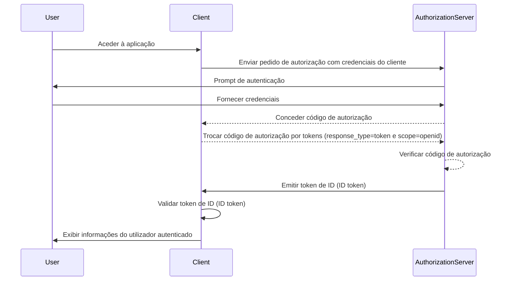

## O que é um token de ID (ID token)?

Um token de ID (ID token) é um tipo específico de token de segurança que contém informações sobre o utilizador autenticado, entregue à aplicação cliente após uma <Ref slug="authentication" /> bem-sucedida. O token de ID (ID token) é a característica chave que distingue o <Ref slug="openid-connect" /> do <Ref slug="oauth-2.0" />. Enquanto o OAuth 2.0 foca-se apenas na autorização, o OIDC constrói sobre ele para adicionar a autenticação do utilizador introduzindo o token de ID (ID token).

No processo de autenticação OIDC, uma aplicação cliente (parte confiável) inicia a autenticação redirecionando o utilizador para um servidor de autorização. Após a autenticação bem-sucedida, o servidor responde com um token de ID (ID token), entre outros tokens como o <Ref slug="access-token" />. O token de ID (ID token) é tipicamente codificado como um <Ref slug="jwt" /> e inclui claims chave como o identificador do utilizador (sub), o issuer (iss), audience (aud) e outras informações específicas do utilizador.

A função principal do token de ID (ID token) é verificar a identidade do utilizador e transmitir esta informação para a aplicação cliente. Isto permite que a aplicação autentique o utilizador sem lidar diretamente com credenciais. Como o cliente só recebe o token de ID (ID token) após o utilizador ter sido autenticado pelo servidor de autorização, o token de ID (ID token) pode ser usado como uma forma segura de verificar a identidade do utilizador.

## Como funciona o token de ID (ID token)?

A aplicação cliente inicia o processo de autenticação redirecionando o utilizador para o servidor de autorização. O utilizador autentica-se com o servidor, que então emite um token de ID (ID token) juntamente com outros tokens como o access token. O token de ID (ID token) é retornado para a aplicação cliente, que pode então usá-lo para verificar a identidade do utilizador.

Como o OIDC é um protocolo popular e padronizado, muitas bibliotecas e frameworks oferecem suporte embutido para lidar com tokens de ID (ID tokens). Isso torna os tokens de ID (ID tokens) fáceis de integrar em aplicações cliente e amplamente usados em cenários de <Ref slug="single-sign-on" /> e identidade federada.

## Claims em um token de ID (ID token)

Um token de ID (ID token) é um JWT que contém um conjunto de <Ref slug="claim" /> sobre o utilizador autenticado. Estas claims incluem tanto claims padrão do JWT que são definidos na [especificação JWT](https://datatracker.ietf.org/doc/html/rfc7519#section-4), como claims específicos do OIDC que são usados para transmitir informações de identidade do utilizador.

Claims padrão do token JWT:

- **iss (Issuer)**: OBRIGATÓRIO. A claim issuer identifica o issuer do token de ID (ID token). Este é tipicamente o URL do servidor de autorização que emitiu o token.
- **sub (Subject)**: OBRIGATÓRIO. A claim subject identifica o utilizador sobre o qual o token de ID (ID token) se refere. Este é tipicamente um identificador único para o utilizador.
- **aud (Audience)**: OBRIGATÓRIO. A claim audience identifica a <Ref slug="audience" /> para o token de ID (ID token). Este é tipicamente a aplicação cliente que solicitou o token.
- **exp (Expiration time)**: OBRIGATÓRIO. A claim expiration time identifica o momento em que o token expira. Após este tempo, o token não deve ser aceito para processamento.
- **iat (Issued at)**: OBRIGATÓRIO. A claim issued at identifica o momento em que o token foi emitido.
- **auth_time (Authentication time)**: OPCIONAL. A claim authentication time identifica o momento em que o utilizador foi autenticado. Esta claim só está presente se o utilizador foi autenticado durante a sessão atual.
- **nonce**: OPCIONAL. A claim nonce é usada para associar uma sessão do cliente com um token de ID (ID token). É tipicamente usada para prevenir ataques de repetição.

Claims padrão de informações do utilizador OIDC:

- **name**: O nome completo do utilizador.
- **given_name**: O nome próprio do utilizador.
- **family_name**: O sobrenome do utilizador.
- **middle_name**: O nome do meio do utilizador.
- **nickname**: O apelido ou outro nome curto do utilizador.
- **preferred_username**: O nome de utilizador preferido do utilizador.
- **profile**: Um URL que aponta para a página de perfil do utilizador.
- **picture**: Um URL que aponta para a foto de perfil do utilizador.
- **website**: Um URL que aponta para o site do utilizador.
- **email**: O endereço de email do utilizador.
- **email_verified**: Um valor booleano indicando se o endereço de email do utilizador foi verificado.
- **gender**: O género do utilizador.
- **birthdate**: A data de nascimento do utilizador. Representada como uma string no formato AAAA-MM-DD.
- **zoneinfo**: O fuso horário do utilizador. String do [Banco de Dados de Fuso Horário da IANA](https://www.iana.org/time-zones).
- **locale**: A localidade do utilizador. Representa a língua e região preferidas do utilizador para formatação de datas, horas e números.
- **phone_number**: O número de telefone do utilizador.
- **phone_number_verified**: Um valor booleano indicando se o número de telefone do utilizador foi verificado.
- **address**: O endereço postal do utilizador. O valor é um objeto JSON que contém as informações de endereço do utilizador.
- **updated_at**: O momento em que as informações do utilizador foram atualizadas pela última vez.

Estas claims fornecem uma forma padronizada de transmitir informações de identidade do utilizador no token de ID (ID token). Enquanto a especificação define apenas um conjunto de claims padrão, claims personalizadas também podem ser incluídas no token de ID (ID token) para transmitir informações adicionais específicas do utilizador conforme necessário.

## Validação do token de ID (ID token)

Quando a aplicação cliente recebe um token de ID (ID token), ela deve validar o token para garantir sua autenticidade e integridade. O processo de validação tipicamente envolve os seguintes passos:

1. **Verificar a assinatura**: O cliente deve verificar a assinatura do token de ID (ID token) usando a chave pública do servidor de autorização. Isso garante que o token não foi adulterado e foi emitido pela parte esperada.
2. **Verificar o issuer**: O cliente deve verificar se a claim `iss` no token de ID (ID token) corresponde ao URL do servidor de autorização que emitiu o token. Isso ajuda a prevenir ataques de substituição de token.
3. **Verificar a audience**: O cliente deve verificar se a claim `aud` no token de ID (ID token) corresponde ao `client_id` da aplicação cliente. Isso garante que o token foi emitido para a aplicação cliente.
4. **Verificar o tempo de expiração**: O cliente deve verificar se a claim `exp` no token de ID (ID token) não passou. Se o token expirou, ele não deve ser aceito. Implementações podem fornecer uma margem para compensar a diferença de relógio.
5. **Verificar o nonce**: Se o cliente incluiu um parâmetro `nonce` no pedido de autenticação, ele deve verificar se a claim `nonce` no token de ID (ID token) corresponde ao valor do parâmetro `nonce`. Isso ajuda a prevenir ataques de repetição.

## Token de ID (ID token) vs token de acesso (access token)

Embora ambos os tokens de ID (ID tokens) e tokens de acesso (access tokens) sejam amplamente usados no OIDC, eles servem a propósitos diferentes e têm características distintas:

|              | Token de ID (ID token)                                                                 | Token de acesso (Access token)                                                                                               |
| ------------ | -------------------------------------------------------------------------------------- | ---------------------------------------------------------------------------------------------------------------------------- |
| **Propósito**| Verifica a identidade do utilizador e transmite informações do utilizador para a aplicação cliente. | Fornece acesso a recursos protegidos em nome do utilizador.                                                                  |
| **Formato**  | Tipicamente um JWT que contém claims de identidade do utilizador.                      | Pode ser um JWT ou um <Ref slug="opaque-token" />.                                                                           |
| **Audience** | Destinado à aplicação cliente que solicitou o token.                                   | Destinado ao servidor de recursos que hospeda os recursos protegidos.                                                        |
| **Duração**  | Token de curta duração que é tipicamente válido por alguns minutos. Uso único.         | Token de longa duração que é válido por um período mais longo (por exemplo, horas). Pode ser reutilizado várias vezes dentro do seu período de validade. |
| **Conteúdo** | Contém informações de identidade do utilizador como nome, email e outros dados específicos do utilizador. | Contém informações sobre as permissões (scopes) do utilizador para recursos específicos.                                     |

## Melhores práticas para usar tokens de ID (ID tokens)

Ao trabalhar com tokens de ID (ID tokens) no OIDC, é importante seguir as melhores práticas para garantir a segurança e integridade do processo de autenticação. Algumas das principais melhores práticas incluem:

1. **Validar tokens de ID (ID tokens)**: Sempre valide o token de ID (ID token) recebido do servidor de autorização para garantir sua autenticidade e integridade. Isso ajuda a prevenir ataques de substituição de token e acesso não autorizado.
2. **Usar canais seguros**: Certifique-se de que os tokens de ID (ID tokens) sejam transmitidos por canais seguros (por exemplo, HTTPS) para prevenir interceptação e adulteração.
3. **Proteger informações sensíveis**: Como os JWTs são tipicamente codificados mas não criptografados, o que torna o conteúdo transparente. Evite incluir informações sensíveis no payload do token de ID (ID token) para prevenir a exposição de dados sensíveis em caso de vazamento de token.
4. **Não para autorização**: Tokens de ID (ID tokens) são destinados à autenticação do utilizador e não devem ser usados para propósitos de autorização. Use tokens de acesso (access tokens) para autorização para acessar recursos protegidos.
5. **Uso único**: Tokens de ID (ID tokens) são geralmente destinados a uso único. Uma vez que uma aplicação cliente tenha validado um token de ID (ID token), ele não deve ser reutilizado para pedidos subsequentes ou preservação de estado de sessão. Para manter o estado de sessão do utilizador, as aplicações cliente devem empregar mecanismos como <Ref slug="refresh-token" /> e pedidos de troca de token. (Refresh tokens são tokens opacos de longa duração que podem ser usados para obter novos tokens de acesso e tokens de ID (ID tokens) quando eles expiram.)

<SeeAlso slugs={["openid-connect", "jwt", "signing-key", "access-token"]} />