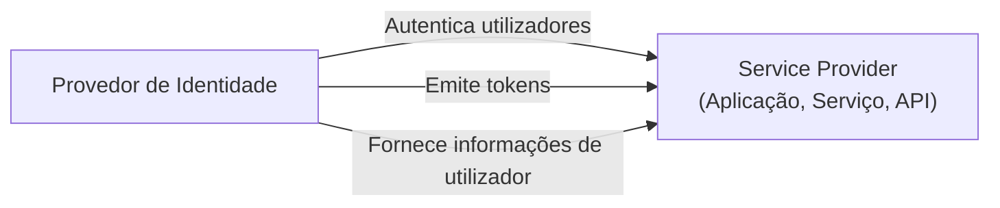
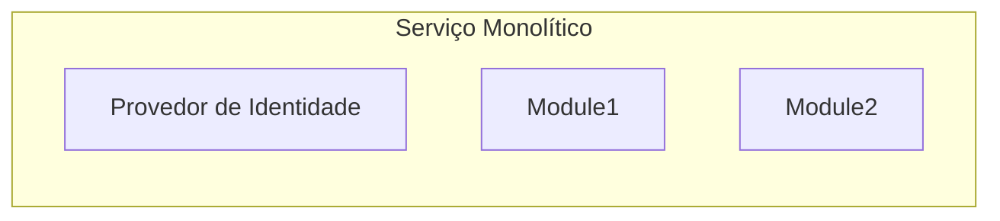
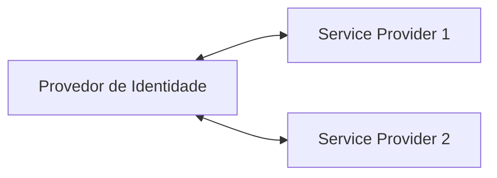

## O que é um provedor de identidade (IdP)?

No domínio de <Ref slug="iam" />, um provedor de identidade (IdP) é o serviço central para gerir identidades. É responsável por autenticar utilizadores, emitir tokens de identidade e fornecer informações de utilizador a <Ref slug="service-provider">service providers</Ref> (por exemplo, aplicações, serviços, APIs).

Além de <Ref slug="authentication" />, os provedores de identidade modernos também são responsáveis por <Ref slug="authorization" /> (aplicando políticas de <Ref slug="access-control" />) e suportando funcionalidades avançadas como <Ref slug="single-sign-on" /> e <Ref slug="multi-tenancy" />.

## Normas do provedor de identidade

Devido à natureza da gestão de identidades e à necessidade de interoperabilidade, seria impraticável e ineficiente construir provedores de identidade sem normas. Aqui estão alguns cenários típicos:

- Dois provedores de identidade precisam comunicar-se entre si para trocar informações de utilizador (por exemplo, login social).
- Uma aplicação precisa autenticar utilizadores usando múltiplos provedores de identidade (por exemplo, identidade federada).
- Um provedor de identidade precisa suportar múltiplos tipos de clientes (por exemplo, web, móvel, IoT).

Para abordar estes cenários, a indústria desenvolveu várias normas populares para provedores de identidade:

- <Ref slug="oauth-2.0" />: Uma estrutura de autorização amplamente utilizada que permite que aplicações obtenham acesso em nome de utilizadores ou serviços.
- <Ref slug="openid-connect" />: Uma camada de identidade construída sobre o OAuth 2.0 que fornece autenticação e informações de utilizador.
- <Ref slug="saml" />: Um padrão para troca de dados de autenticação e autorização entre domínios de segurança.

Para novas aplicações, OpenID Connect (OIDC) é o padrão recomendado a usar, seja para construir um provedor de identidade ou integrar com provedores de identidade existentes.

## Arquitetura do provedor de identidade

O termo "provedor de identidade" não especifica uma arquitetura ou implementação particular. Ou seja, um provedor de identidade pode ser uma aplicação monolítica, um microsserviço ou um serviço em nuvem.

Devido à complexidade e criticidade da gestão de identidades, as aplicações modernas tendem a usar provedores de identidade especializados que são serviços independentes ou soluções de fornecedores.

## Funcionalidades do provedor de identidade

Os provedores de identidade modernos oferecem uma ampla gama de funcionalidades para suportar vários casos de uso e requisitos. Aqui estão algumas funcionalidades comuns:

- <Ref slug="authentication" />: Verificar a identidade dos utilizadores usando vários métodos (por exemplo, nome de utilizador/senha, login social, <Ref slug="mfa" />).
- <Ref slug="authorization" />: Aplicar políticas de acesso e gerir permissões de utilizador (por exemplo, <Ref slug="rbac" />, <Ref slug="abac" />).
- **Gestão de utilizadores**: Criar, atualizar e eliminar contas e perfis de utilizador; fornecer dados de utilizador a <Ref slug="service-provider">service providers</Ref>.
- **Gestão de tokens**: Emitir e gerir tokens de identidade (por exemplo, ID token, access token, refresh token).
- <Ref slug="single-sign-on" />: Permitir que os utilizadores se autentiquem uma vez e acedam a múltiplas aplicações.
- <Ref slug="multi-tenancy" />: Suportar múltiplas organizações ou inquilinos com dados e configurações de utilizador isolados.

<SeeAlso slugs={["service-provider", "iam", "openid-connect", "oauth-2.0"]} />

<Resources
  urls={[
    "https://blog.logto.io/secure-cloud-apps-with-oauth-and-openid-connect",
    "https://blog.logto.io/incorporate-identity-solution",
    "https://blog.logto.io/centralized-identity-system"
  ]}
/>