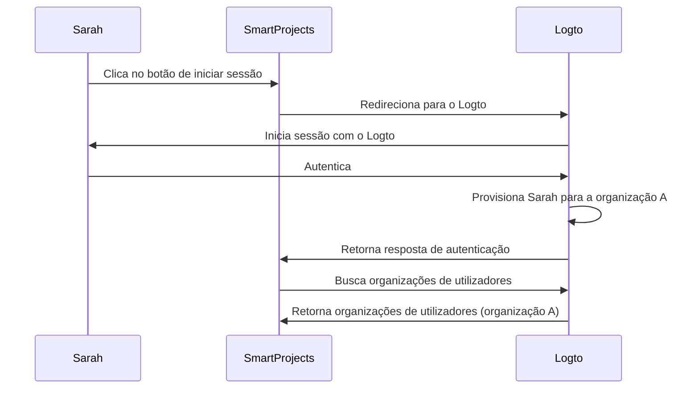
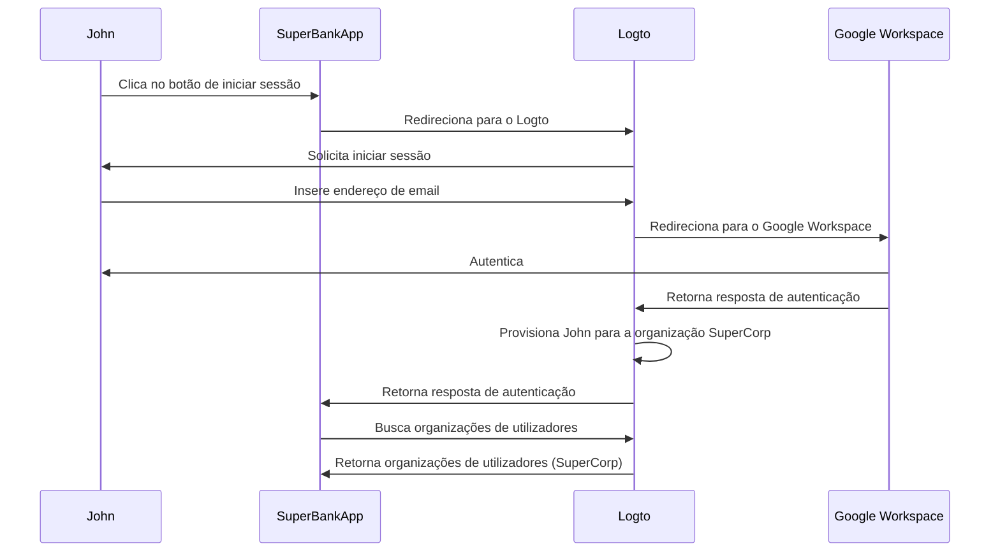

## O que é o provisionamento just-in-time?

O provisionamento Just-in-time (JIT) é um processo utilizado em <Ref slug="iam" /> onde as contas de utilizador são provisionadas de acordo com a identidade do utilizador e a configuração do sistema de forma dinâmica quando o utilizador tenta iniciar sessão pela primeira vez.

## Quais são os casos de uso para o provisionamento just-in-time?

Estes casos são comuns ao construir uma aplicação B2B que envolve arquitetura multi-tenant, Enterprise SSO, ou que requer funcionalidades de integração de equipa. Aqui estão alguns cenários de exemplo que tu ou o teu cliente podem encontrar.

### Integração de funcionários

Imagina que um dos teus clientes, *SuperFantasy*, está a passar por contratações frequentes ou crescimento rápido e pode usar o provisionamento JIT para configurar rapidamente contas de utilizador para novos funcionários. *SuperFantasy* usa o Logto para gestão de identidade e acesso e o SmartProjects para gestão de projetos. Quando uma nova funcionária, Sarah, inicia sessão no SmartProjects pela primeira vez, a sua conta é automaticamente criada e configurada com base nas suas credenciais do Logto.

De acordo com o diagrama acima, quando Sarah inicia sessão no SmartProjects pela primeira vez, a sua conta é automaticamente provisionada para a organização A no Logto. Este processo garante que Sarah tenha o acesso necessário ao SmartProjects sem exigir intervenção manual da equipa de TI.

### Integração de clientes empresariais

Imagina outro cliente, *SuperBank*, uma instituição financeira que fornece serviços bancários online aos seus clientes. *SuperBank* usa o Logto para gestão de identidade e acesso e o SuperBankApp para serviços bancários online. *SuperBank* assinou recentemente um contrato com um novo cliente empresarial, *SuperCorp*, para fornecer serviços bancários online aos seus funcionários.

*SuperCorp* usa o Google Workspace para as contas dos seus funcionários. O SuperBankApp precisa garantir que, quando um funcionário da *SuperCorp* inicia sessão pela primeira vez, a sua conta seja automaticamente adicionada à organização *SuperCorp* no Logto.

No diagrama acima, quando John inicia sessão no SuperBankApp pela primeira vez, a sua conta é automaticamente provisionada para a organização SuperCorp no Logto de acordo com a sua identidade do Google Workspace.

## É específico para SAML e Enterprise SSO?

O provisionamento Just-in-time (JIT) é frequentemente associado ao <Ref slug="enterprise-sso" /> na autenticação SAML, mas não é exclusivo ao <Ref slug="saml" />. O provisionamento JIT também pode ser usado com outros protocolos de autenticação como <Ref slug="oauth-2.0" /> e <Ref slug="openid-connect" />, e não requer sempre uma configuração de <Ref slug="enterprise-sso" />.

Por exemplo, o provisionamento JIT baseado em email pode ser usado quando o teu <Ref slug="identity-provider" /> suporta esta funcionalidade. Neste caso, o endereço de email do utilizador é o único atributo necessário para o provisionamento, independentemente do protocolo de autenticação ou configuração de SSO.

## Aplica-se a novos ou existentes utilizadores da aplicação?

O provisionamento Just-in-time (JIT) geralmente refere-se à primeira tentativa de acesso a uma aplicação. No entanto, diferentes produtos percebem esta funcionalidade de forma diferente. Alguns usam o provisionamento JIT apenas para criação de identidade e conta, enquanto outros também incluem atualizações de conta just-in-time, como reprovisionamento e sincronização de atributos.

Por exemplo, o SAML JIT Provisioning permite conceder e revogar associações de grupo como parte do provisionamento. Também pode atualizar utilizadores provisionados para manter os seus atributos na loja do <Ref slug="service-provider" /> em sincronia com os atributos da loja do <Ref slug="identity-provider" />.

Se quiseres considerar o cenário de início de sessão de utilizadores existentes subsequentes, certifica-te de que tens um sistema de provisionamento robusto juntamente com o teu sistema JIT. Por exemplo:

- **Resolução de conflitos**: O teu sistema deve ter uma estratégia para lidar com conflitos se uma conta já existir com informações diferentes das fornecidas pelo IdP durante o processo JIT. Isto pode exigir um controlo detalhado das políticas da tua organização e configuração do IdP.
- **Registos de auditoria**: É importante manter registos de tanto novas criações de contas quanto atualizações de contas existentes através de processos JIT por razões de segurança e conformidade.
- **Desempenho**: Embora o provisionamento JIT aconteça rapidamente, considera o impacto potencial nos tempos de início de sessão, especialmente para utilizadores existentes se estiveres a atualizar as suas informações a cada início de sessão.
- **Consistência de dados**: Garante que o teu processo de provisionamento JIT mantém a consistência dos dados, especialmente ao atualizar contas de utilizadores existentes.

## Qual é a diferença entre JIT e System for Cross-domain Identity Management (SCIM)?

SCIM é um protocolo padrão aberto projetado para simplificar e automatizar a gestão de identidade de utilizadores em diferentes sistemas e domínios. É comumente usado em cenários de sincronização de diretórios.

A principal diferença entre JIT e SCIM é que JIT geralmente refere-se à primeira tentativa de acesso a uma aplicação (ou integração de novos utilizadores), e é um termo amplo que descreve o processo de provisionamento dinâmico de contas de utilizadores; enquanto SCIM é um protocolo específico para gerir o ciclo de vida de utilizadores em sistemas e não é limitado ao primeiro início de sessão.

Além disso, JIT carece de uma implementação padronizada em sistemas, enquanto SCIM é um protocolo padronizado definido pelo [RFC 7644](https://datatracker.ietf.org/doc/html/rfc7644) para gestão de identidade.

Algumas organizações maiores usam SCIM para provisionamento de contas, integrando-o com os seus próprios sistemas. Isto pode ser muito complexo e variar caso a caso. Para a maioria dos casos de uso, o provisionamento JIT é uma abordagem mais simples e direta.

<Resources urls={['https://blog.logto.io/jit-provisioning', 'https://datatracker.ietf.org/doc/html/rfc7644']} />