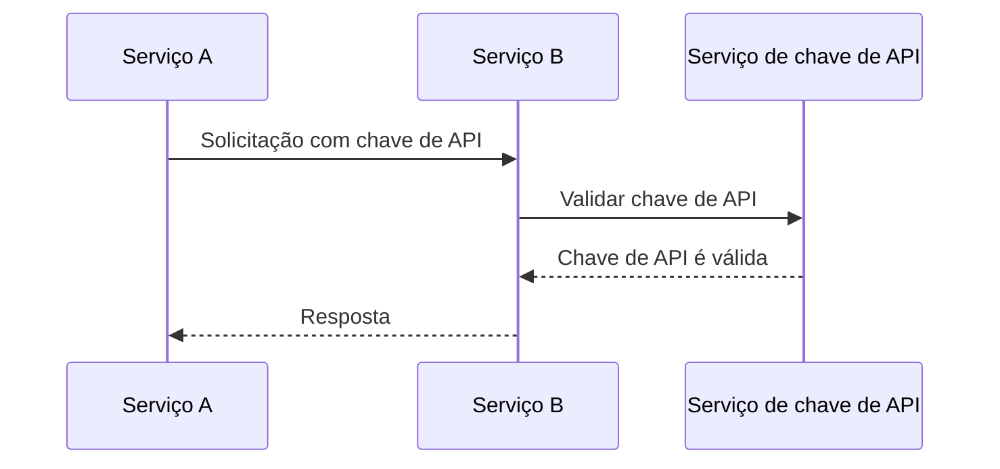
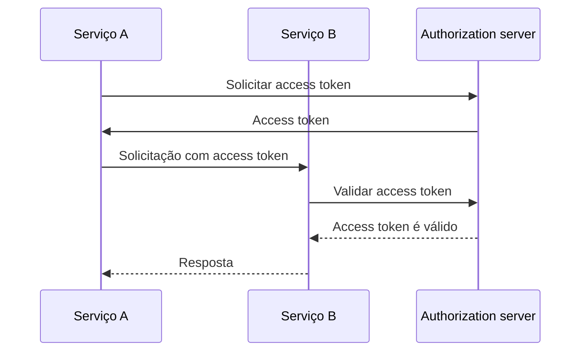
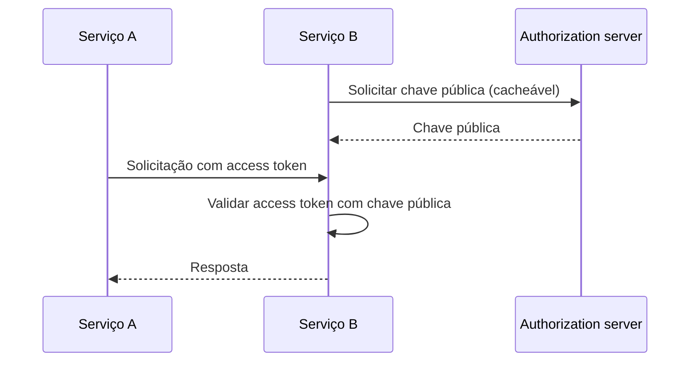

## O que é comunicação máquina a máquina?

Comunicação máquina a máquina (M2M) refere-se à troca automatizada de dados entre dispositivos sem intervenção humana. No contexto de autenticação (authentication) e autorização (authorization), a comunicação M2M frequentemente envolve uma aplicação cliente que precisa acessar recursos, onde a aplicação cliente é uma máquina (serviço) ou uma máquina agindo em nome de um utilizador.

## Por que precisamos lidar com comunicação máquina a máquina?

Quando tens apenas um serviço sem quaisquer dependências, provavelmente não precisas comunicar com outros serviços. À medida que o teu sistema cresce, ou queres integrar com um sistema de gestão de identidade e acesso (IAM), precisas lidar com a comunicação máquina a máquina.

No entanto, ainda parece simples - tudo o que precisas é identificar o serviço e autenticá-lo. Mas, na realidade, há vários desafios que precisas enfrentar:

### 1. Autenticação (Authentication)

Como autenticas o serviço? Não podes usar um nome de utilizador e senha, pois não há um humano para inseri-los. Precisas usar um mecanismo diferente, como chaves de API (api key), certificados de cliente, ou OAuth client credentials.

### 2. Autorização (Authorization)

Uma vez que autenticas o serviço, como determinas o que o serviço pode fazer? Precisas definir as permissões e papéis (roles) para o serviço, semelhante a como os defines para utilizadores. A última coisa que queres é codificar as permissões no teu código.

### 3. Segurança

Como garantis que a comunicação entre serviços é segura? As credenciais serão atualizadas regularmente? Como monitoras e auditas a comunicação?

### 4. Escalabilidade

À medida que o número de serviços cresce, como geres a autenticação (authentication) e autorização (authorization) para cada serviço?

## As abordagens comuns para comunicação máquina a máquina

Com os desafios em mente, há várias abordagens comuns na indústria:

### 1. Chaves de API (API keys)

<Ref slug="api-key">Chaves de API</Ref> são uma maneira simples de autenticar serviços. Cada serviço pode ter uma ou mais chaves de API, que são usadas para autenticação (e às vezes autorização). Podes ver alguns serviços pedindo para fornecer uma chave de API no cabeçalho da solicitação, como `X-API-Key: your-api-key`.

Um exemplo não normativo de como as chaves de API funcionam:

Vantagens:

- Simples de implementar e usar.
- Com geração aleatória segura e suficientemente longa, as chaves de API são difíceis de adivinhar.
- A validação é dinâmica, o que significa que podes revogar uma chave de API a qualquer momento.

Desvantagens:

- Requer comunicação de rede para validar a chave de API.
- Não é autossuficiente, o que significa que é necessário um serviço para introspecção.
- O outro serviço tem o mesmo nível de acesso que o serviço que possui a chave de API (pode ser parcialmente mitigado usando um gateway de API).
- É difícil gerir um grande número de chaves de API entre serviços.

### 2. OAuth client credentials

OAuth (ou OIDC, já que OpenID Connect é baseado em OAuth 2.0) <Ref slug="client-credentials-flow" /> é uma maneira mais avançada de autenticar serviços. É baseado na estrutura OAuth 2.0, que é amplamente usada para autenticação (authentication) e autorização (authorization) de utilizadores. Com OAuth client credentials, um serviço pode obter um access token apresentando seu client ID e client secret ao authorization server.

Um exemplo não normativo de como OAuth client credentials funcionam:

Normalmente, o access token é um JSON Web Token (JWT), que contém informações sobre o serviço e suas permissões. Então, o outro serviço pode validar o access token sem comunicar com o authorization server (desde que tenha a chave pública para verificar a assinatura do JWT). O fluxo de trabalho torna-se:

Para mais informações sobre JSON Web Tokens, veja <Ref slug="jwt" />.

Vantagens (com JWT):

- Autossuficiente, o que significa que o outro serviço pode imediatamente saber as informações necessárias, como permissões, sem comunicação adicional de rede.
- O access token pode ter uma vida curta, reduzindo o risco de uso indevido.
- O outro serviço não precisa conhecer o client secret, apenas a chave pública para verificar a assinatura do JWT.
- O access token pode ser usado para auditar as ações do serviço (por exemplo, qual serviço acessou qual recurso).
- É mais fácil gerir um grande número de serviços, pois estabelece uma fronteira clara entre serviços e permissões.

Desvantagens:

- Um pouco mais complexo de implementar e usar do que chaves de API.
- Se o outro serviço apenas realizar validação offline, pode não saber se o access token foi revogado.

### 3. Mutual TLS

Mutual TLS (mTLS) é uma maneira de autenticar serviços usando certificados de cliente. Com mTLS, cada serviço possui um certificado de cliente com uma chave privada, e o outro serviço verifica o certificado usando a chave pública. No entanto, mTLS foca na camada TLS, o que significa que sozinho geralmente não se adequa à autenticação (authentication) e autorização (authorization) a nível de aplicação.

Para casos de uso avançados, mTLS pode ser combinado com access tokens vinculados a certificados para proteger ainda mais a comunicação. Veja [RFC 8705: OAuth 2.0 Mutual-TLS Client Authentication and Certificate-Bound Access Tokens](https://datatracker.ietf.org/doc/html/rfc8705) para mais informações.

Vantagens:

- Autenticação forte, pois é baseada em criptografia de chave pública.
- A comunicação é criptografada e segura por padrão.
- O certificado de cliente pode ser usado para identificar o serviço, semelhante a como um JWT funciona.

Desvantagens:

- Mais complexo de implementar e gerir do que chaves de API e OAuth client credentials.
- O certificado de cliente precisa ser atualizado regularmente.
- Mais conhecimento técnico é necessário para gerir certificados de cliente adequadamente.
- O outro serviço pode não suportar mTLS, o que significa que precisas ter um mecanismo de fallback.

<SeeAlso slugs={["api-key", "client-credentials-flow", "jwt"]} />