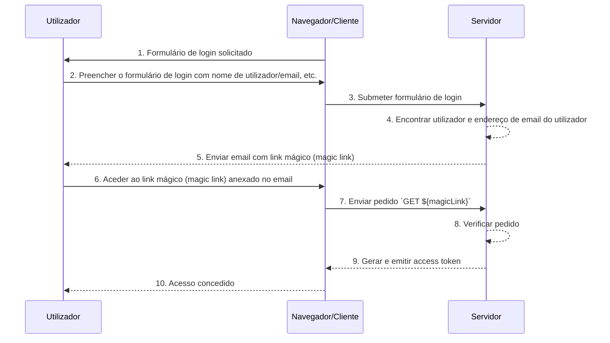

## O que são links mágicos (magic links)?

Um link mágico (magic link) é um link de uso único enviado ao utilizador durante o processo de autenticação (authentication).

Ao aceder a este link, o utilizador completa o fluxo de autorização (authorization flow) necessário para aceder ao recurso desejado e é concedido o acesso apropriado aos recursos. Depois disso, o link mágico (magic link) torna-se inválido.

## Qual é a diferença entre link mágico (magic link) e palavra-passe de uso único (OTP)?

Vamos supor que o utilizador use o email para receber um link mágico (magic link) ou <Ref slug='otp' />.

Em muitos casos, os utilizadores usam o email para receber um OTP para verificar o login ou como um fator de verificação adicional para <Ref slug='mfa' />. Qual é a diferença entre usar um link mágico (magic link) por email e um OTP por email?

Com o OTP, o utilizador precisa verificar o email, lembrar-se do OTP e depois inseri-lo no processo de login/verificação. Isso requer que o utilizador alterne manualmente entre diferentes apps ou páginas repetidamente.

Usando um link mágico (magic link) por email, o utilizador só precisa abrir o email contendo o link mágico (magic link) na sua app de email e clicar no link. Isso proporciona uma experiência de utilizador mais simples.

Além disso, usar um link mágico (magic link) permite a inclusão de informações além de um token de uso único no link, como informações relacionadas à sessão para login. Isso pode melhorar tanto a segurança quanto a experiência do utilizador.

## Como funciona o link mágico (magic link)?

Neste diagrama de sequência, ilustramos como um utilizador faz login e obtém acesso aos recursos apropriados usando um link mágico (magic link).

Neste diagrama de sequência, assumimos que o link mágico (magic link) é enviado por email. No entanto, existem outros métodos possíveis para enviar um link mágico (magic link), como enviá-lo por mensagem de texto para um telemóvel. Estas alternativas não serão abordadas aqui, pois os fluxos são quase os mesmos.

1. **Formulário de login solicitado**
O navegador/cliente inicia o processo de autenticação (authentication) solicitando ao utilizador um formulário de login.
2. **Utilizador preenche o formulário de login**
O utilizador insere o seu identificador, como nome de utilizador, endereço de email ou número de telefone, no formulário de login.
As informações fornecidas precisam ser suficientes para ajudar o sistema a identificar um utilizador único. Por exemplo, na maioria dos sistemas, os nomes de utilizador usados para login são únicos. Em tais sistemas, os utilizadores só precisam fornecer o seu nome de utilizador para ajudar o sistema a identificar exclusivamente a conta que desejam acessar.
3. **Submeter formulário de login**
O navegador/cliente submete o formulário ao servidor, contendo as informações do utilizador descritas no passo 2.
4. **Encontrar utilizador e email**
O servidor processa o pedido localizando o utilizador único na base de dados e recuperando o endereço de email associado ao utilizador.
5. **Enviar email com link mágico (magic link)**
O servidor envia um email para o endereço de email do utilizador. Este email contém um link mágico (magic link) para autenticação (authentication).
6. **Utilizador acede ao link mágico (magic link)**
O utilizador recebe o email e clica no link mágico (magic link) fornecido dentro dele.
7. **Enviar pedido GET com link mágico (magic link)**
O navegador/cliente envia um pedido `GET` ao servidor, usando o URL do link mágico (magic link).
8. **Verificar pedido**
O servidor verifica o pedido para garantir que o link mágico (magic link) é válido, não foi usado e não expirou.
9. **Gerar e emitir access token**
Uma vez verificado o pedido, o servidor gera um access token e emite-o para o navegador/cliente.
10. **Conceder acesso**
O navegador/cliente recebe o access token e permite que o utilizador aceda ao recurso solicitado.

## Qual é o benefício dos links mágicos (magic links)?

Os links mágicos (magic links) melhoram a arquitetura de segurança dos sistemas de autenticação (authentication) ao empregar um modelo de interação baseado em token. Cada link é exclusivamente encriptado e geralmente inclui um carimbo de data/hora de expiração. Dada a sua natureza efémera, mesmo que um link mágico (magic link) seja interceptado ou vazado, a sua curta janela de validade limita a oportunidade de exploração maliciosa.

Além disso, porque usar links mágicos (magic links) requer um método de receção controlado pelo utilizador, como um endereço de email ou número de telefone confiável, ele fornece um método de verificação adicional além do nome de utilizador e senha, oferecendo segurança extra à conta. E como os links mágicos (magic links) eliminam a necessidade de inserir credenciais, a segurança da conta dos utilizadores é melhor protegida, e o processo é mais conveniente.