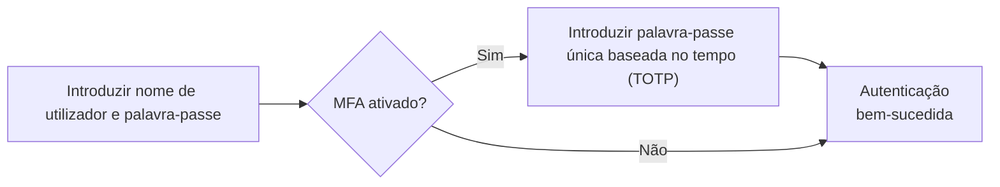

## O que é a autenticação multi-fator (MFA)?

A autenticação multi-fator (MFA) melhora a segurança ao exigir que os utilizadores forneçam múltiplas formas de identificação para verificar a sua identidade. Adiciona uma camada extra de segurança ao processo de <Ref slug="authentication" />, tornando mais difícil para os atacantes obterem acesso não autorizado.

Aqui está um exemplo de MFA:

### A definição de "fator"

No exemplo acima, existem dois fatores:

1. Nome de utilizador e palavra-passe
2. <Ref slug="totp" /> de uma aplicação móvel

Cada fator representa uma categoria diferente de credenciais que podem ser usadas para autenticar um utilizador (provar que és quem dizes ser). Na prática, os fatores podem ser categorizados em três tipos principais:

|            | O que significa    | Fatores de verificação                                                                 |
| ---------- | ------------------ | ------------------------------------------------------------------------------------- |
| Conhecimento | Algo que sabes    | Palavra-passe, Código de verificação por email, Código de backup                      |
| Posse      | Algo que tens      | Código de verificação por SMS, OTP de aplicação autenticadora, OTP de hardware (Chave de segurança), Cartão inteligente |
| Inerência  | Algo que és        | Biometria como impressões digitais, reconhecimento facial                             |

Uma configuração comum de MFA envolve a combinação de dois fatores de categorias diferentes, como uma palavra-passe (conhecimento) e um <Ref slug="totp" /> de uma aplicação autenticadora (posse).

### Por que é que a MFA é importante?

> Não existe segurança perfeita, apenas níveis variados de insegurança. —Salman Rushdie

A importância da MFA é evidente nos números: a MFA reduz o risco de comprometimento em 99,22% em toda a população e em 98,56% nos casos de credenciais vazadas[^1]. Com a ajuda da MFA, ações mais críticas podem ser realizadas com confiança, como aceder a dados sensíveis e realizar transações financeiras. É uma forma simples, mas eficaz, de oferecer um nível de segurança muito mais elevado do que apenas uma palavra-passe ou autenticação de fator único.

## MFA em aplicações modernas

Como o nome sugere, a MFA pode envolver mais de dois fatores. À medida que o número de fatores aumenta, também aumenta o nível de segurança e a complexidade do processo de autenticação, que pode ser menos amigável para o utilizador. Enquanto o <Ref slug="totp" /> é uma escolha popular nos últimos anos, novas tecnologias como o <Ref slug="passkey" /> estão a emergir para proporcionar uma experiência de MFA ainda mais segura e amigável.

Por exemplo, aplicações modernas podem usar a API <Ref slug="webauthn" /> para implementar MFA com passkeys, que são credenciais resistentes a phishing, protegidas por criptografia de chave pública. Empresas como a Apple integraram passkeys com autenticação biométrica (Touch ID, Face ID) para adicionar nativamente o fator de inerência ao processo de MFA, aumentando a segurança e a conveniência do utilizador.

Vamos fazer uma rápida comparação para uma melhor compreensão. Suponhamos que temos um utilizador que tem:

1. Uma aplicação autenticadora instalada no seu telefone para gerar códigos TOTP.
2. Uma passkey integrada com a autenticação biométrica do seu dispositivo.

Quando ele faz login num site com MFA ativado no seu laptop, os dois processos seriam assim:

```mermaid
graph TD
  subgraph TOTP
    A[Introduzir nome de utilizador e palavra-passe]
    A -->|MFA ativado| B[Solicitar código TOTP]
    B --> C[Abrir aplicação autenticadora]
    C --> D[Encontrar o TOTP para o site]
    D --> E[Introduzir o código TOTP]
    E --> F[Autenticação<br/>bem-sucedida]
  end

  subgraph WebAuthn
    G[Introduzir nome de utilizador e palavra-passe]
    G -->|MFA ativado| H[Solicitar autenticação biométrica]
    H --> I["Autenticar com biometria (por exemplo, Touch ID)"]
    I --> J[Autenticação<br/>bem-sucedida]
  end
```

É claro que o processo WebAuthn requer menos passos e muito menos tempo para os utilizadores. Além disso, empresas como a Apple suportam a sincronização de passkeys entre dispositivos (por exemplo, iPhone, iPad, Mac) para tornar o processo de MFA mais suave, mantendo um alto nível de segurança.

## Considerações de segurança

Ao implementar MFA, algumas considerações de segurança devem ser levadas em conta:

- Use uma combinação de fatores de diferentes categorias para garantir um nível mais elevado de segurança. Por exemplo, combinar uma palavra-passe (conhecimento) com um código TOTP (posse).
- Evite usar SMS como um fator de MFA devido à sua suscetibilidade a ataques de troca de SIM.
- As opções de recuperação não devem contornar a MFA. Por exemplo, se um utilizador perder a sua aplicação autenticadora, deve ser obrigado a usar um código de backup ou outro fator de MFA para recuperar o acesso.
- Imponha períodos de espera entre tentativas de MFA falhadas para prevenir ataques de força bruta.

[^1]: [Quão eficaz é a autenticação multifator na dissuasão de ciberataques?](https://query.prod.cms.rt.microsoft.com/cms/api/am/binary/RW166lD)

<SeeAlso slugs={["totp", "webauthn", "passkey"]} />

<Resources
  urls={[
    "https://blog.logto.io/elaborate-mfa",
    "https://blog.logto.io/web-authn-and-passkey-101",
    "https://blog.logto.io/webauthn-base-knowledge",
  ]}
/>