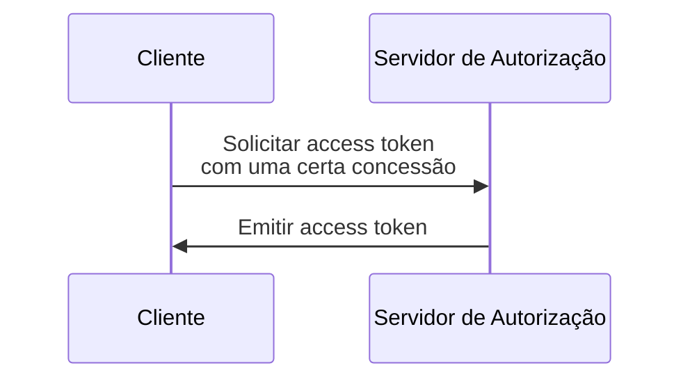

## O que é uma concessão OAuth 2.0 (OAuth 2.0 grant)?

Uma concessão OAuth 2.0 (OAuth 2.0 grant) é um processo de autorização que permite a um <Ref slug="client" /> solicitar um <Ref slug="access-token" /> de um <Ref slug="authorization-server" />. Você também pode ouvir outros termos relacionados a este conceito, então vamos esclarecê-los antes de nos aprofundarmos:

- **Concessão OAuth 2.0 (OAuth 2.0 grant)**: Também conhecida como "tipo de concessão OAuth 2.0", "fluxo OAuth 2.0" ou "concessão de autorização OAuth 2.0". Na maioria dos contextos, esses termos referem-se ao mesmo conceito.
- <Ref slug="authorization-server" />: O servidor que emite access tokens para o cliente. No OpenID Connect (OIDC), o authorization server é o mesmo que o <Ref slug="openid-connect" headingId="openid-provider-op" />.
- <Ref slug="authorization-request" />: A solicitação feita pelo cliente ao authorization server para obter um access token. No OpenID Connect (OIDC), também é referida como uma <Ref slug="authentication-request" />.

Para maior clareza, usaremos os termos iniciais listados acima de forma consistente ao longo deste artigo.

O processo de alto nível de uma concessão OAuth 2.0 (OAuth 2.0 grant) é bastante simples:

Após o cliente receber o access token, ele pode usá-lo para acessar recursos protegidos (por exemplo, APIs) em nome de um usuário ou de si mesmo.

Note que, de acordo com a concessão específica, o cliente e o authorization server podem trocar informações adicionais e envolver mais etapas no processo. Por exemplo, a <Ref slug="authorization-code-flow">concessão de código de autorização</Ref> envolve autenticação e autorização do usuário, geração de código e troca de token.

## Diferentes concessões OAuth 2.0 (OAuth 2.0 grants)

A especificação básica do OAuth 2.0 define quatro concessões que os clientes podem usar para obter access tokens:

1. <Ref slug="authorization-code-flow">Concessão de código de autorização</Ref>: A concessão mais segura e recomendada para a maioria das aplicações. É obrigatório usar <Ref slug="pkce" /> para todos os clientes no <Ref slug="oauth-2.1" />.
2. <Ref slug="implicit-flow">Concessão implícita</Ref>: Uma concessão simplificada que é descontinuada no OAuth 2.1 devido a preocupações de segurança.
3. [Concessão de credenciais de senha do proprietário do recurso (ROPC)](https://datatracker.ietf.org/doc/html/rfc6749#section-4.3): Uma concessão onde as credenciais do usuário são diretamente trocadas por um access token. Não é recomendada para a maioria das aplicações devido a riscos de segurança.
4. <Ref slug="client-credentials-flow">Concessão de credenciais do cliente</Ref>: Uma concessão usada por <Ref slug="client" headingId="confidential-clients" /> para obter um access token sem envolvimento do usuário.

À medida que a indústria evolui, as concessões implícitas e ROPC estão [sendo descontinuadas](https://blog.logto.io/oauth-2-1) em favor de fluxos mais seguros e padronizados. Para novas aplicações, as escolhas são diretas:

- Para autenticação e autorização do usuário, use a concessão de código de autorização com PKCE.
- Para comunicação <Ref slug="machine-to-machine" />, use a concessão de credenciais do cliente.

### Outras concessões OAuth 2.0 (OAuth 2.0 grants)

Além das quatro concessões básicas, existem outras extensões que definem novas concessões para casos de uso específicos. Por exemplo:

- <Ref slug="device-flow">Concessão de autorização de dispositivo</Ref> é uma concessão projetada para dispositivos com capacidades de entrada limitadas, como smart TVs e dispositivos IoT.
- <Ref slug="hybrid-flow">Fluxo híbrido</Ref> é uma concessão OpenID Connect que combina a concessão de código de autorização com a concessão implícita.

## Concessões no OpenID Connect (OIDC)

No <Ref slug="openid-connect" />, o conceito de concessões é estendido para incluir <Ref slug="id-token">ID tokens</Ref> que representam informações de identidade do usuário além dos access tokens. O OIDC estende duas concessões OAuth 2.0 (código de autorização e implícita) para incluir ID tokens, e introduz uma nova concessão chamada <Ref slug="hybrid-flow">fluxo híbrido</Ref> que combina ambos.

> Assim como no OAuth 2.0, é recomendado usar apenas a concessão de código de autorização com PKCE no OIDC para autenticação e autorização do usuário.

Enquanto isso, como o OIDC é construído sobre o OAuth 2.0, outras concessões como a concessão de credenciais do cliente ainda podem ser usadas no mesmo authorization server, desde que o servidor as suporte.

<SeeAlso slugs={["pkce", "oauth-2.1", "authorization-code-flow", "implicit-flow", "client-credentials-flow", "device-flow"]} />

<Resources
  urls={[
    "https://blog.logto.io/implicit-flow-is-dead",
    "https://datatracker.ietf.org/doc/html/rfc6749",
    "https://openid.net/specs/openid-connect-core-1_0.html"
  ]}
/>
