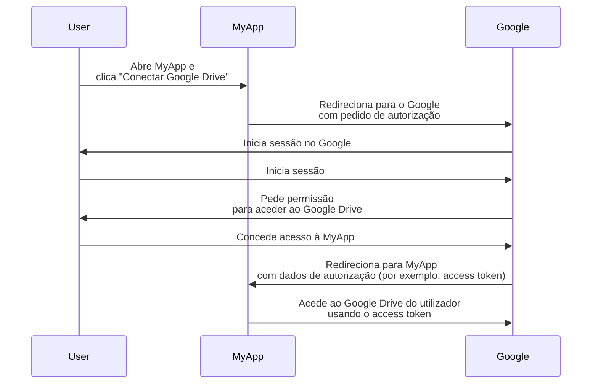
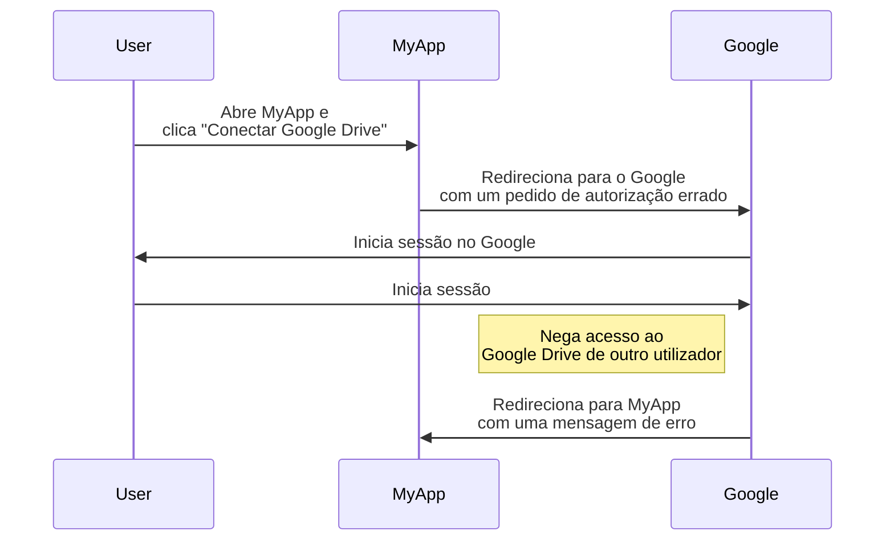
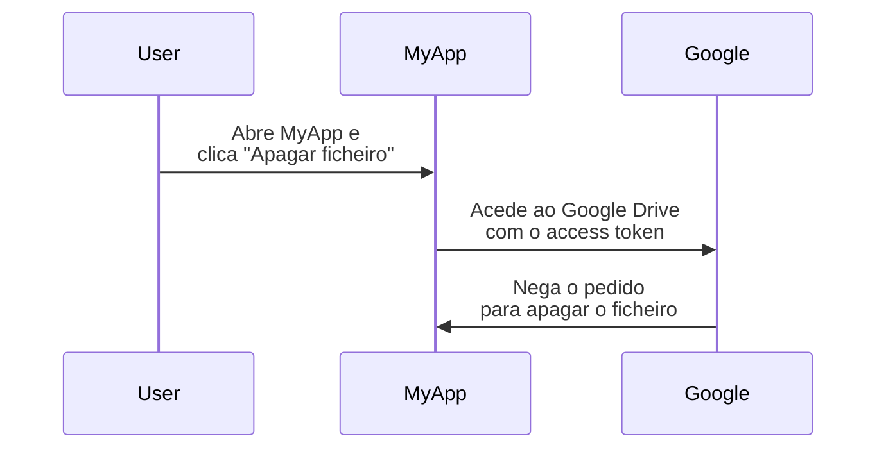

## O que é OAuth 2.0?

OAuth 2.0 é o padrão de facto para autorização e é amplamente utilizado na web. Permite que uma aplicação obtenha de forma segura acesso limitado a recursos protegidos em outra aplicação, como o perfil ou dados de um utilizador, sem expor credenciais como senhas.

Vamos ver um exemplo do mundo real para entender melhor. Tens uma aplicação web MyApp que quer aceder ao Google Drive do utilizador. Em vez de pedir ao utilizador para partilhar as suas credenciais do Google Drive, a MyApp pode usar OAuth 2.0 para solicitar acesso ao Google Drive em nome do utilizador. Aqui está um fluxo simplificado:

Neste fluxo, a MyApp nunca vê as credenciais do Google Drive do utilizador. Em vez disso, recebe um <Ref slug="access-token" /> do Google que lhe permite aceder ao Google Drive em nome do utilizador.

### Componentes chave do OAuth 2.0

Para o exemplo acima, a MyApp é o <Ref slug="client" />, o Google é tanto o <Ref slug="authorization-server" /> quanto o <Ref slug="resource-server" />, e o utilizador é o <Ref slug="resource-owner" />. O fluxo envolve todos os componentes chave do OAuth 2.0:

- **Client**: A aplicação que quer aceder aos recursos protegidos. "Client" e "aplicação" são frequentemente usados de forma intercambiável.
- **Resource owner**: O utilizador que possui os recursos protegidos. O resource owner pode conceder (autorizar) ou negar acesso ao client.
- **Authorization server**: O servidor que realiza a autorização (geralmente com autenticação) e emite access tokens para o client.
- **Resource server**: O servidor que hospeda os recursos protegidos. Verifica o access token e serve os recursos protegidos para o client.

## Concessões (fluxos) do OAuth 2.0

<Ref slug="oauth-2.0-grant">Grant</Ref> constrói a base do OAuth 2.0 e define como o client pode obter um access token do authorization server. A especificação básica do OAuth 2.0 define quatro concessões:

- <Ref slug="authorization-code-flow">Concessão de código de autorização</Ref>
- <Ref slug="implicit-flow">Concessão implícita</Ref>
- [Concessão de credenciais de senha do proprietário do recurso (ROPC)](https://datatracker.ietf.org/doc/html/rfc6749#section-4.3)
- <Ref slug="client-credentials-flow">Concessão de credenciais do client</Ref>

Sem entrar nos detalhes de cada concessão, podemos esperar que estas concessões se dividam em duas categorias:

- **Concessões de autorização**: Usadas quando o client precisa aceder a recursos em nome de um utilizador, ou seja, é necessária autorização do utilizador.
- **Concessão de credenciais do client**: Usada quando o client precisa aceder a recursos em seu próprio nome. Esta concessão é adequada para comunicação <Ref slug="machine-to-machine" />.

### Concessões de autorização

Independentemente do tipo de concessão, as concessões de autorização têm os seguintes passos comuns:

1. O client inicia um <Ref slug="authorization-request" /> para o authorization server.
2. O authorization server autentica o utilizador (resource owner) e pede permissão para aceder aos recursos.
3. O utilizador concede permissão ao client.
4. O authorization server emite um access token para o client.
5. O client usa o access token para aceder aos recursos protegidos no <Ref slug="resource-server" />.

Note que os passos e parâmetros exatos podem variar dependendo do tipo de concessão. Por exemplo, a <Ref slug="authorization-code-flow">concessão de código de autorização</Ref> envolve mais passos como geração e troca de código.

### Concessão de credenciais do client

A <Ref slug="client-credentials-flow">concessão de credenciais do client</Ref> é muito mais simples e não envolve autorização do utilizador. Aqui está um fluxo simplificado:

1. O client envia um <Ref slug="token-request" /> para o authorization server.
2. O authorization server autentica o client e emite um access token.
3. O client usa o access token para aceder aos recursos protegidos no <Ref slug="resource-server" />.

---

Para discussões aprofundadas sobre concessões do OAuth 2.0, veja <Ref slug="oauth-2.0-grant" /> e os artigos específicos sobre concessões.

## Controlo de acesso com OAuth 2.0

OAuth 2.0 define o parâmetro <Ref slug="scope" /> para especificar as permissões que o client está a solicitar. O authorization server pode ignorar total ou parcialmente os scopes solicitados e conceder acesso com base nas suas próprias políticas de controlo de acesso.

No entanto, o OAuth 2.0 deixa ao critério do authorization server como aplicar o <Ref slug="access-control" />. Isso significa que o authorization server pode decidir quais recursos o sujeito (utilizador ou client) pode aceder e quais ações podem realizar nesses recursos.

Vamos ainda usar o exemplo do Google Drive. A MyApp pode iniciar um pedido de autorização para aceder ao Google Drive de outro utilizador por engano. Neste caso, o authorization server do Google deve negar o pedido porque o utilizador não tem as permissões necessárias para aceder ao Google Drive de outro utilizador.

Outro caso é quando a MyApp recebe um access token do Google que lhe permite ler ficheiros do Google Drive do utilizador. No entanto, a MyApp tenta apagar um ficheiro em vez de lê-lo. O resource server (Google) deve negar o pedido.

Ambos os casos demonstram por que o <Ref slug="access-control" /> é necessário ao implementar o OAuth 2.0. O <Ref slug="authorization-server" /> e o <Ref slug="resource-server" /> devem trabalhar juntos para aplicar políticas de controlo de acesso e proteger os recursos.

### Modelos de controlo de acesso

Para lidar adequadamente com o controlo de acesso, é recomendado usar os modelos padrão de controlo de acesso como <Ref slug="rbac" /> e <Ref slug="abac" />. Estes modelos têm-se mostrado eficazes na indústria e fornecem a escalabilidade para requisitos futuros.

## OAuth 2.1

<Ref slug="oauth-2.1" /> é uma atualização proposta para a especificação OAuth 2.0 que visa melhorar a segurança e a usabilidade de acordo com a experiência da indústria ao longo dos anos. Embora o OAuth 2.1 ainda não esteja finalizado, podemos aprender sobre as mudanças propostas e entender como podem afetar as implementações atuais do OAuth 2.0. O OAuth 2.1 pode ser tratado como uma formalização das melhores práticas e recomendações de segurança que foram amplamente adotadas na indústria.

## OAuth 2.0 e OpenID Connect (OIDC)

OAuth 2.0 apenas define o processo de autorização e não cobre a autenticação ou identidade do utilizador. Por esta razão, o <Ref slug="openid-connect" /> foi introduzido como uma camada de identidade sobre o OAuth 2.0. O OIDC estende o OAuth 2.0 para fornecer autenticação do utilizador e informações de identidade na forma de <Ref slug="id-token" />.

O OpenID Connect estende duas concessões do OAuth 2.0 (código de autorização e implícita) para incluir ID tokens, e introduz uma nova concessão chamada <Ref slug="hybrid-flow">fluxo híbrido</Ref> que combina ambos.

Ou seja, todo o teu conhecimento e práticas de OAuth 2.0 podem ser aplicados diretamente ao OIDC; todas as extensões do OAuth 2.0, como <Ref slug="pkce" /> e <Ref slug="resource-indicator" />, podem ser usadas no OIDC também.

<SeeAlso slugs={["oauth-2.0-grant", "oauth-2.1", "openid-connect"]} />

<Resources
  urls={[
    "https://blog.logto.io/secure-cloud-apps-with-oauth-and-openid-connect",
    "https://blog.logto.io/oauth-2-1",
    "https://datatracker.ietf.org/doc/html/rfc6749",
    "https://datatracker.ietf.org/doc/draft-ietf-oauth-v2-1/",
  ]}
/>
