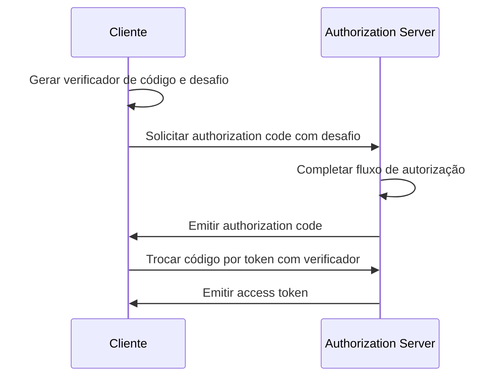

## O que é OAuth 2.1?

OAuth 2.1 é uma atualização proposta para o framework de autorização <Ref slug="oauth-2.0" />. Envolve uma série de mudanças e recomendações para a especificação existente do OAuth 2.0, consolidando as melhores práticas e melhorias de segurança que foram amplamente adotadas na indústria ao longo dos anos.

As principais atualizações do OAuth 2.1 são:

1. Descontinuar <Ref slug="implicit-flow">implicit grant</Ref> e [Resource Owner Password Credentials (ROPC) grant](https://datatracker.ietf.org/doc/html/rfc6749#section-4.3) devido a preocupações de segurança.
2. Impor o uso de <Ref slug="pkce" /> para todos os clientes, incluindo <Ref slug="client" headingId="confidential-clients">clientes confidenciais (privados)</Ref>.
3. Correspondência exata de <Ref slug="redirect-uri">URIs de redirecionamento</Ref>.
4. Definição clara dos tipos de <Ref slug="client">cliente</Ref> (clientes públicos e confidenciais).
5. Requisitos de segurança para <Ref slug="refresh-token">refresh tokens</Ref>.

## Descontinuação do implicit grant

O implicit grant foi projetado para aplicações de página única (SPAs) e aplicações baseadas em navegador que não podem armazenar segredos de cliente de forma segura. No entanto, seus riscos de segurança levaram à sua descontinuação: o grant retorna o access token no canal frontal (fragmento de URL), que pode ser exposto a atacantes através do histórico do navegador e cabeçalhos de referência.

OAuth 2.1 recomenda o uso do <Ref slug="authorization-code-flow">authorization code grant</Ref> com <Ref slug="pkce" /> para aplicações baseadas em navegador.

## Descontinuação do ROPC grant

O ROPC grant permite que o cliente troque as credenciais do usuário diretamente por um access token. Foi projetado para aplicações legadas que não podem suportar o authorization code flow. No entanto, o grant apresenta riscos de segurança ao:

- Expor as credenciais do usuário ao cliente.
- Ignorar a tela de consentimento do authorization server.
- Limitar a capacidade do authorization server de impor outras medidas de segurança, como <Ref slug="mfa" />.

OAuth 2.1 recomenda o uso do <Ref slug="authorization-code-flow">authorization code grant</Ref> com <Ref slug="pkce" /> para autenticação e autorização do usuário.

## Imposição do PKCE para todos os clientes

<Ref slug="pkce" /> é uma extensão de segurança para o authorization code flow que mitiga o risco de ataques de interceptação de authorization code. Envolve o cliente gerando um verificador de código e um desafio de código, e o authorization server verificando o desafio durante a troca de token.

Aqui está um diagrama de sequência simplificado do authorization code flow com PKCE:

Inicialmente, foi recomendado que <Ref slug="client" headingId="public-clients">clientes públicos</Ref> usassem PKCE, mas o OAuth 2.1 estende esta recomendação para um requisito obrigatório para todos os clientes, incluindo <Ref slug="client" headingId="confidential-clients">clientes confidenciais (privados)</Ref>.

## Correspondência exata de URIs de redirecionamento

<Ref slug="redirect-uri">URIs de redirecionamento</Ref> são usados pelo cliente para receber respostas de autorização do authorization server. OAuth 2.1 introduz um novo requisito de que o URI de redirecionamento usado na authorization request deve corresponder exatamente ao URI de redirecionamento registrado pelo cliente com o <Ref slug="authorization-server" />, incluindo o esquema, host e caminho.

Em algumas implementações do OAuth 2.0, a correspondência de URI de redirecionamento era flexível, permitindo correspondências parciais ou caracteres curinga. No entanto, essa flexibilidade pode introduzir riscos de segurança, como vulnerabilidades de redirecionamento aberto.

## Definição clara dos tipos de cliente

OAuth 2.0 não define explicitamente os tipos de cliente. Você pode ver várias categorizações na indústria, como por nível de acesso (público vs. confidencial) ou por tipo de aplicação (aplicativo web vs. aplicativo móvel). Para o framework OAuth, não importa como o cliente é implementado (já que são mais sobre os atributos de negócios do cliente), mas o nível de acesso faz diferença nos requisitos de segurança.

Assim, OAuth 2.1 introduz uma definição clara dos tipos de cliente:

- <Ref slug="client" headingId="public-clients" />: Clientes que NÃO PODEM manter a confidencialidade de suas credenciais (por exemplo, SPAs, aplicativos móveis).
- <Ref slug="client" headingId="confidential-clients" />: Clientes que PODEM manter a confidencialidade de suas credenciais (por exemplo, aplicativos web do lado do servidor, aplicativos desktop nativos).

## Requisitos de segurança para refresh tokens

<Ref slug="refresh-token">Refresh tokens</Ref> são tokens de longa duração usados pelo cliente para obter novos access tokens sem interação do usuário. Enquanto isso, eles também são alvos de alto valor para atacantes. Como clientes públicos não podem armazenar credenciais de forma segura, OAuth 2.1 especifica que o <Ref slug="authorization-server" /> deve usar um dos seguintes métodos para proteger refresh tokens:

- Emitir <Ref slug="refresh-token" headingId="sender-constrained-refresh-tokens">refresh tokens restritos ao remetente</Ref>.
- Usar <Ref slug="refresh-token" headingId="refresh-token-rotation">rotação de refresh token</Ref> para limitar a usabilidade e o tempo de vida dos refresh tokens.

## OAuth 2.1 e OpenID Connect (OIDC)

Como o <Ref slug="openid-connect" /> é construído sobre o OAuth 2.0, as mudanças introduzidas no OAuth 2.1 também se aplicam ao OIDC. Por exemplo, todos os clientes OIDC devem usar authorization code flow com PKCE para autenticação e autorização do usuário.

<SeeAlso slugs={["oauth-2.0", "authorization-code-flow", "pkce", "implicit-flow", "openid-connect"]} />

<Resources
  urls={[
    "https://datatracker.ietf.org/doc/draft-ietf-oauth-v2-1/",
    "https://blog.logto.io/oauth-2-1",
  ]}
/>
