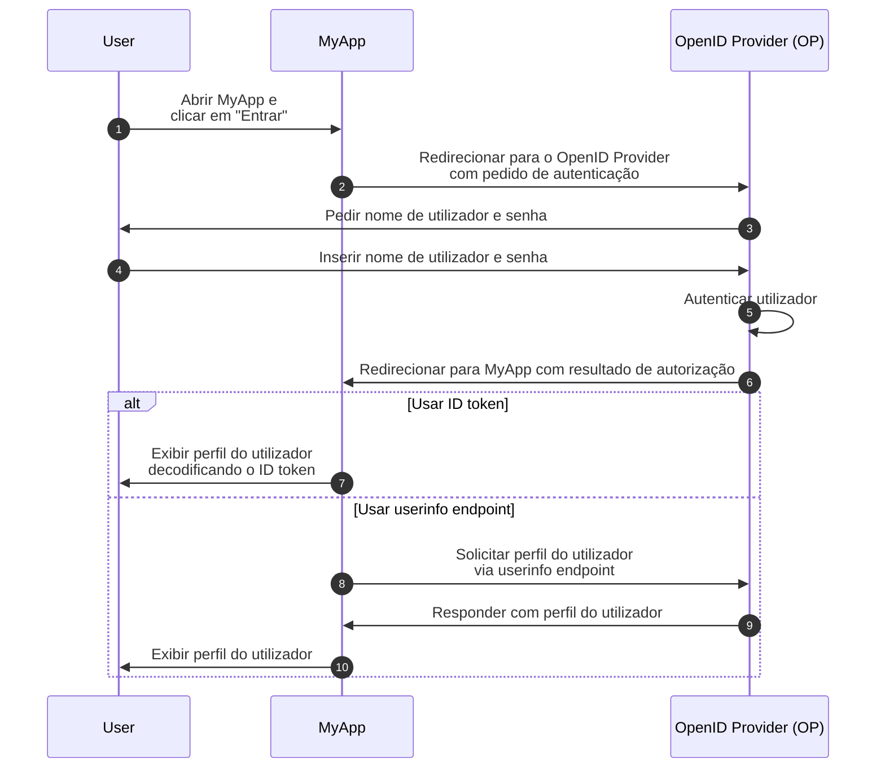
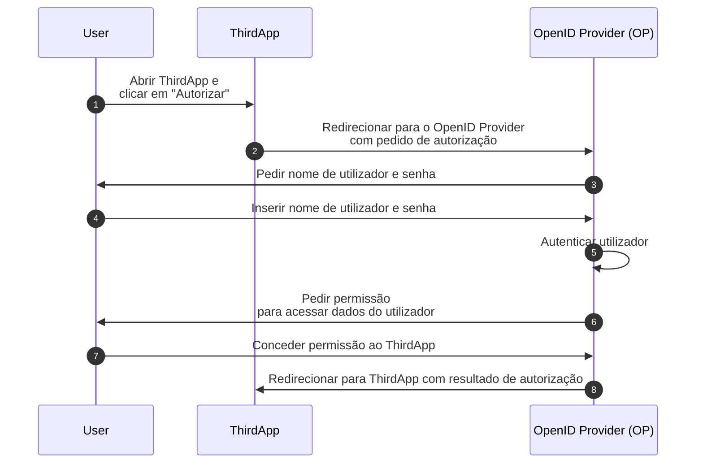

## O que é OpenID Connect (OIDC)?

OpenID Connect (OIDC) adiciona as capacidades de autenticação ao <Ref slug="oauth-2.0" />, uma estrutura de autorização (authorization), introduzindo uma camada de identidade sobre ela. OIDC permite que clientes autentiquem utilizadores e obtenham informações de identidade na forma de <Ref slug="id-token">ID tokens</Ref> e respostas do <Ref slug="userinfo-endpoint" />.

Vamos dar uma olhada em um exemplo. Suponha que você tenha uma aplicação web chamada MyApp e os utilizadores podem fazer login usando nome de utilizador e senha; após o login, eles podem acessar suas informações de perfil. Aqui está um fluxo simplificado:



Alguns termos podem ser novos para você, então vamos esclarecê-los:

### OpenID Provider (OP)

Um OpenID Provider (OP) é um <Ref slug="identity-provider" /> que implementa as especificações do OIDC e OAuth 2.0. Ou seja, um OP também é um <Ref slug="authorization-server" /> do OAuth 2.0.

Os OPs são responsáveis por autenticar utilizadores e emitir ID tokens e access tokens para clientes.

### Tokens

- <Ref slug="id-token">ID tokens</Ref> são <Ref slug="jwt">JSON Web Tokens</Ref> usados para representar informações de identidade do utilizador, como nome, email e foto de perfil.
- <Ref slug="access-token">Access tokens</Ref> são usados para acessar recursos protegidos em nome do utilizador (o mesmo que no OAuth 2.0), por exemplo, o userinfo endpoint.

### Pedido e resultado de autenticação

- <Ref slug="authentication-request" /> é um pedido feito pelo cliente ao OP para autenticar o utilizador. Inclui parâmetros para especificar certos requisitos e afetará o processo de autenticação.
- Dependendo do pedido de autenticação, o resultado da autenticação pode variar. Por enquanto, basta saber que o resultado carrega informações necessárias para o cliente identificar o utilizador.

### Userinfo endpoint

<Ref slug="userinfo-endpoint" /> é um endpoint específico do OIDC que permite que clientes recuperem informações de perfil do utilizador. É uma alternativa ao uso de ID tokens, já que o userinfo endpoint geralmente fornece informações de utilizador mais detalhadas do que o ID token.

OIDC deixa para o OpenID Provider (OP) decidir quais informações incluir no ID token e na resposta do userinfo. Portanto, antes de analisar o ID token ou chamar o userinfo endpoint, você deve verificar a documentação do OP para entender quais informações estão disponíveis.

## Diferenças de termos entre OAuth 2.0 e OIDC

Como o OIDC é construído sobre o OAuth 2.0, muitos termos são compartilhados entre as duas especificações. No entanto, enquanto o OAuth 2.0 foca na autorização (authorization), o OIDC introduz autenticação (authentication) e identidade, tornando alguns termos inadequados no contexto do OIDC. Aqui estão algumas diferenças notáveis:

| OAuth 2.0             | OpenID Connect (OIDC)  |
|-----------------------|------------------------|
| Authorization server  | OpenID Provider (OP)   |
| Authorization request | Authentication request |
| Grant                 | Flow                   |

Essencialmente, os termos acima podem apontar para o mesmo assunto, mas têm significados diferentes no contexto do OAuth 2.0 e OIDC:

- **OpenID Provider (OP)** é um <Ref slug="authorization-server" /> do OAuth 2.0 que tem a capacidade de autenticar utilizadores e emitir ID tokens.
- **<Ref slug="authentication-request" />** é um <Ref slug="authorization-request" /> do OAuth 2.0 que usa parâmetros específicos do OIDC para solicitar autenticação do utilizador final e obter um ID token.
- **Flow** é um termo mais geral usado no OIDC para descrever o processo de autenticação e autorização do utilizador, que pode envolver múltiplos passos e interações em vez de um único ciclo de pedido-resposta. É essencialmente o mesmo que um <Ref slug="oauth-2.0-grant" />.

## Fluxos do OIDC

Como o exemplo acima mostra, os fluxos do OIDC são iniciados pelo cliente (por exemplo, MyApp) com um pedido de autenticação ao OP. O pedido de autenticação especifica o fluxo a ser usado, que pode ser um dos seguintes:

- **<Ref slug="authorization-code-flow" />**: O fluxo mais seguro e recomendado para autenticação e autorização do utilizador. <Ref slug="pkce" /> é obrigatório para todos os clientes no <Ref slug="oauth-2.1" />.
- **<Ref slug="implicit-flow" />**: Um fluxo simplificado que está obsoleto no OAuth 2.1 devido a preocupações de segurança.
- **<Ref slug="hybrid-flow" />**: Um fluxo do OIDC que combina o authorization code flow com o implicit flow. Também não é recomendado para novas aplicações devido a preocupações de segurança.

Authorization code flow e implicit flow são estendidos do OAuth 2.0 para incluir ID tokens, enquanto o hybrid flow é um fluxo específico do OIDC que combina ambos. Clique nos links acima para saber mais sobre cada fluxo.

## Scopes e claims do OIDC

Como o OAuth 2.0, o OIDC usa valores de <Ref slug="scope" /> para especificar as permissões que o cliente está solicitando. Como <Ref slug="id-token">ID tokens</Ref> são <Ref slug="jwt">JSON Web Tokens</Ref>, eles podem incluir <Ref slug="claim">claims</Ref> (pares nome-valor) que representam informações de identidade do utilizador de acordo com os scopes solicitados no <Ref slug="authentication-request" />. Tais claims também são retornados na resposta do <Ref slug="userinfo-endpoint" />.

OIDC define vários scopes padrão e claims correspondentes que os clientes podem solicitar no pedido de autenticação:

- **openid**: Indica que o cliente é um cliente OIDC e solicita um ID token.
- **profile**: Solicita acesso aos claims de perfil padrão do utilizador, que são: `name`, `family_name`, `given_name`, `middle_name`, `nickname`, `preferred_username`, `profile`, `picture`, `website`, `gender`, `birthdate`, `zoneinfo`, `locale`, e `updated_at`.
- **email**: Solicita acesso aos claims `email` e `email_verified` do utilizador.
- **address**: Solicita acesso ao claim `address` do utilizador.
- **phone**: Solicita acesso aos claims `phone_number` e `phone_number_verified` do utilizador.
- **offline_access**: Solicita um refresh token para permitir que o cliente obtenha novos access tokens sem interação do utilizador.

Confira [Standard Claims](https://openid.net/specs/openid-connect-core-1_0.html#StandardClaims) e [Requesting Claims using Scope Values](https://openid.net/specs/openid-connect-core-1_0.html#ScopeClaims) na especificação do OIDC para mais informações sobre scopes e claims. Também verifique <Ref slug="offline-access" /> para uma explicação detalhada do scope `offline_access`.

> [!Note]
> OpenID Providers (OPs) podem suportar scopes e claims adicionais além dos padrões. Verifique a documentação do OP para mais detalhes.

## Autorização no OIDC

Se você está familiarizado com o OAuth 2.0, pode notar que o exemplo acima não envolve nenhum processo de <Ref slug="authorization" />. O exemplo omitiu a parte de consentimento do utilizador porque assumimos que o MyApp é uma aplicação de primeira parte que não envolve acesso de terceiros aos dados do utilizador. A autorização ainda está sendo aplicada pelo OP, mas não é explicitamente mostrada no fluxo.

A parte de consentimento do utilizador é necessária quando um cliente de terceiros (por exemplo, uma aplicação que não é propriedade do OP) solicita acesso aos dados do utilizador. Nesses casos, o OP pedirá ao utilizador que conceda permissão ao cliente antes de emitir o ID token ou access token. Vamos supor que há uma aplicação de terceiros chamada ThirdApp que deseja acessar os dados do utilizador:



Uma vez que o processo de autorização esteja completo e o ThirdApp receba o resultado da autorização (geralmente um <Ref slug="access-token" />), ele pode acessar os dados do utilizador a partir do <Ref slug="resource-server" />.

Veja <Ref slug="oauth-2.0" /> para mais informações sobre OAuth 2.0 e fluxos de autorização.

### Scopes

Semelhante ao OAuth 2.0, o OIDC usa valores de <Ref slug="scope" /> para especificar as permissões que o cliente está solicitando. Já cobrimos os scopes e claims padrão em [Scopes e claims do OIDC](#oidc-scopes-and-claims). Vale a pena notar que esses scopes e claims devem ser tratados como valores reservados no OIDC, o que significa que você NÃO deve usá-los para fins específicos de negócios.

Na prática, seu OpenID Provider (OP) pode suportar scopes e claims personalizados para suas necessidades de negócios. Consulte a documentação do OP para mais informações sobre scopes e claims personalizados. Se você não definir scopes e claims personalizados, o OP pode ignorá-los diretamente ou retornar uma resposta de erro.

### Indicadores de recursos

Como a estrutura como OIDC e o OP podem reservar certos scopes e claims para propósitos específicos, geralmente o OP recomenda usar um prefixo ou namespace para evitar conflitos com valores reservados ao definir scopes e claims personalizados. Por exemplo, você pode prefixar seus scopes personalizados com `myapp:` para indicar que são específicos para sua aplicação.

```json
{
  "scope": "myapp:custom_scope"
}
```

No entanto, isso não pode garantir que seus scopes e claims personalizados não entrarão em conflito com valores reservados futuros, e pode aumentar o tamanho do token. Uma extensão do OAuth 2.0 chamada <Ref slug="resource-indicator">indicadores de recursos</Ref> fornece uma maneira mais flexível e escalável de alcançar o mesmo objetivo. Indicadores de recursos são URIs que representam os recursos solicitados, e podem ser os endpoints reais da API para refletir os recursos do mundo real. Por exemplo, você pode usar `https://api.myapp.com` como um indicador de recurso para representar os recursos da API que seu cliente deseja acessar.

Novamente, como o OIDC é construído sobre o OAuth 2.0, você pode usar indicadores de recursos em pedidos de autenticação do OIDC quando estiverem devidamente configurados. Aqui está um exemplo não normativo de um pedido de autenticação com um indicador de recurso:

```http
GET /authorize?response_type=code
  &client_id=YOUR_CLIENT_ID
  &redirect_uri=https%3A%2F%2Fclient.example.com%2Fcallback
  &scope=openid%20profile
  &resource=https%3A%2F%2Fapi.example.com HTTP/1.1
Host: your-openid-provider.com
```

Para usar indicadores de recursos, você precisa primeiro confirmar que seu OP suporta esta extensão (RFC 8707). Se suportado, você deve registrar um URI de indicador de recurso com o OP e usá-lo no parâmetro `resource` do pedido de autenticação.

Confira <Ref slug="resource-indicator" /> para informações detalhadas sobre indicadores de recursos.

## Considerações de segurança do OIDC

### Comunicação segura

Todas as comunicações entre o cliente, OP e resource server devem ser protegidas usando HTTPS para evitar qualquer escuta ou adulteração dos dados.

### Escolher fluxos seguros

Ao implementar o OIDC, é recomendado usar:

- <Ref slug="authorization-code-flow" /> com <Ref slug="pkce" /> para autenticação e autorização do utilizador (obrigatório no <Ref slug="oauth-2.1" />).
- <Ref slug="client-credentials-flow" /> para comunicação machine-to-machine.

Implicit flow e hybrid flow estão obsoletos devido a preocupações de segurança, então evite usá-los para novas aplicações e considere migrar aplicações existentes para fluxos mais seguros.

### Validação do ID token

Ao receber um ID token do OP, o cliente deve validar o token para garantir sua integridade e autenticidade. O processo de validação deve INCLUIR PELO MENOS as seguintes verificações:

- **Issuer**: O claim `iss` deve corresponder ao URL do issuer do OP.
- **Audience**: O claim `aud` deve corresponder ao ID do cliente.
- **Expiration**: O claim `exp` deve estar no futuro.
- **Signature**: O token deve ser assinado pela <Ref slug="signing-key" /> do OP.

### Uso do access token

Access tokens são usados para acessar recursos protegidos em nome do utilizador. Os clientes devem tratar access tokens como informações sensíveis e seguir estas melhores práticas:

- **Armazenamento de tokens**: Armazenar access tokens de forma segura e evitar expô-los a partes não autorizadas.
- **Expiração de tokens**: Access tokens devem ter um tempo de expiração curto (por exemplo, 1 hora) para reduzir o risco de acesso não autorizado se o token for comprometido.
- **Revogação de tokens**: Implementar mecanismos de revogação de tokens para invalidar access tokens quando necessário.

### Consentimento do utilizador

Quando um cliente de terceiros solicita acesso aos dados do utilizador, o OP deve garantir que o utilizador esteja ciente das permissões solicitadas e conceda consentimento. O processo de consentimento do utilizador deve ser transparente e fornecer informações claras sobre os dados sendo acessados e como serão usados.

<SeeAlso slugs={["oauth-2.0", "authorization-code-flow", "implicit-flow", "hybrid-flow", "pkce", "resource-indicator"]} />

<Resources
  urls={[
    "https://blog.logto.io/secure-cloud-apps-with-oauth-and-openid-connect",
    "https://openid.net/specs/openid-connect-core-1_0.html",
  ]}
/>