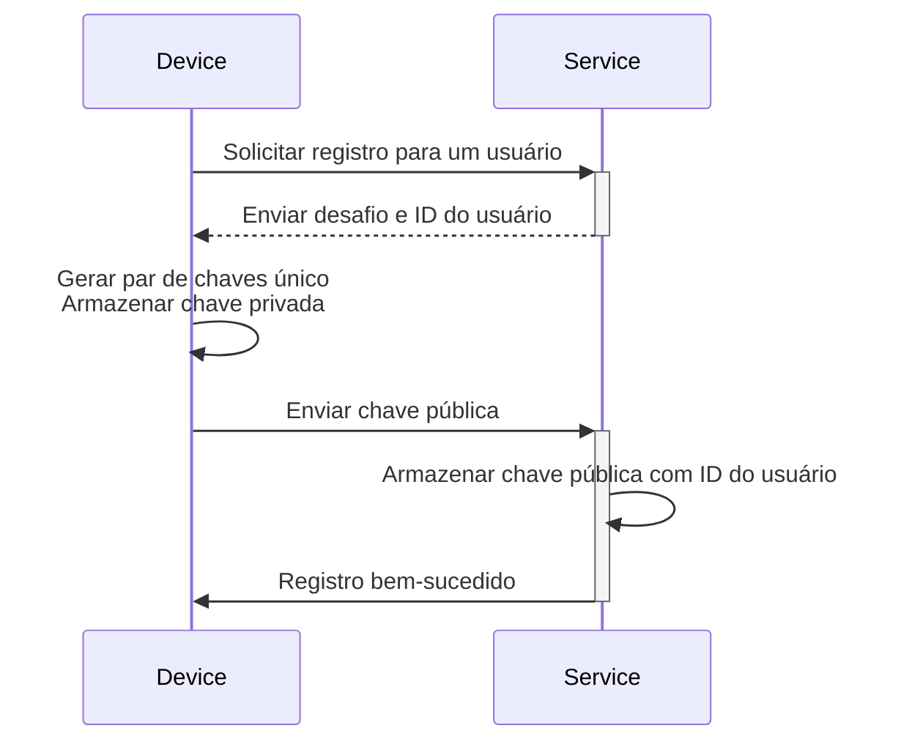
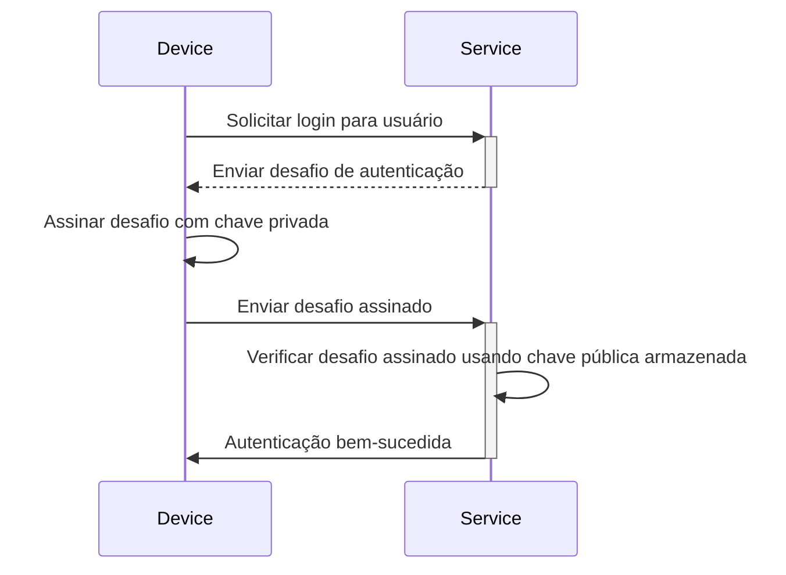

## O que é chave de acesso (passkey)?

**Chave de Acesso (Passkey)** é uma alternativa segura e conveniente baseada em [FIDO](https://fidoalliance.org/) às senhas tradicionais. Elas usam criptografia avançada para proteger suas contas contra ataques de [phishing](https://en.wikipedia.org/wiki/Phishing).

- **Única para cada serviço**: Quando você se registra em um serviço, seu dispositivo cria uma chave de acesso única vinculada ao domínio específico desse serviço.
- **Vinculada ao dispositivo:** As chaves de acesso são tipicamente vinculadas a um dispositivo, como um telefone, laptop, identificador biométrico ou chaves de segurança de hardware.
- **Par de chaves pública-privada:** O dispositivo mantém a chave privada, enquanto a chave pública é compartilhada com o serviço. Esses pares de chaves criptográficas são chamados de chaves de acesso. (Citado de [FIDO](https://fidoalliance.org/how-fido-works/))
- **Múltiplos métodos de autenticação:** Você pode usar uma digitalização de impressão digital, reconhecimento facial, PIN do dispositivo, digitalização de código QR ou chaves de segurança para autenticar com uma chave de acesso.
- **Sincronização entre dispositivos**: As chaves de acesso podem ser sincronizadas entre dispositivos usando armazenamento em nuvem seguro (por exemplo, iCloud Keychain da Apple ou Google Password Manager), permitindo que você inicie sessão de qualquer dispositivo suportado.

## Como é o fluxo de trabalho da chave de acesso (passkey)?

Aqui está um exemplo do mundo real para ajudar você a entender melhor. Você tem um serviço web MyApp que deseja implementar a entrada com Chave de Acesso em vez de entrada baseada em senha. Os usuários selecionam o dispositivo atual com digitalização de impressão digital como método de autenticação de Chave de Acesso.

**Chaves de Acesso (Passkeys)** funcionam utilizando criptografia de chave pública para fornecer credenciais seguras.

- **Registro de Chave de Acesso**
    - Quando você se registra em um serviço, seu dispositivo gera um par de chaves criptográficas único vinculado a esse serviço.
    - A **chave privada** permanece no seu dispositivo, enquanto a **chave pública** é compartilhada com o serviço.

- **Autenticação de Chave de Acesso**
    - Quando você tenta iniciar sessão, o serviço envia um **desafio** para o seu dispositivo.
    - Seu dispositivo usa a **chave privada** para gerar uma **assinatura** criptográfica baseada no desafio.
    - A **assinatura** é enviada de volta ao serviço, que a verifica usando a **chave pública**.
    - Se a assinatura for válida, a autenticação é bem-sucedida.

Leia <Ref slug="webauthn" />, uma API para implementar chaves de acesso, para aprender os detalhes.

## Como é o fluxo do usuário final com chave de acesso (passkey)?

As chaves de acesso oferecem flexibilidade com dois tipos de autenticador para uso local e em nuvem, e os usuários podem habilitar um ou ambos para o serviço.

- **Autenticador de plataforma (Autenticador interno):** Vinculado a um sistema operacional de dispositivo específico (por exemplo, telefone, laptop), usando biometria ou código de acesso do dispositivo para autorizar. É rápido e conveniente.
    - Exemplos: iCloud Keychain em dispositivos Apple (verificar via Touch ID, Face ID ou código de acesso do dispositivo), Windows Hello, Google Password Manager no Android.
- **Autenticador itinerante (Autenticador externo):** Dispositivos ou software portáteis, por exemplo, chaves de segurança, smartphones. Podem ser usados em vários dispositivos, mas podem exigir etapas adicionais, como digitalização de código QR ou emparelhamento NFC/Bluetooth.
    - Exemplos: YubiKey e contas baseadas em nuvem em smartphones. Autenticadores móveis geralmente exigem digitalização de código QR para vincular com dispositivos de desktop, e a autenticação entre dispositivos precisa se conectar via Bluetooth, NFC ou USB para garantir que o autenticador esteja próximo.

## Quando usar chave de acesso (passkey)?

As chaves de acesso são um fator de autenticação moderno que pode ser usado como primeiro ou segundo fator.

- **Entrada com Chave de Acesso:** As chaves de acesso oferecem um método de autenticação sem senha mais rápido e seguro em comparação com a senha tradicional.
    - Aplicações modernas geralmente apresentam um botão “Entrar com chave de acesso” na página de login, incentivando os usuários a tocar nessa opção proativamente.
    - Além disso, a página de login pode automaticamente exibir um pop-up de entrada com chave de acesso se reconhecer que o usuário está acessando o mesmo dispositivo e navegador onde sua chave de acesso está registrada.
- **Chave de Acesso MFA:** As chaves de acesso também podem servir como um segundo fator para MFA.
    - Quando um usuário tenta iniciar sessão, ele primeiro insere seu e-mail e senha (ou outros primeiros fatores), após o que o serviço solicita que ele complete a verificação em duas etapas usando uma chave de acesso.
    - Se houver sessões existentes no navegador, o serviço pode solicitar diretamente que os usuários iniciem sessão com sua chave de acesso sem exigir que insiram sua senha novamente. Este processo, conhecido como completar MFA, porque a chave de acesso é um nível alto de segurança ao vincular ao dispositivo atual e verificar usuários através de biometria, PINs ou outros métodos de hardware.
- **Verificação de segurança**: Em ambientes de alta segurança, as chaves de acesso são frequentemente usadas para verificar a identidade do usuário. Por exemplo, ao acessar informações financeiras sensíveis ou realizar operações críticas (bancárias, governamentais, sistema corporativo).

### Por que as chaves de acesso são o método de autenticação mais seguro?

As chaves de acesso são uma das maneiras mais seguras para clientes comuns iniciarem sessão porque usam **criptografia de chave pública**. Ao contrário de senhas ou códigos de uso único (TOTPs), sua chave privada nunca sai do seu dispositivo. Mesmo que um invasor roube a chave pública, que está livremente disponível, ele não pode forjar uma tentativa de login válida.

Aqui está uma comparação para ilustrar por que as chaves de acesso são significativamente mais seguras:

| Ataques | Chaves de Acesso | TOTP de Software (Autenticador) |
| --- | --- | --- |
| **Ataques de phishing** | Altamente resistente a phishing, pois a chave privada nunca sai do dispositivo ou é inserida manualmente em qualquer lugar, tornando mais difícil de roubar. | Vulnerável a phishing, pois o TOTP de Software é exibido na sua tela, então os atacantes podem enganá-lo para revelar em um site falso. |
| **Ataques man-in-the-middle (MitM)** | Forte proteção contra MitM, pois protocolos criptográficos robustos fazem com que as chaves privadas permaneçam apenas no seu dispositivo. | Vulnerável a MitM, pois os TOTPs podem ser interceptados por um atacante MitM que poderia então usá-los para iniciar sessão como você. |
| **Ataques de repetição** | Forte proteção contra ataque de repetição, pois cada solicitação de chave de acesso é única, tornando inútil para um atacante capturar e repetir mais tarde. | Possível ataque de repetição, pois o TOTP muda periodicamente, mas se interceptado antes de expirar, eles poderiam ser reutilizados para acesso não autorizado. |

<SeeAlso slugs={["webauthn", "authentication", "authorization"]} />

<Resources
  urls={[
    "https://fidoalliance.org/passkeys/",
    "https://webauthn.io/"
  ]}
/>