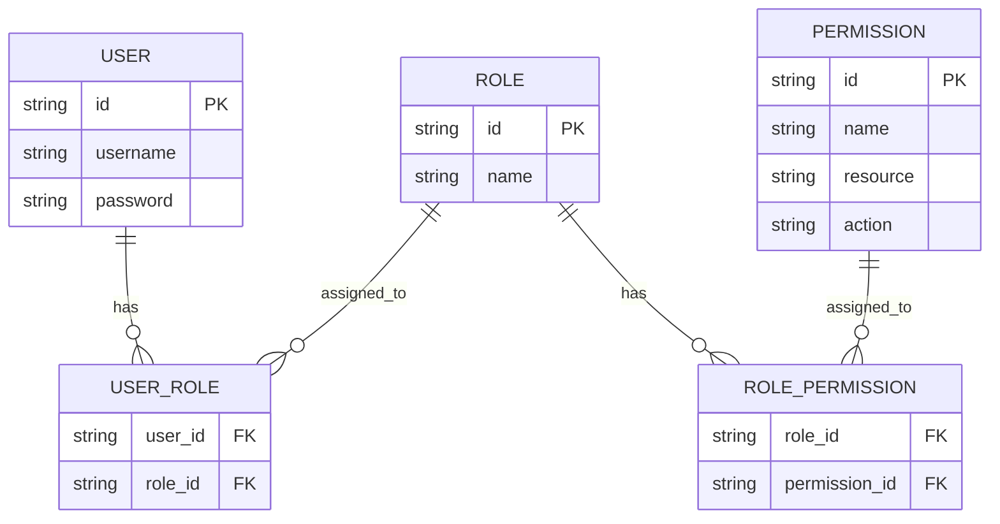
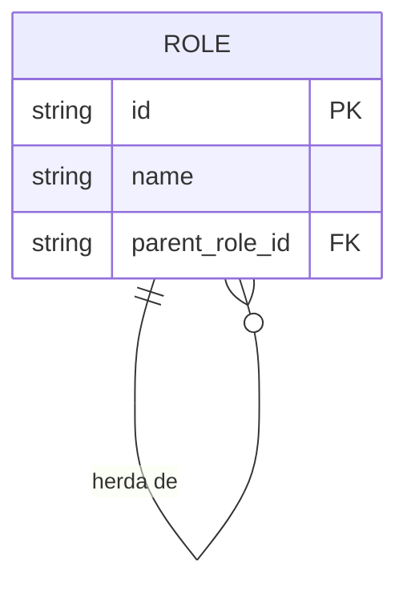
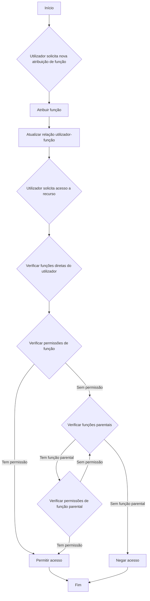
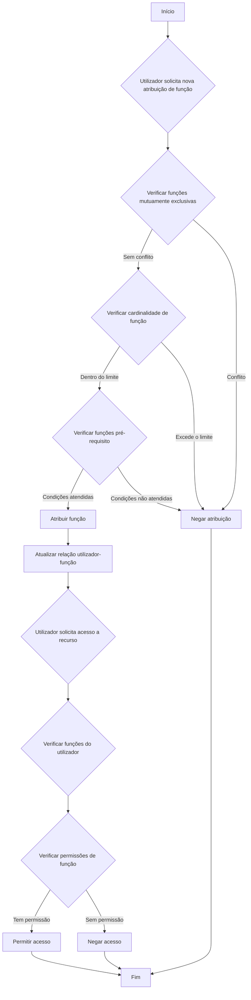

## O que é o controlo de acesso baseado em funções (RBAC)?

O controlo de acesso baseado em funções (RBAC) é um modelo de controlo de acesso amplamente adotado que introduz o conceito de "funções" para dissociar utilizadores de permissões, resultando num sistema de gestão de permissões flexível e eficiente.

A ideia central por trás do RBAC é simples, mas poderosa: em vez de atribuir permissões diretamente aos utilizadores, as permissões são atribuídas a funções, que são então atribuídas aos utilizadores. Este método indireto de alocação de permissões simplifica grandemente o processo de gestão de direitos de acesso.

## Quais são os conceitos-chave no RBAC?

O modelo RBAC gira em torno de quatro elementos principais:

1. Utilizadores: Indivíduos dentro do sistema, tipicamente pessoas reais.
2. Funções: Representações de funções ou responsabilidades dentro de uma organização.
3. Permissões: Autorizações para realizar operações específicas em recursos particulares.
4. Sessões: Ambientes dinâmicos onde os utilizadores ativam certas funções.

O fluxo de trabalho básico do RBAC pode ser resumido da seguinte forma:
1. Definir funções com base na estrutura organizacional ou nos requisitos de negócio.
2. Atribuir permissões apropriadas a cada função.
3. Atribuir uma ou mais funções aos utilizadores com base nas suas responsabilidades.
4. Quando um utilizador tenta aceder a um recurso, o sistema verifica se as funções atribuídas têm as permissões necessárias.

## Como é que o RBAC é comumente usado em aplicações do mundo real?

Ao usar o RBAC numa aplicação de negócios típica, podes começar por responder às seguintes três perguntas básicas:

1. Que recursos precisam ser protegidos no sistema?
2. Que operações precisam ser controladas nesses recursos?
3. Em cenários do mundo real, que funções são responsáveis por executar esses recursos e operações?

Tomemos como exemplo um sistema de e-commerce.

Podes primeiro identificar os recursos que precisam ser protegidos:

- Produto
- Pedido

Depois, podes determinar que operações precisam ser controladas nesses recursos, ou seja, definir as permissões para esses recursos:

- Produto
  - `read:product`
  - `create:product`
  - `delete:product`
- Pedido
  - `read:order`
  - `create:order`
  - `delete:order`

Com as permissões acima, podes agora definir o seguinte modelo de gestão de permissões com base nas funções em cenários do mundo real:

- Administrador de produtos
  - Produto
    - `read:product`
    - `create:product`
    - `delete:product`
- Administrador de pedidos
  - Pedido
    - `read:order`
    - `create:order`
    - `delete:order`

Finalmente, atribuir as funções aos utilizadores com base nas suas responsabilidades:

- Alice: Administradora de produtos
- Bob: Administrador de pedidos

Quando um utilizador acede a um recurso, o sistema verificará se as funções atribuídas ao utilizador têm as permissões necessárias.

Por exemplo, quando Alice tenta ler informações de produtos, o sistema primeiro recupera a informação da sua função e descobre que ela tem a função de administradora de produtos.

Depois, o sistema consulta as permissões associadas a essa função, que incluem `read:product`, `create:product` e `delete:product`.

O sistema então verifica se a permissão necessária `read:product` existe na sua lista de permissões.

Como esta permissão existe, o sistema permite que Alice aceda à lista de produtos. Se a permissão necessária não estiver na lista, o sistema nega o pedido de acesso.

## Porque não deves usar funções diretamente para controlo de acesso

Um erro comum na implementação do RBAC é usar funções diretamente para controlo de acesso:

```typescript
// ❌ Abordagem problemática
if (user.hasRole('product_admin')) {
  await deleteProduct(productId);
}
```

Embora esta abordagem pareça simples, cria problemas à medida que o teu sistema cresce. Por exemplo:
- Quando a equipa de marketing precisa atualizar descrições de produtos, terás de modificar o código para verificar as funções de marketing.
- Quando quiseres que certos gestores de produtos apenas publiquem, mas não eliminem produtos, terás de criar novas verificações de funções para operações relacionadas.
- Quando uma nova equipa de conteúdo precisa de acesso parcial a produtos, terás novamente de atualizar o teu código.

Em vez disso, deves sempre verificar permissões específicas:

```typescript
// ✅ Abordagem recomendada
if (user.hasPermission('delete:product')) {
  await deleteProduct(productId);
}
```

Esta abordagem baseada em permissões oferece várias vantagens:

1. Controlo de permissões detalhado: as permissões podem mapear precisamente para operações específicas de recursos:

- Criar produto: `create:product`
- Atualizar produto: `update:product`
- Eliminar produto: `delete:product`
- Publicar produto: `publish:product`

2. Configuração flexível de funções: as permissões podem ser livremente combinadas em funções sem alterações de código:

```typescript
const roles = {
  product_admin: ['create:product', 'update:product', 'delete:product', 'publish:product'],
  content_editor: ['update:product'],
  publisher: ['publish:product']  // Novas funções podem ser facilmente adicionadas
};
```

Este design torna o teu sistema adaptável ao crescimento do negócio:
- Adicionar novas funções requer apenas configuração de permissões
- Ajustar permissões de funções é feito através de configuração
- Novas funcionalidades apenas precisam de novas entradas de permissões

Lembra-te: as funções devem ser apenas contêineres de permissões, não a base para decisões de controlo de acesso. Este design permite que o RBAC forneça o máximo valor.

## Modelos RBAC e a sua evolução

### RBAC0: A fundação

RBAC0 é o modelo básico que define os conceitos centrais de utilizadores, funções, permissões e sessões. Serve como a base para todos os outros modelos RBAC.

Características principais:
- Associação utilizador-função: Relação muitos-para-muitos
- Associação função-permissão: Relação muitos-para-muitos



Este diagrama ilustra a estrutura básica do RBAC0, mostrando as relações entre utilizadores, funções e permissões.

Operações principais:
1. Atribuir funções a utilizadores
2. Atribuir permissões a funções
3. Verificar se um utilizador tem uma permissão específica

Embora o RBAC0 forneça um ponto de partida sólido, tem algumas limitações:
1. Explosão de funções: À medida que a complexidade do sistema aumenta, o número de funções pode crescer rapidamente.
2. Redundância de permissões: Diferentes funções podem exigir conjuntos semelhantes de permissões, levando à duplicação.
3. Falta de hierarquia: Não pode representar relações de herança entre funções.

### RBAC1: Introduzindo hierarquias de funções

RBAC1 baseia-se no RBAC0 ao adicionar o conceito de herança de funções.

```plaintext
RBAC1 = RBAC0 + Herança de Funções
```

Características principais:
- Hierarquia de funções: As funções podem ter funções parentais
- Herança de permissões: As funções filhas herdam todas as permissões das suas funções parentais



Este diagrama mostra como as funções podem herdar de outras funções no RBAC1.

Operações principais:



Este fluxograma ilustra o processo de atribuição de funções e verificação de permissões no RBAC1, incluindo o aspeto de herança de funções.

O RBAC1 oferece várias vantagens:
1. Redução do número de funções: Menos funções base podem ser criadas através da herança
2. Gestão simplificada de permissões: Mais fácil refletir hierarquias organizacionais

No entanto, o RBAC1 ainda tem algumas limitações:
1. Falta de mecanismos de restrição: Incapaz de restringir utilizadores de manter simultaneamente funções potencialmente conflitantes
2. Considerações de desempenho: As verificações de permissões podem exigir a travessia de toda a hierarquia de funções

### RBAC2: Implementando restrições

RBAC2 também é baseado no RBAC0, mas introduz o conceito de restrições.

```plaintext
RBAC2 = RBAC0 + Restrições
```

Características principais:
1. Funções mutuamente exclusivas: Os utilizadores não podem ser atribuídos a estas funções simultaneamente
2. Cardinalidade de funções: Limita o número de utilizadores que podem ser atribuídos a uma função particular
3. Funções pré-requisito: Os utilizadores devem ter uma função específica antes de serem atribuídos a outra



Este fluxograma demonstra o processo de atribuição de funções e controlo de acesso no RBAC2, incorporando as várias restrições.

O RBAC2 melhora a segurança ao prevenir a concentração excessiva de permissões e permite um controlo de acesso mais preciso. No entanto, aumenta a complexidade do sistema e pode impactar o desempenho devido à necessidade de verificar múltiplas condições de restrição para cada atribuição de função.

### RBAC3: O modelo abrangente

RBAC3 combina as características do RBAC1 e RBAC2, oferecendo tanto herança de funções quanto mecanismos de restrição:

```plaintext
RBAC3 = RBAC0 + Herança de Funções + Restrições
```

Este modelo abrangente proporciona máxima flexibilidade, mas também apresenta desafios na implementação e otimização de desempenho.

## Quais são as vantagens do RBAC (controlo de acesso baseado em funções)?

1. Gestão simplificada de permissões: A autorização em massa através de funções reduz a complexidade de gerir permissões de utilizadores individuais.
2. Segurança aprimorada: Controlo mais preciso sobre permissões de utilizadores reduz riscos de segurança.
3. Custos administrativos reduzidos: Modificar permissões de funções afeta automaticamente todos os utilizadores associados.
4. Alinhamento com a lógica de negócios: As funções frequentemente correspondem a estruturas organizacionais ou processos de negócios, tornando-as mais fáceis de entender e gerir.
5. Suporte para separação de deveres: Responsabilidades críticas podem ser separadas através de restrições como funções mutuamente exclusivas.

## Quais são as considerações práticas de implementação?

Ao implementar o RBAC em cenários do mundo real, os desenvolvedores devem considerar estes aspetos-chave:

1. Design de base de dados: Utilizar bases de dados relacionais para armazenar e consultar efetivamente estruturas RBAC.
2. Otimização de desempenho: Implementar estratégias de cache e otimizar verificações de permissões, especialmente para modelos RBAC3 complexos.
3. Integração de API e frontend: Projetar APIs claras para gerir utilizadores, funções e permissões, e considerar como usar o RBAC em aplicações frontend.
4. Segurança e auditoria: Garantir a segurança do próprio sistema RBAC e implementar funções detalhadas de registo e auditoria.
5. Escalabilidade: Projetar com expansões futuras em mente, como suportar regras de permissões mais complexas ou integrar com outros sistemas.
6. Experiência do utilizador: Projetar interfaces intuitivas para administradores do sistema configurarem e manterem facilmente a estrutura RBAC.

<SeeAlso slugs={['abac', 'access-control']} />

<Resources
  urls={[
    "https://blog.logto.io/rbac-and-abac",
    "https://blog.logto.io/mastering-rbac",
    "https://blog.logto.io/organization-and-role-based-access-control",
    "https://docs.logto.io/docs/recipes/rbac/",
    "https://en.wikipedia.org/wiki/Role-based_access_control"
  ]}
/>