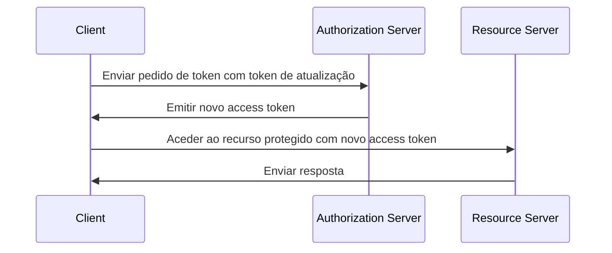

## O que é um token de atualização (refresh token)?

Um token de atualização (refresh token) é uma credencial de longa duração, tipicamente uma sequência aleatória, que é usada para obter novos <Ref slug="access-token">access tokens (tokens de acesso)</Ref> sem exigir que o utilizador se autentique novamente. No contexto do OAuth 2.0 e OpenID Connect (OIDC), os <Ref slug="authorization-server">authorization servers (servidores de autorização)</Ref> podem emitir tokens de atualização para os clients (aplicações) quando o client solicita <Ref slug="offline-access" />.

Embora o [RFC do OAuth 2.0](https://datatracker.ietf.org/doc/html/rfc6749#section-1.5) defina o ciclo de vida de alto nível de um token de atualização, os detalhes de implementação podem variar entre os authorization servers e os clients. Vamos explorá-los nas seções subsequentes.

## Como funciona um token de atualização (refresh token)?

Um token de atualização é tipicamente emitido juntamente com um access token quando o client solicita <Ref slug="offline-access" />. A norma da indústria para solicitar acesso offline é incluir o scope `offline_access` no <Ref slug="authorization-request" />, enquanto o <Ref slug="openid-connect" /> define oficialmente o scope `offline_access` para este propósito (disponível no <Ref slug="authentication-request" />).

Aqui está um exemplo não normativo de um authorization request que inclui o scope `offline_access`:

```http
GET /authorize?response_type=code
  &client_id=YOUR_CLIENT_ID
  &redirect_uri=https%3A%2F%2Fclient.example.com%2Fcallback
  &scope=openid%20profile%20email%20offline_access
  &state=abc123
  &nonce=123456 HTTP/1.1
```

Uma vez que o client recebe o token de atualização, pode usá-lo para solicitar novos access tokens quando o access token atual expirar. Aqui está um exemplo simplificado usando um token de atualização:



Como o diagrama de sequência ilustra, o uso de um token de atualização precisa ser suportado tanto pelo client quanto pelo authorization server:

- O client deve armazenar o token de atualização de forma segura e usá-lo no <Ref slug="token-request" /> para obter um novo access token.
- O authorization server deve validar o token de atualização e emitir um novo access token quando o client apresentar um token de atualização válido.

O token de atualização não deve ser compartilhado com o <Ref slug="resource-server" />. Os access tokens são os únicos tokens que o resource server deve verificar para autorização.

Aqui está um exemplo não normativo de um token request usando um token de atualização:

```http
POST /token HTTP/1.1
Host: your-authorization-server.com
Content-Type: application/x-www-form-urlencoded

grant_type=refresh_token
  &refresh_token=YOUR_REFRESH_TOKEN
  &client_id=YOUR_CLIENT_ID
  &client_secret=YOUR_CLIENT_SECRET
  &scope=openid%20profile%20email
```

## Considerações de segurança ||security-considerations||

Como os tokens de atualização são de longa duração (por exemplo, dias, semanas) e podem ser usados para obter novos access tokens sem interação do utilizador, eles representam um risco de segurança maior do que os access tokens (por exemplo, minutos, horas). O uso de tokens de atualização deve ser cuidadosamente considerado e implementado para mitigar potenciais ameaças de segurança. Aqui estão algumas práticas recomendadas a considerar:

### Armazenamento seguro

Armazene tokens de atualização de forma segura no lado do client para prevenir acesso não autorizado. Esses mecanismos de armazenamento incluem:

- **Cookies HTTP-only**: Armazene tokens em cookies HTTP-only para impedir que o JavaScript do lado do client os acesse.
- **Armazenamento encriptado**: Use armazenamentos seguros como Keychain (iOS) ou KeyStore (Android) em dispositivos móveis, ou bases de dados encriptadas em aplicações web.

### Rotação de token de atualização ||refresh-token-rotation||

Embora os tokens de atualização possam ser de longa duração, rotacioná-los periodicamente ou com base em certas condições (por exemplo, após uma troca de token bem-sucedida) pode reduzir significativamente o risco de acesso não autorizado. A estratégia de rotação exata pode variar com base nos requisitos de segurança da aplicação e nas capacidades do authorization server.

Aqui estão duas estratégias comuns de rotação de token:

- **Rotação baseada no tempo**: Rotacionar tokens de atualização após um certo período (por exemplo, a cada 7 dias).
- **Rotação baseada em eventos**: Rotacionar tokens de atualização após eventos específicos (por exemplo, troca de token bem-sucedida, alteração de senha).

Quando um token de atualização é rotacionado, o token de atualização anterior deve ser invalidado para prevenir seu reuso. Essas estratégias são frequentemente combinadas com o TTL (tempo de vida) da sessão para garantir que, após um certo período de tempo, independentemente da validade do token de atualização, o utilizador deve se autenticar novamente.

### Tokens de atualização vinculados ao remetente ||sender-constrained-refresh-tokens||

Tokens de atualização vinculados ao remetente são um mecanismo de segurança para vincular o token de atualização ao client que o solicitou, caso o client não seja um <Ref slug="client" headingId="confidential-clients">client confidencial</Ref>. Métodos comuns são [DPoP](https://datatracker.ietf.org/doc/html/rfc9449) e [mTLS](https://datatracker.ietf.org/doc/html/rfc8705).

### Tipo de client

É uma boa prática limitar o uso de tokens de atualização a <Ref slug="client" headingId="confidential-clients">clients confidenciais (privados)</Ref>.

- Clients públicos (por exemplo, aplicações de página única) expõem o código-fonte ao lado do client, tornando mais fácil para atacantes extrair e abusar de tokens de atualização. Normalmente, mecanismos mais seguros como <Ref slug="pkce" /> e rotação de token de atualização são usados para clients públicos se os tokens de atualização forem necessários.
- Clients confidenciais, por outro lado, executam em um ambiente de servidor seguro onde o código-fonte e o ambiente não são expostos ao lado do client. Tokens de atualização podem ser usados de forma mais segura em tais ambientes.

### Revogação de token

Como os tokens de atualização são geralmente <Ref slug="opaque-token">opaque tokens (tokens opacos)</Ref> (ou seja, não têm significado para o client) e devem ser validados pelo authorization server, o authorization server pode facilmente implementar mecanismos de revogação de token para invalidar tokens de atualização quando necessário. Isso pode ser útil em cenários como logout do utilizador, comprometimento de conta ou uso indevido de token.

<SeeAlso slugs={["access-token", "id-token", "jwt", "opaque-token"]} />

<Resources urls={[
  "https://blog.logto.io/understanding-refresh-token-rotation",
  "https://blog.logto.io/understanding-tokens-in-oidc",
  {
    url: "https://openid.net/specs/openid-connect-core-1_0.html#OfflineAccess",
    result: {
      ogTitle: "Offline Access in OpenID Connect Core 1.0",
    }
  },
  {
    url: "https://datatracker.ietf.org/doc/html/rfc6749#section-1.5",
    result: {
      ogTitle: "Refresh Token in OAuth 2.0",
      ogDescription: "Refresh tokens are credentials used to obtain access tokens."
    },
  },
]} />
