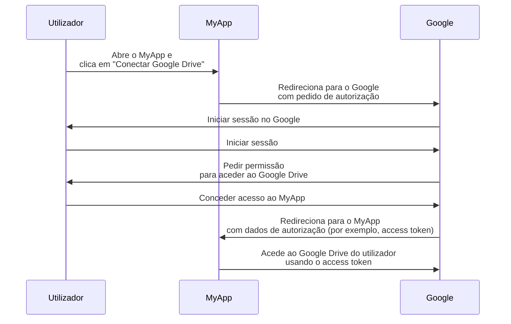

## O que é um proprietário do recurso (resource owner)?

No contexto de <Ref slug="oauth-2.0" />, um proprietário do recurso (resource owner) é uma identidade (tipicamente um utilizador) que tem a capacidade de conceder acesso a um recurso protegido (por exemplo, dados, ficheiros ou serviços).

Por exemplo, tens uma aplicação web MyApp que quer aceder ao Google Drive do utilizador. Aqui está um fluxo típico de OAuth 2.0:

Neste fluxo, o **utilizador** é o **proprietário do recurso (resource owner)** que concede acesso ao seu Google Drive ao MyApp, enquanto o **MyApp** é o <Ref slug="client" /> que quer aceder aos recursos protegidos e o **Google** é tanto o <Ref slug="authorization-server" /> como o <Ref slug="resource-server" />.

Como o nome sugere, o proprietário do recurso possui alguns recursos num <Ref slug="resource-server" /> e pode autorizar clientes a aceder a eles em seu nome no contexto de <Ref slug="oauth-2.0" />.

## Por que o proprietário do recurso é importante?

Durante um processo de <Ref slug="authorization" />, o proprietário do recurso é indispensável porque é ele quem concede ou nega explicitamente o acesso aos seus recursos. O consentimento do proprietário do recurso é obrigatório por razões técnicas e de conformidade:

- **Técnico**: O consentimento do proprietário do recurso garante que o cliente tem as permissões necessárias para aceder aos recursos. Em vez de um acesso total ou nenhum, o proprietário do recurso pode conceder acesso parcial de acordo com o pedido do cliente. Por outro lado, o proprietário do recurso também pode revogar explicitamente o acesso a qualquer momento. Esta abordagem fornece uma maneira clara e auditável para o <Ref slug="access-control" />.
- **Conformidade**: O consentimento do proprietário do recurso é um requisito legal em muitas jurisdições, especialmente quando se lida com dados sensíveis. Por exemplo, o Regulamento Geral sobre a Proteção de Dados (GDPR) exige que o titular dos dados (proprietário do recurso) forneça consentimento explícito para atividades de processamento de dados.

## Proprietário do recurso vs. servidor de recursos

<Ref slug="resource-server">Servidores de recursos</Ref> são responsáveis por hospedar e servir os **recursos protegidos**. Eles são os guardiões que verificam os access tokens e servem os recursos aos clientes.

O proprietário do recurso, por outro lado, pode ter controlo total ou parcial sobre os recursos protegidos no servidor de recursos de acordo com as políticas de <Ref slug="access-control" />.

<SeeAlso slugs={["resource-server", "oauth-2.0", "resource-indicator", "access-control"]} />

<Resources
  urls={[
    "https://tools.ietf.org/html/rfc6749",
  ]}
/>