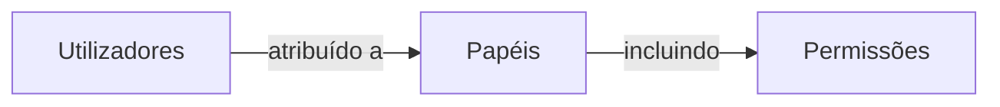

## Papel (Role)

Um papel (role) é um dos componentes centrais em <Ref slug="rbac" />. Serve como um contêiner para permissões que podem ser atribuídas a utilizadores, atuando como um intermediário entre os utilizadores e os seus direitos de acesso.



Uma estrutura típica de papel (role) contém um nome e um conjunto de permissões:

```typescript
const role = {
  name: 'order_admin',
  permissions: [
    'read:orders',   // Ver detalhes do pedido
    'write:orders',  // Editar pedidos
    'read:products'  // Ver produtos
  ]
}
```

> [!Note]
> Os papéis (roles) são usados principalmente para gestão de permissões. Para a implementação de controlo de acesso, é recomendado verificar as permissões diretamente em vez dos papéis. Veja <Ref slug="rbac" /> para mais informações.

<SeeAlso slugs={["rbac", "authorization", "access-control"]} />