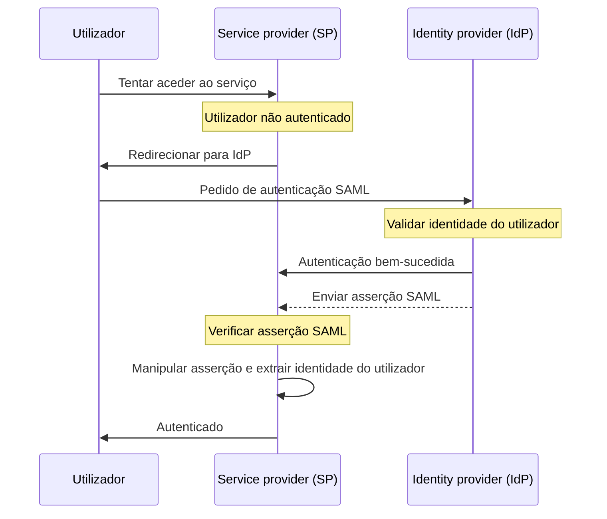

## O que é SAML?

SAML (geralmente referido como SAML 2.0) é um padrão baseado em XML para a troca de dados de autenticação (authentication) e autorização (authorization) entre duas partes: o <Ref slug="identity-provider" /> e o <Ref slug="service-provider" />. É amplamente utilizado para federação de identidade e soluções de <Ref slug="enterprise-sso" />.

Como o nome sugere, SAML transmite asserções sobre a identidade e atributos do utilizador. Estas asserções são assinadas digitalmente e, opcionalmente, criptografadas para garantir a sua integridade e confidencialidade.

## Como funciona o SAML?

Antes de mergulhar no fluxo de autenticação (authentication) do SAML, precisamos entender como os identity providers e service providers podem reconhecer e confiar uns nos outros. Esta confiança é estabelecida através da troca de metadados, onde ambas as partes compartilham informações sobre:

- **Entity ID**: Um identificador único para o identity provider ou service provider.
- **Chave pública**: Usada para verificar as assinaturas digitais nas asserções SAML.
- **Endpoints**: URLs para diferentes operações SAML, como authentication requests e respostas.

Uma vez estabelecida a confiança, o fluxo de autenticação SAML pode prosseguir:

### RelayState

No fluxo SAML, o parâmetro `RelayState` é usado para manter o estado do utilizador durante o processo de autenticação. Atua como uma referência ao pedido original feito pelo utilizador antes de ser redirecionado para o identity provider. O service provider pode usar este parâmetro para redirecionar o utilizador de volta à página ou recurso original após a autenticação bem-sucedida.

RelayState também é usado para prevenir ataques de <Ref slug="csrf" /> garantindo que o utilizador seja redirecionado de volta para a página correta após a autenticação.

### Asserções SAML

As asserções SAML são o componente central do protocolo SAML. Elas contêm informações sobre a identidade do utilizador, atributos e status de autenticação. Existem três tipos de asserções SAML:

- **Asserção de autenticação**: Indica que o utilizador foi autenticado pelo identity provider.
- **Asserção de atributo**: Contém informações adicionais sobre o utilizador, como roles, permissões e dados de perfil.
- **Asserção de decisão de autorização**: Especifica os direitos de acesso do utilizador a recursos específicos.

## Considerações para adotar SAML

SAML é amplamente adotado em ambientes empresariais desde o seu início no início dos anos 2000. Aqui estão algumas considerações importantes ao adotar SAML para as suas aplicações:

- Complexidade: As implementações de SAML podem ser complexas ao integrar com as suas aplicações, especialmente em comparação com frameworks modernos como <Ref slug="oauth-2.0" /> e <Ref slug="openid-connect" />.
- Eficiência de transporte: As mensagens SAML podem ser grandes devido à formatação XML, o que pode impactar o desempenho da rede.
- Segurança: As asserções SAML devem ser protegidas contra adulteração e escuta. Certifique-se de que a sua implementação SAML segue as melhores práticas para criptografia e assinaturas digitais.

Apesar destas considerações, SAML continua a ser um padrão robusto e amplamente utilizado para federação de identidade segura e soluções de single sign-on em ambientes empresariais. No entanto, para novas aplicações ou serviços, pode considerar alternativas modernas como OAuth 2.0 e OpenID Connect para uma abordagem mais leve e amigável ao desenvolvedor para autenticação (authentication) e autorização (authorization).

<SeeAlso slugs={["enterprise-sso", "oauth-2.0", "openid-connect"]} />

<Resources
  urls={[
    "https://blog.logto.io/saml-security-cheat-sheet",
    "https://blog.logto.io/picking-your-sso-method",
    "https://blog.logto.io/differences-between-saml-and-oidc",
  ]}
/>