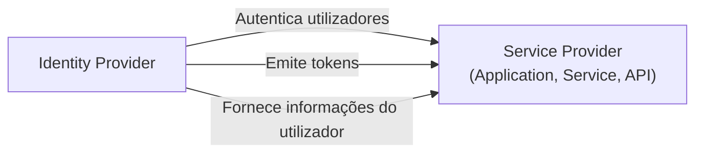

## O que é um provedor de serviço (SP)?

No domínio de <Ref slug="iam" />, um provedor de serviço (SP) (ou uma **parte confiável** no contexto de <Ref slug="openid-connect" />) é uma aplicação ou serviço que depende de um <Ref slug="identity-provider" /> para authentication e authorization. É responsável por fornecer serviços aos utilizadores e aplicar políticas de <Ref slug="access-control" /> com base nos tokens emitidos pelo identity provider.

## Normas do provedor de serviço

Não há uma norma estrita para provedores de serviço, pois eles podem ser qualquer tipo de aplicação ou serviço que requer gestão de identidade. No entanto, os provedores de serviço frequentemente seguem as normas estabelecidas pelo identity provider em que confiam. Por exemplo, se o identity provider suporta <Ref slug="openid-connect" />, o provedor de serviço geralmente usará OIDC para authentication e authorization.

## Arquitetura do provedor de serviço

O termo "provedor de serviço" não especifica uma arquitetura ou implementação particular. Normalmente, os provedores de serviço precisam ser registados com o identity provider para estabelecer confiança e permitir comunicação segura. O processo de registro geralmente envolve a troca de metadados e client credentials.

Por exemplo, no contexto de OpenID Connect, os metadados do provedor de serviço geralmente incluem:

- **Client ID**: Um identificador único para o provedor de serviço.
- **Client secret**: Um segredo compartilhado usado para autenticar o provedor de serviço.
- **<Ref slug="redirect-uri">URIs de redirecionamento</Ref>**: Os URIs onde o identity provider redirecionará os utilizadores de volta após authentication e authorization.

Uma vez registado, o provedor de serviço pode iniciar o processo de <Ref slug="authentication" /> redirecionando os utilizadores para o endpoint especificado do identity provider.

Quando os provedores de serviço são construídos para casos de uso sem interação, eles são frequentemente referidos como <Ref slug="client">clientes</Ref> que requerem comunicação <Ref slug="machine-to-machine" />.

<SeeAlso slugs={["identity-provider", "openid-connect", "oauth-2.0"]} />

<Resources
  urls={[
    "https://blog.logto.io/secure-cloud-apps-with-oauth-and-openid-connect",
    "https://blog.logto.io/incorporate-identity-solution",
    "https://blog.logto.io/centralized-identity-system"
  ]}
/>