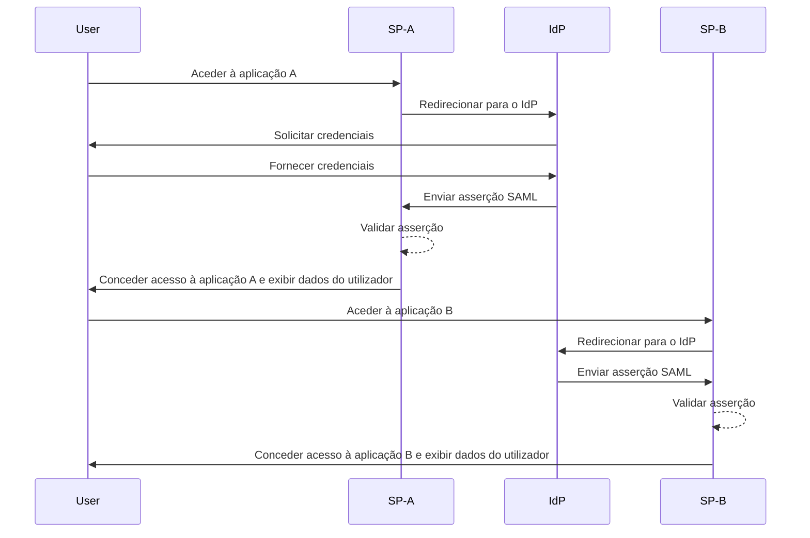
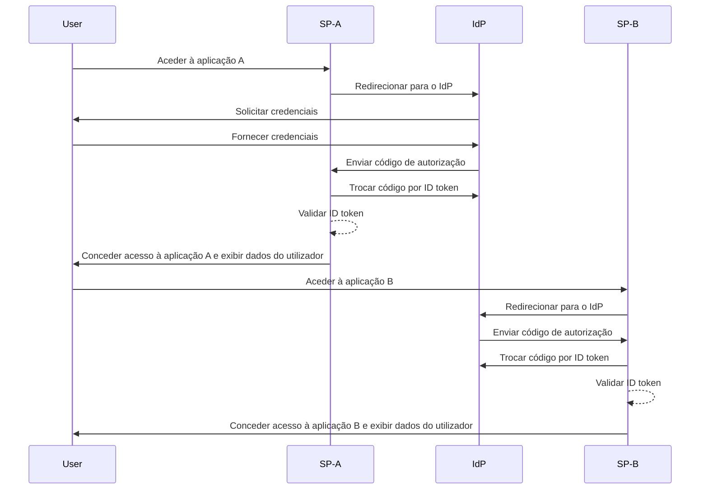

## O que é o início de sessão único (SSO)?

O início de sessão único (SSO) é um método de <Ref slug="authentication" /> que permite aos utilizadores aceder a múltiplas aplicações ou serviços com um único conjunto de credenciais. Em vez de gerir logins separados para cada sistema, os utilizadores autenticam-se uma vez e são automaticamente conectados a todas as plataformas associadas.

O SSO é comumente utilizado tanto em ambientes pessoais quanto empresariais, especialmente em ambientes empresariais onde os funcionários ou trabalhadores remotos dependem de várias aplicações SaaS para realizar o seu trabalho. Ao implementar o SSO, as organizações podem melhorar a segurança, simplificar a gestão de acessos e aumentar a produtividade dos utilizadores.

Um exemplo bem conhecido de SSO é o conjunto de serviços do Google, como o Gmail, Google Drive e Google Calendar. Após iniciar sessão na sua conta Google, os utilizadores podem facilmente aceder a todos estes serviços sem reintroduzir as suas credenciais.

## Como funciona o início de sessão único?

O SSO opera com base numa relação de confiança entre uma aplicação ou serviço, conhecido como o <Ref slug="service-provider" /> e um <Ref slug="identity-provider" />. O IdP lida com a autenticação do utilizador e partilha de forma segura as informações necessárias com o SP para conceder acesso. Esta confiança é estabelecida através de um processo chamado federação, onde tanto o SP quanto o IdP concordam em padrões e protocolos específicos para trocar dados de autenticação de forma segura.

Quando um utilizador tenta aceder a uma aplicação com SSO ativado, o SP redireciona-o para o IdP para autenticação. O IdP solicita as credenciais do utilizador, verifica a sua identidade e gera um token de segurança ou asserção contendo as informações do utilizador. Este token é enviado de volta para o SP, que o utiliza para conceder acesso.

Se o utilizador tentar aceder a outra aplicação com SSO ativado, o processo é repetido automaticamente sem exigir que ele faça login novamente. O IdP envia os dados de autenticação necessários diretamente para o SP, permitindo que o utilizador aceda à nova aplicação sem interrupções.

<Ref slug="saml" /> e <Ref slug="openid-connect" /> são dois protocolos amplamente utilizados para implementar o SSO. Estes padrões definem como os dados de autenticação são trocados entre o IsP e o SP, garantindo uma comunicação segura e confiável.

### SSO baseado em SAML

No SSO baseado em SAML, uma vez que o utilizador é autenticado pelo IdP, uma asserção SAML baseada em XML é gerada, assinada e enviada de forma segura para o SP. O SP então valida a asserção e concede acesso com base na identidade do utilizador.

### SSO baseado em OIDC

OIDC, em contraste, é construído sobre o <Ref slug="oauth-2.0" /> e oferece uma abordagem mais moderna para o SSO. Utiliza <Ref slug="jwt" /> para trocar informações de identidade entre o IdP e o SP, proporcionando maior segurança e flexibilidade.

## Benefícios do início de sessão único

1. **Segurança melhorada**: O SSO reduz o risco de violações de segurança relacionadas com senhas ao minimizar o número de credenciais que os utilizadores precisam lembrar. Também permite que as organizações imponham métodos de autenticação mais fortes, como <Ref slug="mfa" />, para proteger as contas dos utilizadores.

2. **Experiência do utilizador melhorada**: Os utilizadores podem aceder a múltiplas aplicações sem interrupções, sem a necessidade de fazer login repetidamente, aumentando a produtividade e reduzindo a frustração. O SSO simplifica o processo de login e proporciona uma experiência de utilizador consistente em diferentes plataformas.

3. **Gestão centralizada de acessos**: As organizações podem gerir centralmente o acesso e as permissões dos utilizadores através do IdP, garantindo políticas de segurança consistentes e controlos de acesso em todas as aplicações conectadas. Isso simplifica os processos de provisionamento, desprovisionamento e auditoria de utilizadores.

## Quando usar o início de sessão único

1. **Ambientes empresariais e organizacionais**: O SSO é particularmente benéfico para empresas que dependem de múltiplas aplicações e serviços para otimizar fluxos de trabalho. Simplifica o acesso dos utilizadores e reduz o fardo das equipas de TI para gerir contas de utilizadores individuais. Por exemplo, empresas que utilizam múltiplas aplicações SaaS, como CRM, RH e ferramentas de colaboração.
2. **Aplicações voltadas para o cliente**: O SSO também pode melhorar a experiência do utilizador para clientes que acedem a serviços online ou plataformas de e-commerce. Por exemplo, permitindo que os utilizadores façam login com as suas contas de redes sociais ou endereços de email em vez de criar novas contas para cada serviço.
3. **Serviços multi-produto**: Empresas que oferecem um conjunto de produtos ou serviços interconectados podem aproveitar o SSO para proporcionar uma experiência de utilizador contínua em todas as suas ofertas. Os utilizadores podem navegar entre diferentes aplicações sem o incómodo de logins repetidos. Por exemplo, o G Suite do Google. Os utilizadores podem fazer login uma vez no seu navegador Chrome e aceder a múltiplos serviços do Google sem reintroduzir as suas credenciais.

O uso do SSO não se limita a estes cenários e pode ser adaptado a vários casos de uso com base nas necessidades específicas de uma organização ou aplicação. É amplamente considerado uma prática recomendada para melhorar a segurança, a experiência do utilizador e a eficiência operacional em ambientes digitais modernos.

<SeeAlso slugs={["enterprise-sso"]} />