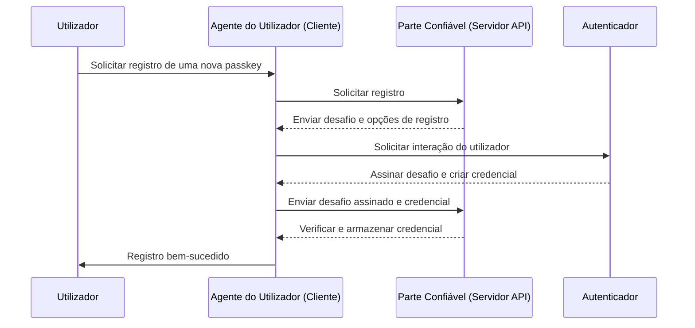
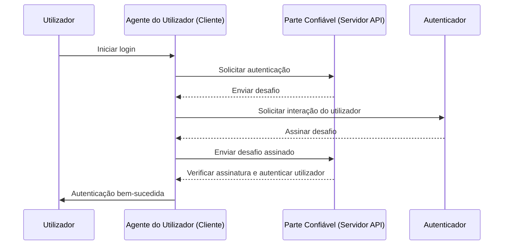

## O que é WebAuthn?

WebAuthn (Web Authentication API), desenvolvido pelo [W3C](https://www.w3.org/) e [FIDO Alliance](https://fidoalliance.org/), é uma especificação para autenticação web segura usando os padrões FIDO2. WebAuthn fornece uma API para permitir que websites implementem <Ref slug="passkey" />, que são credenciais resistentes a phishing, protegidas por criptografia de chave pública. Passkeys podem substituir senhas tanto para logins sem senha quanto para <Ref slug="mfa" />.

## Como é o fluxo de trabalho do WebAuthn?

Aqui está um exemplo do mundo real para entender melhor. Você tem uma aplicação web MyApp que deseja integrar a API WebAuthn para implementar Passkey para autenticação multifator.

**Fase de registro:** Após assinar com uma verificação de email e definir uma nova senha, este utilizador é solicitado a criar uma Passkey. Eles escolhem vincular o seu dispositivo usando uma impressão digital. Isso estabelece a Passkey de forma segura no seu dispositivo.

**Fase de autenticação:** Durante o próximo login, o utilizador é solicitado a verificar a sua Passkey após inserir a sua senha. Com apenas uma rápida digitalização de impressão digital, eles podem facilmente completar o processo de autenticação.


Para fornecer uma explicação mais detalhada, podemos dividir o processo em duas fases: registro e autenticação. Primeiro, é essencial entender as quatro entidades chave envolvidas no fluxo do WebAuthn.

### 4 entidades chave

1. **Utilizador:** O indivíduo que tenta aceder a uma aplicação web.
2. **Agente do utilizador:** O navegador web que lida com as chamadas da API WebAuthn e gere o processo de autenticação entre o utilizador, a parte confiável e o autenticador.
3. **Parte confiável:** O serviço, aplicação ou servidor API que o utilizador procura aceder.
4. **Autenticador:** O componente de hardware ou software usado para verificar a identidade do utilizador. Pode assumir várias formas com base na capacidade da plataforma ou navegador, como chaves de segurança (como Yubikeys), telefones ou tablets (conectados por Bluetooth, NFC ou USB), biometria baseada em dispositivos ou PINs, etc.

### Registro WebAuthn

A criptografia assimétrica de chave pública é o processo central.

1. **Geração de par de chaves**: 
O agente do utilizador gera um par de chaves pública-privada.
   - **Chave pública**: Compartilhada com a parte confiável.
   - **Chave privada**: Permanece armazenada de forma segura no autenticador do utilizador.
2. **Desafio de registro**: 
Quando o utilizador tenta inscrever uma passkey, a parte confiável envia um desafio de registro para o agente do utilizador.
3. **Verificação do utilizador**: 
O agente do utilizador encaminha o desafio para o autenticador, que solicita a verificação do utilizador (por exemplo, autenticação biométrica ou uma chave de segurança de hardware).
4. **Assinatura criptográfica:** 
O autenticador usa sua chave privada para assinar o desafio, criando uma assinatura criptográfica.
5. **Verificação e acesso:** 
O agente do utilizador envia o desafio assinado de volta para a parte confiável, que verifica a assinatura usando a chave pública e completa o processo de registro.



### Autenticação WebAuthn

1. **Desafio de autenticação:**
Quando o utilizador tenta fazer login, a parte confiável envia um desafio de autenticação para o agente do utilizador.
2. **Verificação do utilizador:**
O agente do utilizador envia o desafio para o autenticador, que solicita a verificação do utilizador (por exemplo, autenticação biométrica ou uma chave de segurança de hardware).
3. **Assinatura criptográfica:**
O autenticador usa sua chave privada para assinar o desafio, criando uma assinatura criptográfica.
4. **Verificação e acesso:**
O agente do utilizador verifica a assinatura usando a chave pública e informa a parte confiável de uma autenticação bem-sucedida. O acesso é concedido se a verificação for bem-sucedida.



## Como usar o WebAuthn?

A API WebAuthn pode ser usada para implementar login com passkey ou verificação em 2 etapas. Consulte a experiência Passkey para saber mais detalhes.

Para usar a API de Autenticação Web (WebAuthn) para autenticação segura, você precisa lidar com dois processos principais: registro e autenticação. Aqui estão exemplos de código simples de como você pode implementar esses processos usando JavaScript.

**Registro**

A parte confiável (sua aplicação web) inicia o processo de registro chamando o método `navigator.credentials.create()`.

```jsx
// Registro
navigator.credentials.create({
  publicKey: {
    rp: {
      name: "Nome da Sua Parte Confiável",
      id: "seu-id-da-parte-confiável"
    },
    user: {
      id: "id-do-utilizador",
      displayName: "Nome do Utilizador",
      name: "Nome do Utilizador"
    },
    challenge: "seu-valor-de-desafio",
    timeout: 60000 // 60 segundos
  }
}).then(credential => {
  // Armazenar o id da credencial para futura autenticação
  localStorage.setItem("credentialId", credential.id);
}).catch(error => {
  console.error("Erro de registro:", error);
});
```

A parte confiável inicia o processo de autenticação chamando o método `navigator.credentials.get()`.

```jsx
// Autenticação
navigator.credentials.get({
  publicKey: {
    rp: {
      name: "Nome da Sua Parte Confiável",
      id: "seu-id-da-parte-confiável"
    },
    challenge: "seu-valor-de-desafio",
    timeout: 60000 // 60 segundos
  }
}).then(credential => {
  // Verificar o id da credencial e outras propriedades
  if (credential.id === localStorage.getItem("credentialId")) {
    // Autenticação bem-sucedida
    console.log("Utilizador autenticado com sucesso");
  } else {
    console.error("Credencial inválida");
  }
}).catch(error => {
  console.error("Erro de autenticação:", error);
});
```

Para aprender os detalhes, leia as especificações: https://fidoalliance.org/specifications/download/.

Nota: Nas ações do WebAuthn, seja para registro ou autenticação, o "ID da parte confiável" (rp ID) é um campo obrigatório. Ele representa o nome de domínio da página web atual. Se não corresponder ao domínio atual, o navegador rejeitará a solicitação. Isso significa que as passkeys estão vinculadas a um domínio específico, e atualmente não há como migrar passkeys existentes para um domínio diferente. Além disso, passkeys não podem ser usadas em domínios diferentes.

## WebAuth e OpenID Connect (OIDC)

Ao combinar a forte segurança do WebAuthn com o protocolo de identidade padronizado do OIDC, podemos criar uma experiência de autenticação mais segura e amigável.

Saiba como funciona:

- **Fase de registro**: Os utilizadores completam um processo de registro padrão do <Ref slug="openid-connect" /> (por exemplo, verificação de email e criação de senha). O WebAuthn gera um par de chaves pública-privada, armazenando a chave pública com o <Ref slug="identity-provider" /> do OIDC e mantendo a chave privada no dispositivo do utilizador.
- **Fase de autenticação**: Os utilizadores acedem a um recurso protegido por OIDC e são redirecionados para a página de login. Após fornecer credenciais básicas (por exemplo, email e senha), o sistema invoca o WebAuthn para autenticação com passkey. Uma vez verificada a Passkey, o OIDC emite um Access Token ou ID Token para acesso do utilizador.

## Qual é a diferença entre WebAuthn e CTAP2?

**WebAuthn** e **CTAP2** são ambos componentes essenciais do padrão FIDO2, mas servem a propósitos distintos:

- **CTAP2 (Client to Authenticator Protocol 2):** Este protocolo define como um dispositivo, como uma chave de segurança ou smartphone, comunica-se com uma aplicação web. Ele estabelece um canal seguro entre o **autenticador** e o **dispositivo do utilizador**, garantindo que os dados de autenticação sensíveis sejam protegidos.
- **WebAuthn (Web Authentication API):** Esta API fornece uma maneira padronizada para aplicações web interagirem com autenticadores compatíveis com CTAP2. Ela lida com o processo de autenticação, incluindo a troca de dados de autenticação entre o **dispositivo do utilizador** e a **parte confiável**.

<SeeAlso slugs={["passkey", "mfa", "openid-connect"]} />

<Resources
  urls={[
    "https://fidoalliance.org/specs/fido-v2.0-id-20180227/fido-client-to-authenticator-protocol-v2.0-id-20180227.html",
    "https://blog.logto.io/webauthn-nextjs",
    "https://blog.logto.io/webauthn-base-knowledge"
  ]}
/>