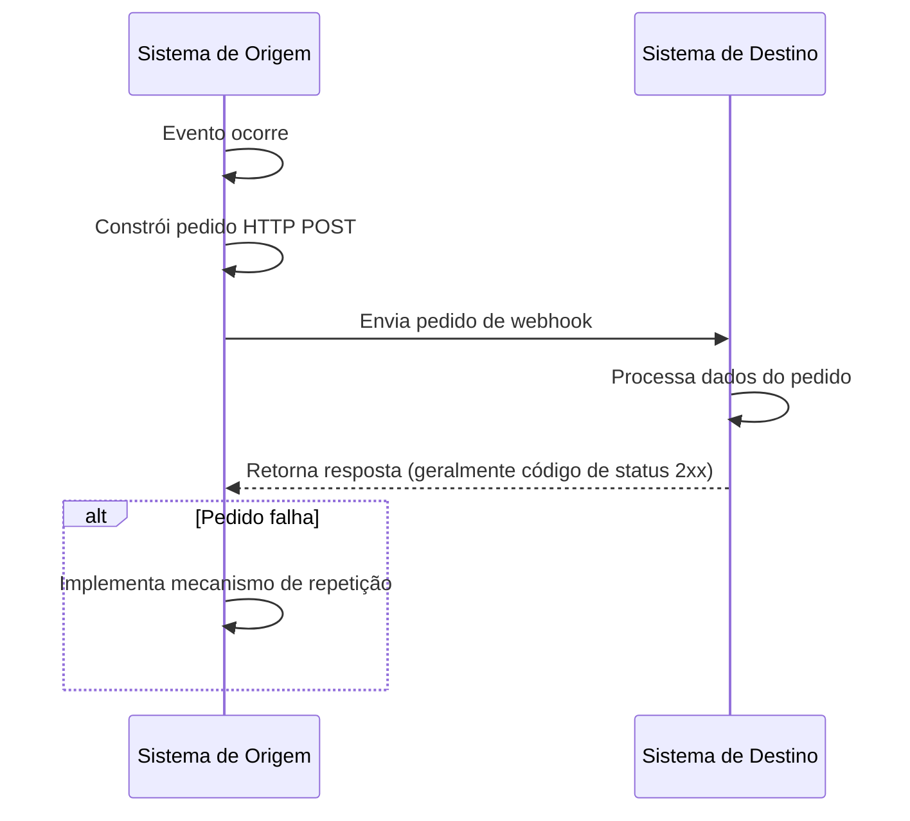
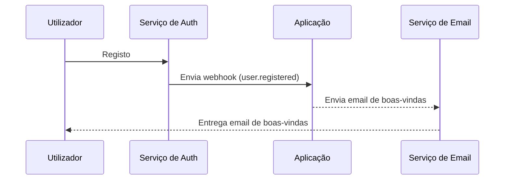

## O que é um webhook?

Um webhook é um mecanismo de callback HTTP que permite que aplicações enviem notificações em tempo real para URLs predefinidos quando eventos específicos ocorrem. Este mecanismo possibilita a troca de dados automatizada e comunicação em tempo real entre sistemas.

## Como funcionam os webhooks?



1. Um evento específico ocorre no sistema de origem
2. O sistema de origem constrói um pedido HTTP POST contendo dados do evento
3. O sistema de origem envia o pedido para a URL do sistema de destino pré-configurada
4. O sistema de destino recebe o pedido e processa os dados
5. O sistema de destino retorna uma resposta ao sistema de origem
6. Se o pedido falhar, o sistema de origem pode implementar um mecanismo de repetição

## Como funcionam os webhooks num cenário do mundo real?

Vamos tomar uma aplicação integrada com um serviço de auth como exemplo. Quando um novo utilizador se regista, a aplicação enviará um email de boas-vindas ao utilizador.

Tipicamente, o serviço de auth fornece um evento de webhook `user.registered` que é acionado quando um novo utilizador completa o registo.

A carga útil do evento de webhook contém as informações do utilizador, como email e nome de utilizador, que podem ser usadas para enviar o email de boas-vindas:

```json
// Nota: a estrutura real da carga útil depende do serviço de auth.
{
  "event": "user.registered",
  "timestamp": "2024-03-21T08:00:00Z",
  "data": {
    "user_id": "u_1234567890",
    "email": "john@example.com",    // Endereço de email para enviar o email de boas-vindas
    "username": "johndoe",          // Nome de utilizador para personalizar o email
    "registered_at": "2024-03-21T08:00:00Z"
  }
}
```

Aqui está como o fluxo do webhook funciona:



## Quais são as melhores práticas para implementar webhooks?

Quando és o remetente (produtor) de webhooks, considera os seguintes aspetos:

### Design de webhook

Desenha estruturas de webhook claras e consistentes:

- Define tipos de eventos claros: Por exemplo, `order.created`, `user.updated`, etc.
- Usa formato JSON padrão: Garante que a estrutura de dados seja clara e fácil de analisar.
- Controle de versão: Inclui informações de versão nos cabeçalhos do pedido ou na carga útil. Por exemplo:

  ```javascript
  // Nos cabeçalhos do pedido
  headers: {
    'Content-Type': 'application/json',
    'X-Webhook-Version': '1.0'
  }
  
  // Ou na carga útil
  {
    "version": "1.0",
    "event_type": "order.created",
    "data": {
      // Detalhes do evento
    }
  }
  ```

- Fornece contexto suficiente: Inclui timestamps de quando os eventos ocorreram, identificadores únicos para recursos relacionados, etc.
- Mantém consistência: Usa convenções de nomenclatura e estruturas de dados consistentes em todos os tipos de eventos.

### Mecanismo de envio

Implementa um mecanismo de envio de webhook confiável:

- Usa filas de tarefas assíncronas: Evita bloquear o programa principal e melhora a capacidade de resposta do sistema.
- Implementa mecanismos de repetição: Lida com falhas de rede ou indisponibilidade temporária do receptor.

### Estratégia de repetição

Desenha uma estratégia de repetição apropriada:

- Implementa backoff exponencial: Evita repetições frequentes que poderiam sobrecarregar o sistema e o receptor.
- Define um número máximo de repetições: Previne repetições infinitas que consomem recursos do sistema.
- Fornece mecanismos de repetição manual: Oferece uma interface para repetições manuais para webhooks que falham definitivamente.

### Implementação de segurança

Implementa um mecanismo de assinatura para permitir que os receptores verifiquem a autenticidade dos pedidos:

```javascript
const crypto = require('crypto');

function generateSignature(payload, secret) {
  return crypto.createHmac('sha256', secret)
    .update(JSON.stringify(payload))
    .digest('hex');
}

function sendWebhookWithSignature(url, payload, secret) {
  const signature = generateSignature(payload, secret);
  return axios.post(url, payload, {
    headers: { 'X-Webhook-Signature': signature }
  });
}
```

### Otimização de desempenho

Otimiza o desempenho do envio de webhooks:

- Usa pools de conexão: Reduz o overhead de estabelecer conexões e melhora o desempenho.
- Implementa processamento em lote: Envia webhooks em lotes quando apropriado para reduzir o número de interações de rede.

### Documentação e ferramentas de teste

Fornece suporte para utilizadores de webhooks:

- Documentação detalhada da API: Inclui todos os possíveis tipos de eventos, formatos de pedido e descrições de campos.
- Fornece ferramentas de teste: Implementa endpoints de teste de webhook para permitir que os utilizadores simulem o recebimento de notificações de webhook.
- Código de exemplo: Fornece exemplos de integração em várias linguagens de programação.

## Quais são as melhores práticas para usar webhooks?

Ao usar webhooks como receptor (consumidor), considera os seguintes aspetos:

### Segurança

Como os endpoints para receber webhooks são geralmente acessíveis publicamente, a segurança é uma preocupação primária. Presta atenção aos seguintes pontos:

- Verifica a autenticidade do pedido: Implementa um mecanismo de verificação de assinatura para garantir que os pedidos venham de remetentes esperados.
  
  ```javascript
  const crypto = require('crypto');

  function verifySignature(payload, signature, secret) {
    const expectedSignature = crypto
      .createHmac('sha256', secret)
      .update(JSON.stringify(payload))
      .digest('hex');
    
    return crypto.timingSafeEqual(
      Buffer.from(signature),
      Buffer.from(expectedSignature)
    );
  }
  ```

- Usa HTTPS: Garante que o teu endpoint de receção de webhook use HTTPS para evitar que os dados sejam interceptados ou adulterados durante a transmissão.
- Implementa lista branca de IPs: Apenas aceita pedidos de webhook de endereços IP confiáveis para reduzir o risco de ataques.

### Confiabilidade

Para garantir o manuseio confiável de webhooks recebidos:

- Implementa processamento idempotente: Desenha o teu sistema para lidar corretamente com notificações de webhook duplicadas, já que os remetentes podem repetir pedidos falhados.
- Responde rapidamente: Retorna uma resposta (geralmente um código de status 2xx) imediatamente após receber um pedido de webhook para evitar que o remetente considere o pedido falhado e acione uma repetição.

### Desempenho

Mantém a operação eficiente do sistema:

- Processamento assíncrono: Após receber um webhook, realiza o processamento real dos dados em segundo plano sem bloquear a resposta.
- Define limites de tempo: Define períodos de tempo razoáveis para o processamento de webhooks para evitar que tarefas de longa duração afetem o desempenho do sistema.

### Tratamento de erros

Lida adequadamente com situações de erro potenciais:

- Registo: Mantém registos detalhados dos pedidos de webhook recebidos e procedimentos de processamento para facilitar a investigação de problemas.
- Degradação graciosa: Tem mecanismos de tratamento de erros apropriados quando não for possível processar webhooks para garantir que outras partes do sistema não sejam afetadas.

### Compatibilidade de versão

Como os formatos de webhook podem mudar ao longo do tempo:

- Lida com informações de versão: Esteja preparado para lidar com diferentes versões de formatos de webhook. As informações de versão são geralmente fornecidas na URL ou nos cabeçalhos do pedido.
- Compatibilidade retroativa: Ao atualizar a tua lógica de manuseio de webhooks, garante suporte contínuo para versões de formato mais antigas.

### Monitorização

Monitoriza continuamente a receção e processamento de webhooks:

- Configura alertas: Implementa monitorização em tempo real e alertas para situações anormais (como altas taxas de falha ou tráfego incomum).
- Métricas de desempenho: Acompanha métricas de desempenho para o processamento de webhooks, como tempo de resposta e taxa de sucesso.

<Resources
  urls={[
    "https://docs.logto.io/docs/recipes/webhooks/",
    "https://docs.logto.io/docs/recipes/webhooks/securing-your-webhooks/",
    "https://en.wikipedia.org/wiki/Webhook"
  ]}
/>