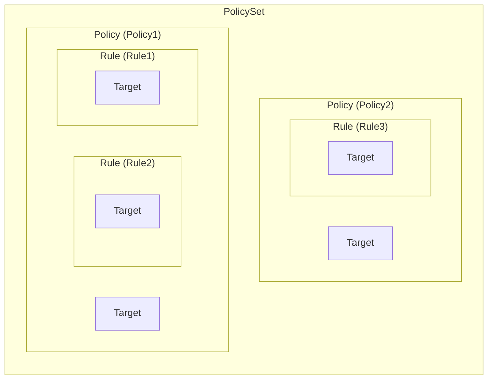
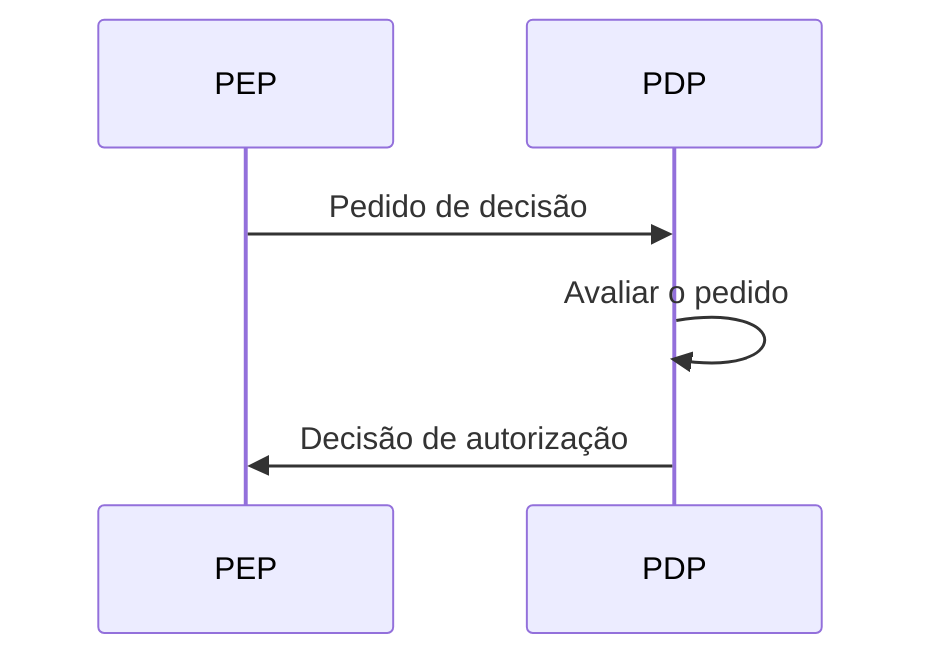
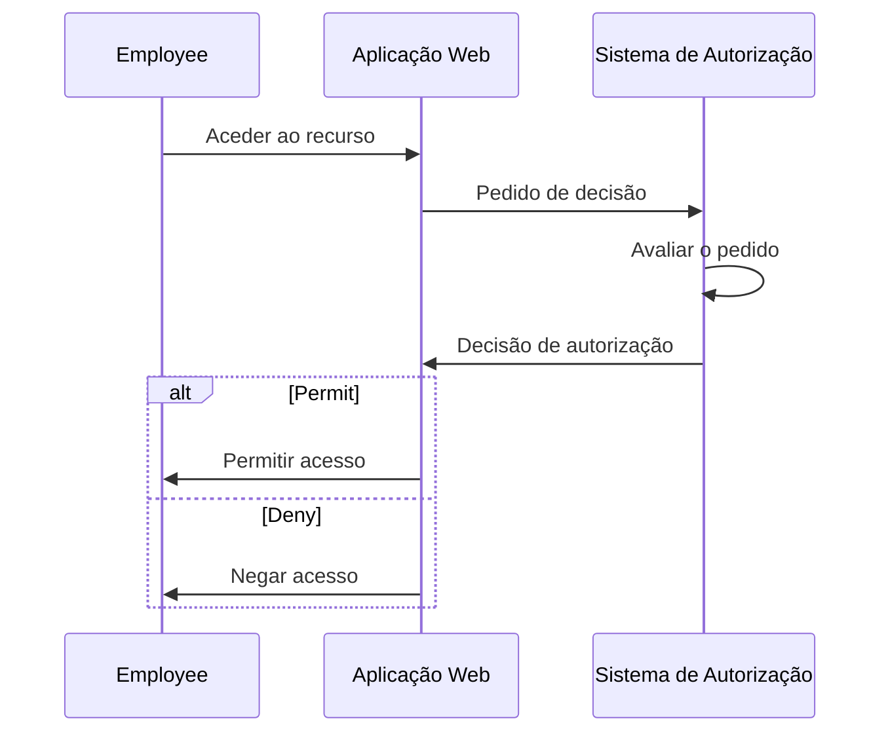
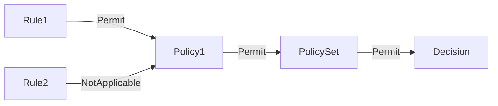
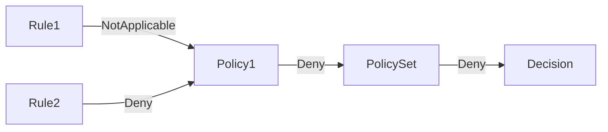
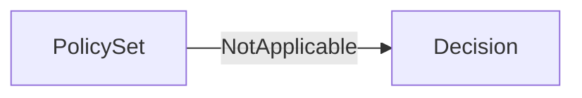

## O que é XACML?

Como o nome sugere, a Linguagem de Marcação Extensível de Controlo de Acesso (XACML) é uma linguagem baseada em XML usada principalmente para controlo de acesso. É um padrão definido pela Organização para o Avanço dos Padrões de Informação Estruturada (OASIS).

[XACML 3.0](https://docs.oasis-open.org/xacml/3.0/xacml-3.0-core-spec-os-en.html) é a versão mais recente do padrão, lançada em 2013. Embora não especifique um modelo particular de controlo de acesso, o XACML é frequentemente usado para implementar políticas de <Ref slug="abac" />. Vamos ver um exemplo simples de como o XACML pode ser usado para representar políticas ABAC:

```xml
<PolicySet PolicySetId="ABAC_Policies" PolicyCombiningAlgId="urn:oasis:names:tc:xacml:3.0:policy-combining-algorithm:deny-overrides">
  <Description>Políticas ABAC</Description>
  <Policy PolicyId="Policy1" RuleCombiningAlgId="urn:oasis:names:tc:xacml:3.0:rule-combining-algorithm:deny-overrides">
    <Description>Os funcionários podem ler dados</Description>
    <Target>
      <AnyOf>
        <AllOf>
          <Match MatchId="urn:oasis:names:tc:xacml:1.0:function:string-equal">
            <AttributeValue DataType="http://www.w3.org/2001/XMLSchema#string">read</AttributeValue>
            <AttributeDesignator
              AttributeId="urn:oasis:names:tc:xacml:1.0:action:action-id"
              Category="urn:oasis:names:tc:xacml:3.0:attribute-category:action"
              DataType="http://www.w3.org/2001/XMLSchema#string"
              MustBePresent="true"
            />
          </Match>
        </AllOf>
      </AnyOf>
    </Target>
    <Rule RuleId="Rule1" Effect="Permit">
      <Target>
        <AnyOf>
          <AllOf>
            <Match MatchId="urn:oasis:names:tc:xacml:1.0:function:string-equal">
              <AttributeValue DataType="http://www.w3.org/2001/XMLSchema#string">employee</AttributeValue>
              <AttributeDesignator
                AttributeId="urn:oasis:names:tc:xacml:1.0:subject:subject-id"
                Category="urn:oasis:names:tc:xacml:1.0:subject-category:access-subject"
                DataType="http://www.w3.org/2001/XMLSchema#string"
                MustBePresent="true"
              />
            </Match>
          </AllOf>
        </AnyOf>
      </Target>
    </Rule>
    <Rule RuleId="Rule2" Effect="Deny">
      <Target>
        <AnyOf>
          <AllOf>
            <Match MatchId="urn:oasis:names:tc:xacml:1.0:function:string-equal">
              <AttributeValue DataType="http://www.w3.org/2001/XMLSchema#string">user</AttributeValue>
              <AttributeDesignator
                AttributeId="urn:oasis:names:tc:xacml:1.0:subject:subject-id"
                Category="urn:oasis:names:tc:xacml:1.0:subject-category:access-subject"
                DataType="http://www.w3.org/2001/XMLSchema#string"
                MustBePresent="true"
              />
            </Match>
          </AllOf>
        </AnyOf>
      </Target>
    </Rule>
  </Policy>
  <!-- ...outras políticas... -->
</PolicySet>
```

O XACML faz um bom trabalho em convenções de nomenclatura autoexplicativas. A linguagem é projetada para ser legível por humanos e fácil de entender.

Em resumo, esta política afirma que os funcionários têm permissão para ler dados, e os utilizadores são negados a ler dados. Vamos decompor a política analisando os componentes principais:

- `<PolicySet>`: O elemento raiz do conjunto de políticas. Um `PolicySet` pode conter múltiplos elementos `Policy` e `PolicySet`, formando uma hierarquia de políticas.
- `<Policy>`: Uma política que contém uma ou mais regras. Cada política pode ter:
  - Um elemento `Target` que especifica as condições sob as quais a política se aplica.
  - Múltiplos elementos `Rule` que definem as regras de controlo de acesso.
  - Um atributo `RuleCombiningAlgId` que especifica como as regras são combinadas para tomar uma decisão.
- `<Rule>`: Uma regra que define as condições sob as quais o acesso é concedido ou negado. Cada regra tem:
  - Um elemento `Target` que especifica as condições sob as quais a regra se aplica.
  - Um atributo `Effect` que especifica se a regra permite ou nega o acesso.

> [!Note]
> Os componentes e atributos disponíveis no XACML não se limitam aos que acabamos de mencionar. Consulte a [especificação XACML 3.0](https://docs.oasis-open.org/xacml/3.0/xacml-3.0-core-spec-os-en.html) para uma lista completa de elementos e atributos.

Uma representação gráfica da relação entre os diferentes componentes principais é mostrada abaixo:



Uma explicação detalhada de outros elementos e atributos no exemplo será fornecida nas seções seguintes.

## Como o XACML funciona

Para simplificar, vamos assumir que apenas uma política está definida no conjunto de políticas acima. Para acionar o processo de avaliação da política, um **pedido de decisão** precisa ser enviado de um **ponto de aplicação de política (PEP)** para um **ponto de decisão de política (PDP)**. O PDP avalia o pedido em relação à política e retorna uma **decisão de autorização** ao PEP.



- PEP: O componente que envia o pedido de decisão ao PDP e aplica a decisão de autorização (ou seja, executa <Ref slug="access-control" />).
- PDP: O componente que avalia o pedido de decisão em relação à política e retorna a decisão de autorização.

Vamos usar um exemplo do mundo real para substituir a linguagem shakespeariana. Suponha que exista uma aplicação web que permite aos funcionários aceder a certos recursos, e a aplicação está integrada com um sistema de autorização baseado em XACML.

Quando um funcionário tenta aceder a um recurso, a aplicação web (**PEP**) envia um **pedido de decisão** ao sistema de autorização (**PDP**). Uma vez que o sistema de autorização avalia o pedido em relação à política XACML, ele retorna uma **decisão de autorização** à aplicação web.



## Pedido de decisão

Um pedido de decisão no XACML consiste nos seguintes componentes principais:

- **Subject**: A entidade que solicita acesso a um recurso. Pode ser um utilizador, dispositivo ou qualquer outra entidade.
- **Resource**: O recurso a ser acedido. Pode ser um ficheiro, base de dados, endpoint de API ou qualquer outro recurso.
- **Action**: A ação a ser realizada no recurso. Pode ser ler, escrever, eliminar ou qualquer outra ação.
- **Environment**: O contexto em que o pedido de acesso é feito. Pode incluir informações como hora do dia, localização ou qualquer outra informação contextual.

Aqui está um exemplo de um pedido de decisão no XACML:

```xml
<Request>
  <Attributes Category="urn:oasis:names:tc:xacml:3.0:attribute-category:resource">
    <Attribute AttributeId="urn:oasis:names:tc:xacml:1.0:resource:resource-id" DataType="http://www.w3.org/2001/XMLSchema#string">
      <AttributeValue>http://example.com/data</AttributeValue>
    </Attribute>
  </Attributes>
  <Attributes Category="urn:oasis:names:tc:xacml:3.0:attribute-category:action">
    <Attribute AttributeId="urn:oasis:names:tc:xacml:1.0:action:action-id" DataType="http://www.w3.org/2001/XMLSchema#string">
      <AttributeValue>read</AttributeValue>
    </Attribute>
  </Attributes>
  <Attributes Category="urn:oasis:names:tc:xacml:3.0:attribute-category:subject">
    <Attribute AttributeId="urn:oasis:names:tc:xacml:1.0:subject:subject-id" DataType="http://www.w3.org/2001/XMLSchema#string">
      <AttributeValue>employee</AttributeValue>
    </Attribute>
  </Attributes>
</Request>
```

## Processo de avaliação

Uma vez que o PDP recupera o conjunto de políticas, ele avalia o pedido de decisão da seguinte forma:

1. **Correspondência de alvo**: Para cada política, o PDP verifica se o pedido corresponde ao alvo da política. Se o pedido corresponder ao alvo, o PDP prossegue para avaliar as regras.
2. **Avaliação de regras**: O PDP avalia cada regra na política. Se o alvo de uma regra corresponder ao pedido, o PDP avalia a condição da regra. Se a condição for avaliada como `true`, o PDP retorna o efeito da regra (permitir ou negar). Se a condição for avaliada como `false`, o PDP continua avaliando a próxima regra.
3. **Combinação de regras**: O PDP combina os efeitos de todas as regras na política com base no atributo `RuleCombiningAlgId` da política. O efeito combinado é então retornado como a decisão da política.
4. **Combinação de políticas**: Se o conjunto de políticas contiver múltiplas políticas, o PDP combina as decisões de todas as políticas com base no atributo `PolicyCombiningAlgId` do conjunto de políticas. A decisão combinada é então retornada como a decisão final de autorização.

### Exemplo 1

Por exemplo, no conjunto de políticas de exemplo, vamos supor que o pedido de decisão seja como acima. O PDP avaliaria o pedido em relação à política `Policy1` da seguinte forma:

#### Correspondência de alvo

O `Target` da política especifica que qualquer sujeito que tenha um ID de ação de `read` deve ser avaliado pela política. Como a ação do pedido é `read`, o pedido corresponde ao alvo da política.

#### Avaliação de regras

A política contém duas regras:

1. `Rule1`: Como o ID do sujeito do pedido é `employee`, a condição da regra é avaliada como `true`, e o efeito da regra é `Permit`.
2. `Rule2`: Como o ID do sujeito do pedido não é `user`, a condição da regra é avaliada como `false`, e o efeito da regra é `NotApplicable`.

#### Combinação de regras e políticas

- Como a `Policy1` usa o algoritmo de combinação de regras `deny-overrides`, a decisão da política é `Permit` porque a `Rule1` permite o acesso e seu efeito sobrepõe o efeito `NotApplicable` da `Rule2`.
- O conjunto de políticas também usa o algoritmo de combinação de políticas `deny-overrides`, e a decisão final é `Permit` porque a decisão da política é `Permit`.

Aqui está uma representação gráfica não normativa do processo de avaliação:



### Exemplo 2

Agora, vamos considerar um pedido de decisão diferente onde todos os outros atributos são os mesmos, mas o ID do sujeito é `user` em vez de `employee`.

#### Correspondência de alvo

Como a ação não mudou, o pedido ainda corresponde ao alvo da política.

#### Avaliação de regras

- `Rule1`: O ID do sujeito do pedido não é `employee`, então a condição da regra é avaliada como `false`, e o efeito da regra é `NotApplicable`.
- `Rule2`: O ID do sujeito do pedido é `user`, então a condição da regra é avaliada como `true`, e o efeito da regra é `Deny`.

#### Combinação de regras e políticas

- A decisão da política é `Deny` porque a `Rule2` nega o acesso, e seu efeito sobrepõe o efeito `NotApplicable` da `Rule1`.
- A decisão final é `Deny` porque o algoritmo de combinação de políticas `deny-overrides` do conjunto de políticas retorna a decisão mais restritiva.

Aqui está uma representação gráfica não normativa do processo de avaliação:



### Exemplo 3

Por último, vamos considerar um pedido de decisão onde a ação é `write` em vez de `read`. Todos os outros atributos permanecem os mesmos que no exemplo 1.

#### Correspondência de alvo

O pedido já não corresponde ao alvo da política porque a ação é `write`, não `read`. Portanto, a política não é avaliada.

#### Combinação de regras e políticas

Como a política não é avaliada, a decisão final é `NotApplicable`.

Aqui está uma representação gráfica não normativa do processo de avaliação:



## Algoritmos de combinação

O XACML define vários algoritmos de combinação padrão que determinam como os efeitos de múltiplas regras ou políticas são combinados para tomar uma decisão. Nos exemplos acima, mencionamos o algoritmo de combinação `deny-overrides` tanto para regras quanto para políticas.

Como o nome sugere, o algoritmo `deny-overrides` prioriza decisões `Deny` sobre decisões `Permit`. Aqui está uma explicação simplificada de como o algoritmo `deny-overrides` funciona:

- se qualquer regra ou política negar o acesso, a decisão final é `Deny`; 
- se nenhuma regra ou política negar o acesso, e PELO MENOS uma regra ou política permitir o acesso, a decisão final é `Permit`;
- se nenhuma regra ou política negar o acesso, e NENHUMA regra ou política permitir o acesso, a decisão final é `NotApplicable`.

O algoritmo real é mais complexo e leva em consideração outras decisões "indeterminadas" como `Indeterminate{D}` e `Indeterminate{P}`.

> [!Note]
> Este algoritmo não fornece uma decisão de "reserva" caso nenhuma regra ou política corresponda ao pedido. Nesses casos, a decisão é `NotApplicable`.

Para uma lista completa de algoritmos de combinação e seu comportamento, consulte a [especificação XACML 3.0](https://docs.oasis-open.org/xacml/3.0/xacml-3.0-core-spec-os-en.html#_Toc325047268).

## Considerações de implementação

O XACML é uma linguagem poderosa para expressar políticas de controlo de acesso baseadas em atributos. Antes de implementar o XACML no teu sistema, considera o seguinte:

- Design de controlo de acesso: O XACML é flexível e expressivo, mas requer um design cuidadoso, pois pode envolver conjuntos de políticas complexos que podem levar a consequências não intencionais.
- Complexidade: As políticas XACML são frequentemente complexas e podem ser desafiadoras de gerir. Para a maioria das aplicações, modelos de controlo de acesso mais simples como <Ref slug="rbac" /> podem ser mais apropriados.
- Desempenho: Avaliar políticas XACML pode ser computacionalmente dispendioso, especialmente ao lidar com grandes conjuntos de políticas. Considera as implicações de desempenho de usar XACML no teu sistema.

<SeeAlso slugs={['abac', 'rbac', 'access-control', 'authorization']} />

<Resources
  urls={[
    'https://docs.oasis-open.org/xacml/3.0/xacml-3.0-core-spec-os-en.html',
  ]}
/>