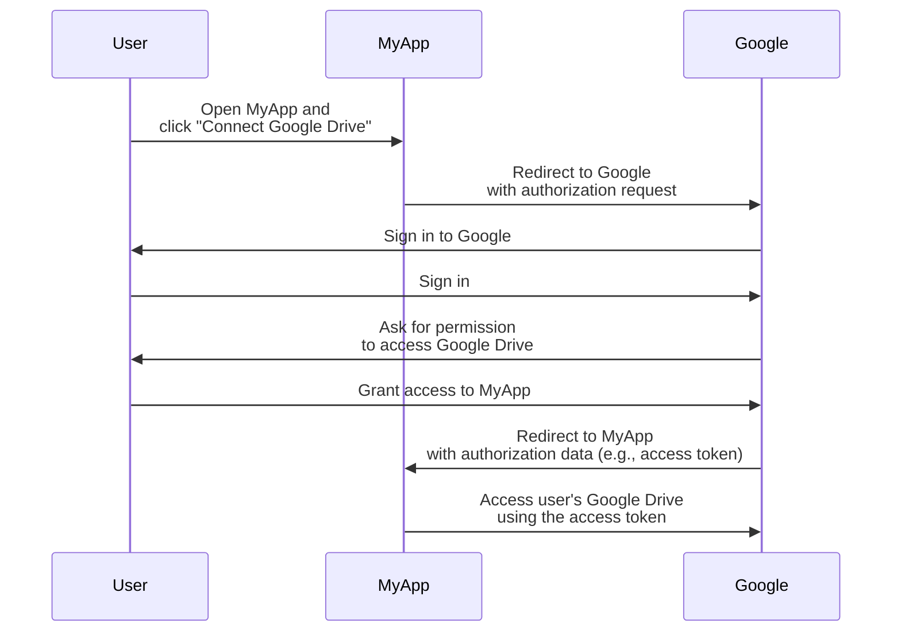

## What is a resource owner?

In the context of <Ref slug="oauth-2.0" />, a resource owner is an identity (typically a user) that has the ability to grant access to a protected resource (e.g., data, files, or services).

For example, you have a web application MyApp that wants to access the user's Google Drive. Here's a typical OAuth 2.0 flow:

In this flow, the **user** is the **resource owner** who grants access to their Google Drive to MyApp, while **MyApp** is the <Ref slug="client" /> that wants to access the protected resources and **Google** is both the <Ref slug="authorization-server" /> and the <Ref slug="resource-server" />.

As the name suggests, the resource owner owns some resources in a <Ref slug="resource-server" /> and can authorize clients to access them on their behalf in the <Ref slug="oauth-2.0" /> context.

## Why is the resource owner important?

During an <Ref slug="authorization" /> process, the resource owner is unneglectable because they are the ones who explicitly grant or deny access to their resources. The resource owner's consent is a mandatory for both technical and compliance reasons:

- **Technical**: The resource owner's consent ensures that the client has the necessary permissions to access the resources. Rather than all-or-nothing access, the resource owner may grant partial access according to the client's request. On the other hand, the resource owner can also explicitly revoke access at any time. This approach provides a clear and auditable way for <Ref slug="access-control" />.
- **Compliance**: The resource owner's consent is a legal requirement in many jurisdictions, especially when dealing with sensitive data. For example, the General Data Protection Regulation (GDPR) mandates that the data subject (resource owner) must provide explicit consent for data processing activities.

## Resource owner vs. resource server

<Ref slug="resource-server">Resource servers</Ref> are responsible for hosting and serving the **protected resources**. They are the gatekeepers that verify the access tokens and serve the resources to the clients.

The resource owner, on the other hand, may have full or partial control over the protected resources in the resource server according to the <Ref slug="access-control" /> policies.

<SeeAlso slugs={["resource-server", "oauth-2.0", "resource-indicator", "access-control"]} />

<Resources
  urls={[
    "https://tools.ietf.org/html/rfc6749",
  ]}
/>
