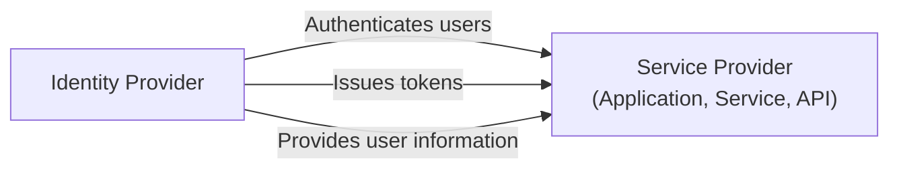

## What is a service provider (SP)?

In the realm of <Ref slug="iam" />, a service provider (SP) (or a **relying party** in the context of <Ref slug="openid-connect" />) is an application or service that relies on an <Ref slug="identity-provider" /> for authentication and authorization. It is responsible for providing services to users and enforcing <Ref slug="access-control" /> policies based on the tokens issued by the identity provider.

## Service provider standards

There's no strict standard for service providers, as they can be any type of application or service that requires identity management. However, service providers often follow the standards set by the identity provider they rely on. For example, if the identity provider supports <Ref slug="openid-connect" />, the service provider will typically use OIDC for authentication and authorization.

## Service provider architecture

The term "service provider" does not specify a particular architecture or implementation. Usually, service providers need to be registered with the identity provider to establish trust and enable secure communication. The registration process typically involves exchanging metadata and client credentials.

For example, in the context of OpenID Connect, the service provider metadata typically includes:

- **Client ID**: A unique identifier for the service provider.
- **Client secret**: A shared secret used to authenticate the service provider.
- **<Ref slug="redirect-uri">Redirect URIs</Ref>**: The URIs where the identity provider will redirect users back after authentication and authorization.

Once registered, the service provider can initiate the <Ref slug="authentication" /> process by redirecting users to the identity provider's specified endpoint.

When service providers are built for non-interaction use cases, they are often referred to as <Ref slug="client">clients</Ref> that require <Ref slug="machine-to-machine" /> communication.

<SeeAlso slugs={["identity-provider", "openid-connect", "oauth-2.0"]} />

<Resources
  urls={[
    "https://blog.logto.io/secure-cloud-apps-with-oauth-and-openid-connect",
    "https://blog.logto.io/incorporate-identity-solution",
    "https://blog.logto.io/centralized-identity-system"
  ]}
/>
