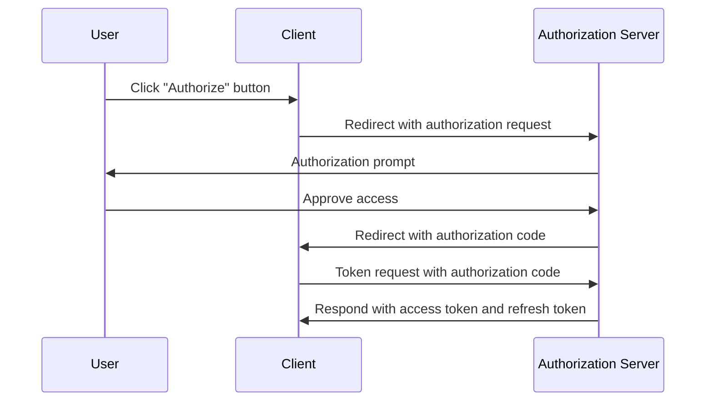
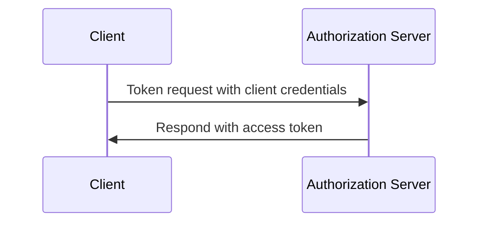

## What is a token request?

In <Ref slug="oauth-2.0" /> and <Ref slug="openid-connect" />, a token request is a request to the <Ref slug="authorization-server" /> (or <Ref slug="openid-connect" headingId="openid-provider-op" /> in OIDC) for exchanging credentials (e.g., authorization code, refresh token) for a set of tokens. The token set typically includes one or more of the following:

- <Ref slug="access-token" />: A token that grants access to protected resources.
- <Ref slug="id-token" />: A token that contains user information (OIDC-specific).
- <Ref slug="refresh-token" />: A token that can be used to obtain a new access token without user interaction.

Depending on the <Ref slug="oauth-2.0-grant">grant type</Ref> used, the request may include different parameters and return different tokens.

For example, in the <Ref slug="client-credentials-flow" />, the <Ref slug="client" /> directly requests an <Ref slug="access-token" /> with client credentials. Here's a non-normative example of the token request:

```http
POST /token HTTP/1.1
Host: authorization-server.example.com
Content-Type: application/x-www-form-urlencoded

grant_type=client_credentials
  &client_id=client-id
  &client_secret=client-secret
  &scope=read
```

If the request is successful, the authorization server responds with an access token:

```http
HTTP/1.1 200 OK
Content-Type: application/json

{
  "access_token": "eyJhbGci...zHg",
  "token_type": "Bearer",
  "expires_in": 3600,
  "scope": "read"
}
```

## How does a token request work?

As the above example shows, the token request itself is straightforward. The client sends an HTTP request to the token endpoint of the authorization server with the necessary parameters. The authorization server validates the request, processes it, and returns the tokens in the response.

However, according to the spefic grant type (flow) used, the token request may need more preparation.

### Authorization code flow

In the <Ref slug="authorization-code-flow" />, the client first obtains an authorization code by initiating an <Ref slug="authorization-request" /> (or <Ref slug="authentication-request" /> in OIDC) with the authorization server. Once the user grants permission, the client exchanges the authorization code for an access token and optionally a refresh token via the token request.

Here's a simplified sequence diagram of the authorization code flow:



### Client credentials flow

As the example in the first section shows, the <Ref slug="client-credentials-flow" /> is much simpler. The client directly requests an access token with its client credentials. The authorization server validates the client credentials and issues an access token if successful.

Here's a non-normative sequence diagram of the client credentials flow:



### Refresh token

In some grant types, the client can also request <Ref slug="offline-access" /> by including the `offline_access` scope in the authorization request. If granted, the authorization server issues a refresh token along with the access token. The client can use the refresh token to obtain a new access token via the token request without user interaction.

Here's a non-normaltive example of using a refresh token to obtain a new access token:

```http
POST /token HTTP/1.1
Host: authorization-server.example.com
Content-Type: application/x-www-form-urlencoded

grant_type=refresh_token
  &refresh_token=refresh-token
  &client_id=client-id
  &client_secret=client-secret
```

---

Other <Ref slug="oauth-2.0-grant">grant types</Ref> may also involve token requests, but the basic idea stays the same.

## Key parameters in a token request

Here are some key parameters that are commonly used in a token request:

- **`grant_type`**: The type of grant being requested. Common values include `authorization_code`, `client_credentials`, `refresh_token`, etc.
- **`client_id`**: The client identifier issued by the authorization server.
- **`client_secret`**: The client secret issued by the authorization server (for confidential clients).
- **`code`**: The authorization code obtained from the authorization server (for the authorization code flow).
- **`refresh_token`**: The refresh token obtained from the authorization server (for refreshing access tokens).
- **`scope`**: The requested <Ref slug="scope">scopes</Ref> (permissions) for the access token.
- **`redirect_uri`**: The URI where the authorization server sends the response (for the authorization code flow).
- **`code_verifier`**: The code verifier used in the <Ref slug="pkce" /> extension (for the authorization code flow).

The actual parameters and their values depend on the grant type and the specific requirements of the application. Before making a token request, you should refer to the full list of parameters for the specific grant type you are using.

<SeeAlso slugs={["oauth-2.0", "openid-connect", "authorization-request", "authentication-request"]} />
